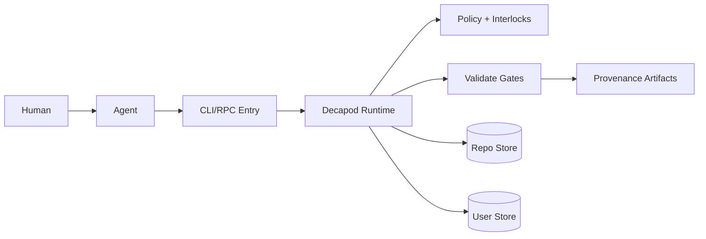
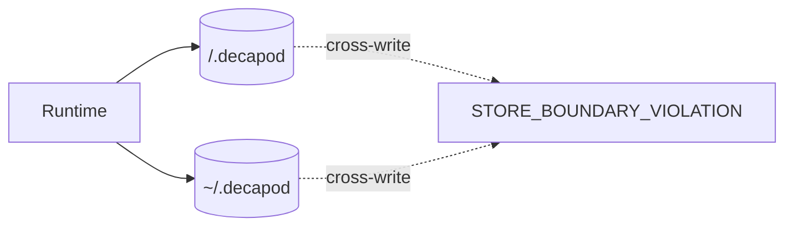
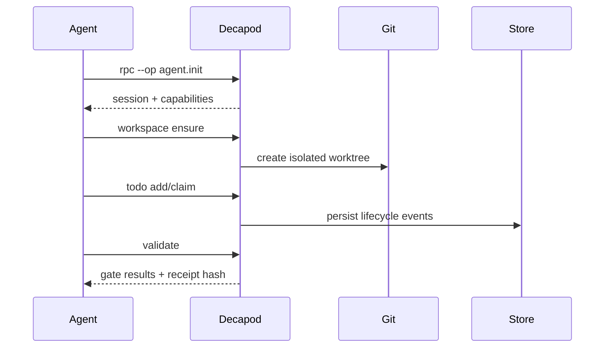
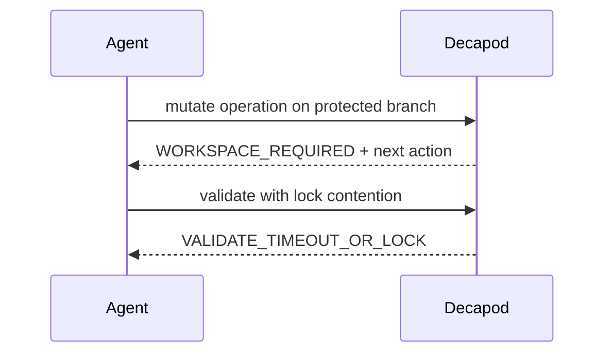

# Architecture

## Direction
Decapod is an on-demand control-plane runtime. It enforces workflow invariants around workspace isolation, task state transitions, and proof-backed completion while preserving deterministic local-first state.

## Current Facts
- Runtime/languages: rust
- Detected surfaces/framework hints: cargo, cli, rpc
- Product type: control-plane service_or_cli

## Topology

## Store Boundaries

## Happy Path Sequence

## Error Path

## Execution Path
`intent -> context.resolve -> workspace.ensure -> task lifecycle -> implementation -> validate -> evidence -> completion`

## Concurrency and Runtime Model
- Execution model: single-process daemonless command execution.
- Isolation boundaries: per-task git worktrees and store-mode boundary.
- Backpressure strategy: bounded validation runtime + typed timeout failures.
- Synchronization: SQLite transaction boundaries + append-only event logs.

## Deployment Topology
- Runtime units: local binary invocation in developer/CI environments.
- Environment model: repo-scoped state + optional user-global state.
- Rollout strategy: standard branch/PR flow with validate gate before promotion.
- Rollback trigger: any blocking gate failure or proof artifact mismatch.

## Data and Contracts
- Inbound contracts: CLI command schema and RPC op schema.
- Outbound dependencies: filesystem, git worktree, SQLite, JSONL ledgers.
- Data ownership boundaries: task/session/workunit ownership explicit in repo store.
- Schema evolution: additive-first with deterministic schema export and migration checks.

## ADR Register
| ADR | Title | Status | Rationale | Date |
|---|---|---|---|---|
| ADR-001 | Daemonless runtime model | Accepted | deterministic invocation and low operational burden | 2026-02-26 |
| ADR-002 | Strict workspace interlock | Accepted | protect main/master and preserve reviewability | 2026-02-26 |

## Delivery Plan (first 3 slices)
- Slice 1: scaffold-v2 specs + validation awareness.
- Slice 2: machine-checkable docs/diagram/changelog proof gates.
- Slice 3: CI evidence aggregation and stricter promotion policy.

## Risks and Mitigations
| Risk | Likelihood | Impact | Mitigation |
|---|---|---|---|
| Spec drift from implementation | Medium | High | enforce spec-drift gate and update discipline |
| Validation performance contention | Medium | Medium | lock-aware retries and bounded execution |
| Interface growth complexity | Medium | High | ADR discipline + typed error taxonomy |
