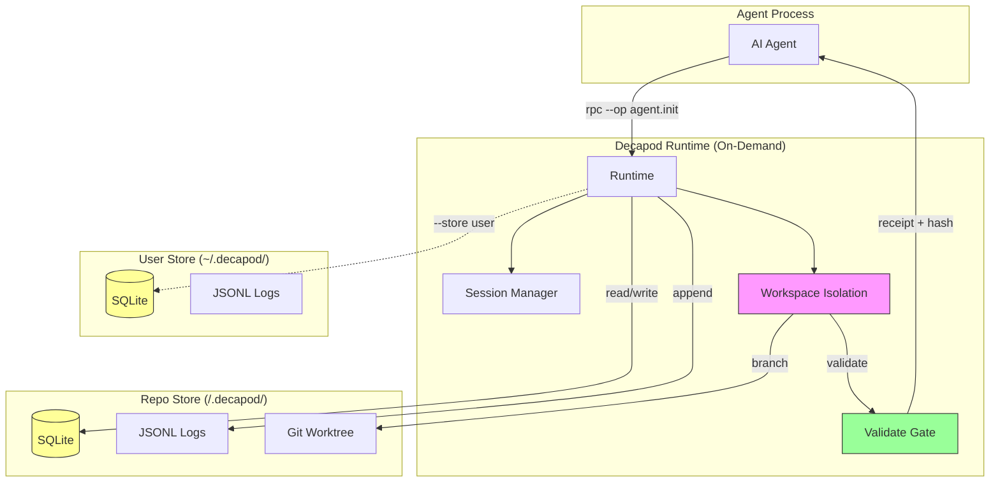
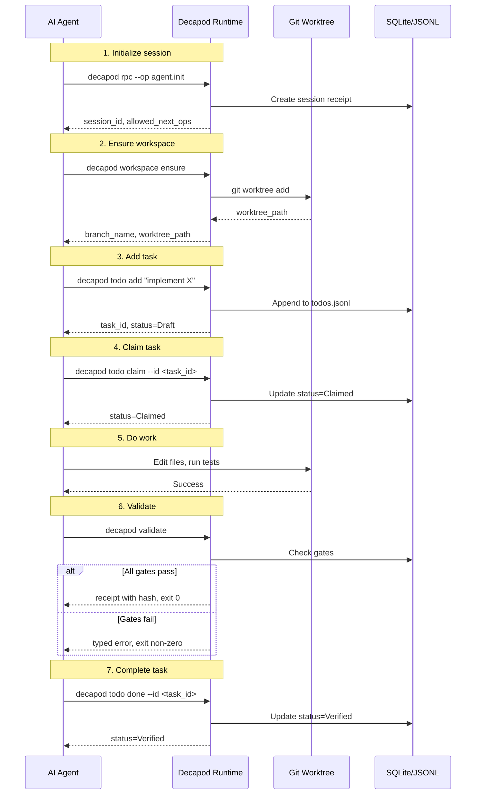
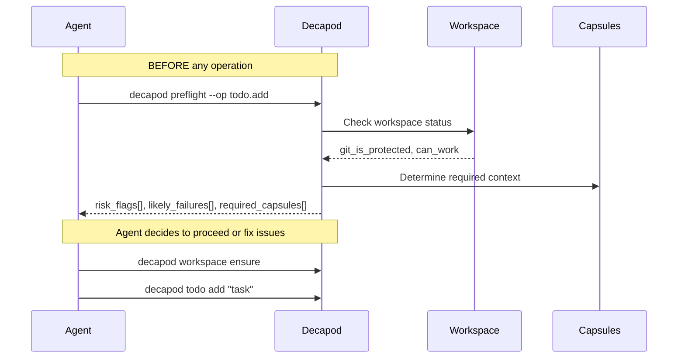
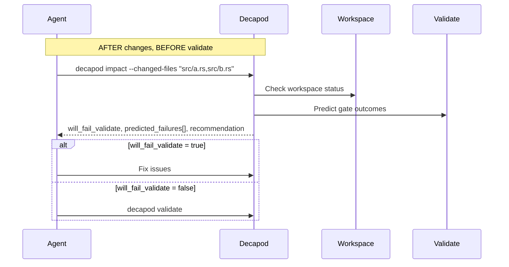
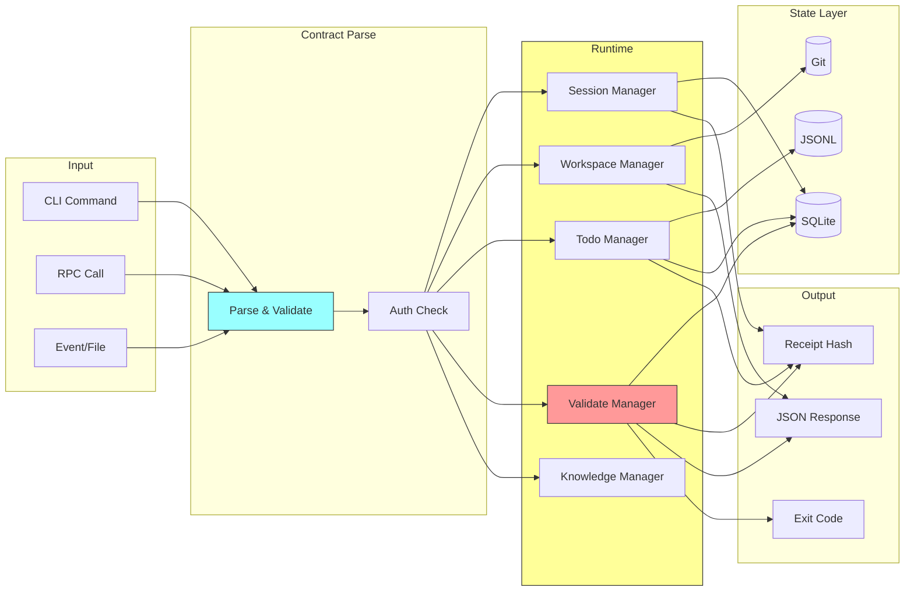
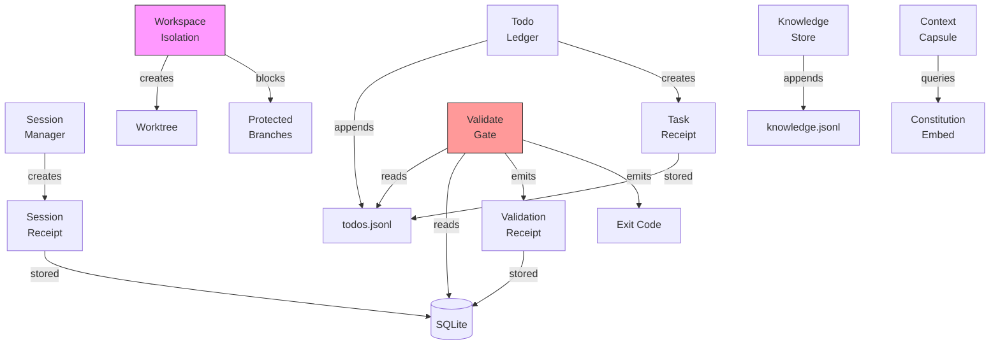

# Architecture

## Direction

Composable repository architecture with explicit boundaries and proof-backed delivery invariants. Decapod is a daemonless control plane for AI coding agents - invoked on-demand, exits immediately after, state persists locally.

## Current Facts

- Runtime/languages: rust
- Detected surfaces/framework hints: cargo
- Product type: service_or_library

## Topology

```mermaid
Human Intent
  │
  ▼
AI Agent (Claude/Codex/Gemini/Cursor)
  │
  │ decapod rpc --op agent.init
  ▼
Decapod Runtime (On-Demand)
  ├── Session Manager
  ├── Workspace Isolation
  ├── Todo Ledger
  ├── Validate Gates
  ├── Knowledge Store
  └── Context Capsule
  │
  ▼
Repository + Services
  ├── Git worktree (.decapod/workspaces/*)
  ├── SQLite ledger (.decapod/data/*.db)
  └── Constitution embedded in binary
```

### System Topology with Store Boundaries



### Happy Path Sequence



### Preflight Before Operation



### Impact Before Validate



## Execution Path

```
Input/Event --> Contract Parse --> Session Init --> Workspace Isolation
      |              |                  |                  |
      +--------------+------------------+------------------+
                        Trace + Metrics + Artifacts
```

### Detailed Data Flow



1. **Agent Initialization**: `decapod rpc --op agent.init` creates session
2. **Workspace Check**: `decapod workspace ensure` creates isolated worktree
3. **Task Tracking**: `decapod todo add/claim/done` with event sourcing
4. **Validation**: `decapod validate` produces proof receipt

### Component Interaction Map



## Data and Contracts

### Inbound Contracts (CLI/API/events)

- CLI: `decapod <command>` with subcommands
- RPC: `decapod rpc --op <operation> --params <json>`
- Events: File-based ledger appends

### Outbound Dependencies (datastores/queues/external APIs)

- SQLite: `.decapod/data/*.db` for persistent state
- JSONL: `.decapod/data/*.jsonl` for event logs
- Git: Worktree management via `git worktree`

### Data Ownership Boundaries

- User store: `~/.decapod/` - personal blank-slate tasks
- Repo store: `<repo>/.decapod/` - project dogfood backlog
- Strict separation: no cross-contamination

## Service Contracts

| Component | Responsibility | CLI Surface | Schema |
|-----------|---------------|-------------|--------|
| Session Manager | Track agent session lifecycle | `decapod session` | Session receipt |
| Workspace Isolation | Enforce branch protection + worktree | `decapod workspace` | Branch state |
| Todo Ledger | Event-sourced task tracking | `decapod todo` | todos.jsonl |
| Validate Gate | Deterministic completion proof | `decapod validate` | Gate results |
| Knowledge Store | Repository knowledge + provenance | `decapod data knowledge` | SQLite |
| Context Capsule | Scoped constitution query | `decapod govern capsule` | Deterministic hash |

## Delivery Plan

1. **Slice 1**: Core session + workspace + todo + validate
2. **Slice 2**: Knowledge store + context capsules
3. **Slice 3**: Policy enforcement + eval gates

## Risks and Mitigations

- **Risk**: Store contamination between user/repo
  - **Mitigation**: Explicit --store flag, validation gates

- **Risk**: Validation hangs under DB contention
  - **Mitigation**: Bounded timeout with typed error (`VALIDATE_TIMEOUT_OR_LOCK`)

- **Risk**: Agent works on main/master
  - **Mitigation**: Workspace enforcement blocks this

- **Risk**: Scope creep beyond daemonless on-demand model
  - **Mitigation**: Constitution documents non-goals explicitly
