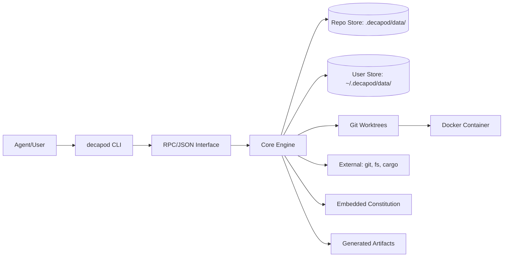
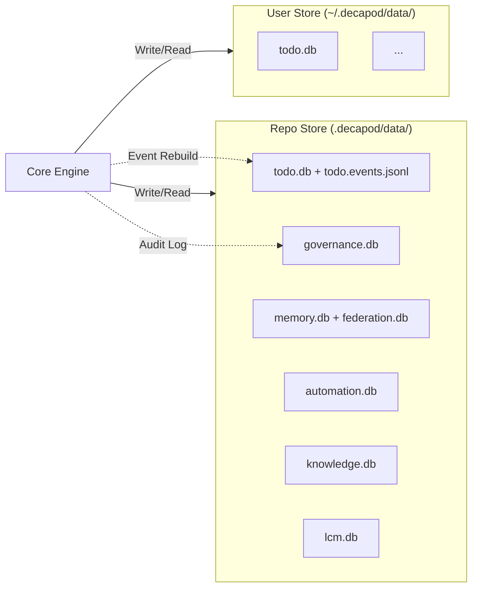
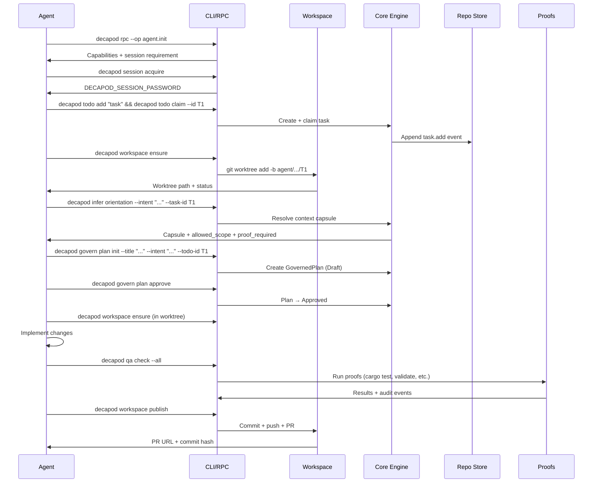
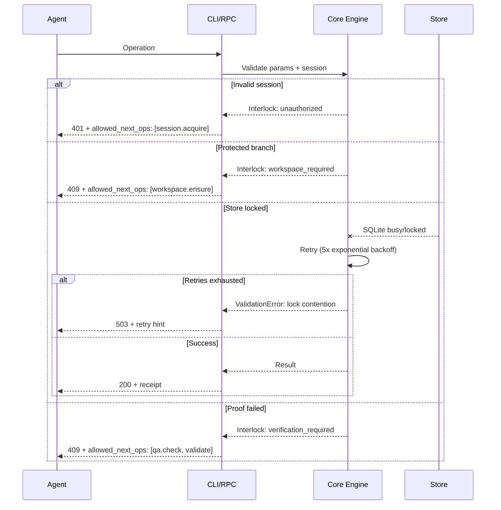

# Architecture

<!-- decapod:capability-overlay:persistent-state:start -->

## Persistent State Architecture Overlay

### State Ownership
- Each entity type MUST have a designated state owner
- State ownership boundaries MUST be explicitly documented
- Cross-boundary state access MUST go through defined interfaces

### Transaction Boundaries
- All multi-entity mutations MUST occur within explicit transactions
- Transaction boundaries MUST be documented in ARCHITECTURE.md
- Compensating transactions for distributed operations

### Storage Abstraction
- Storage ownership, consistency behavior, and access boundaries MUST be explicit
- Portability or swappable implementations are project decisions, not universal requirements
- Migration and rollback treatment MUST match the selected storage technology
<!-- decapod:capability-overlay:persistent-state:end -->

## Direction
CLI governance runtime with dual-store architecture, git worktree isolation, and deterministic context management.

## What This Project Is
Decapod is a Rust CLI governance kernel for AI agents. It runs on-demand (daemonless), manages project-scoped state in SQLite with event sourcing, enforces workspace isolation via git worktrees and optional Docker containers, and provides deterministic context capsules for inference governance.

**Architectural Principles:**
- **Daemonless**: No background processes; invoked by agents on demand (INV-DAEMONLESS)
- **Dual-Store**: User (blank-slate) + Repo (dogfood backlog, event-sourced, deterministic rebuild)
- **Workspace Isolation**: Git worktrees mandatory; containers optional but gated
- **Deterministic**: Same inputs → identical outputs; event logs enable full rebuild
- **Capability-Gated**: External actions (git, docker, fs) require declared capabilities

## Capability Ownership

Declared capabilities are repository-shaping context, not a closed feature taxonomy. The current codebase owns authentication and authorization boundaries, durable SQLite/JSONL state, event-ledger rebuilds, workflow and scheduled automation, external tool integrations, and stable CLI/JSON-RPC interfaces. Each surface must retain an explicit owner, invariant, and proof path; capability labels must not silently select storage, queue, deployment, or service-level architecture.

Persistent state is proven by the configured `[repo.migration_validation]` command in `.decapod/config.toml`; migration directory presence is discovery evidence only.
- **Interface Abstraction**: Agents access `.decapod/` only via CLI (INV-STORE-BOUNDARY)

## Current Facts
- **Runtime**: Rust 1.96.1, edition 2024
- **Build**: Cargo with `cargo-dist` for multi-platform binaries
- **Primary binary**: `decapod`
- **State**: 6 SQLite databases ("bins") + JSONL event logs in `.decapod/data/`
- **Config**: `.decapod/config.toml` (schema_version 1.0.0)
- **Generated**: `.decapod/generated/{specs,context,policy,artifacts}`

## Architecture Map
```
src/
├── bin/                    # Entry points (decapod, selective-test)
├── cli.rs                  # All clap command definitions
├── lib.rs                  # Library root, module exports, init logic
├── constitution/           # Embedded constitution graph routing
│   ├── core.rs             # Core runtime surfaces
│   ├── interfaces.rs       # Interface contracts
│   ├── methodology.rs      # Methodology nodes
│   └── specs.rs            # Specs nodes
├── core/                   # Control plane runtime
│   ├── mod.rs              # Core module exports
│   ├── db.rs               # SQLite connections, WAL, health preflight
│   ├── schemas.rs          # All 6 bin schemas (centralized)
│   ├── store.rs            # Store abstraction (User/Repo, root discovery)
│   ├── workspace.rs        # Git worktree + container isolation
│   ├── todo.rs             # Task tracking + event sourcing + agent coordination
│   ├── plan_governance.rs  # Governed Plan (Draft→Approved→Executing→Done)
│   ├── workunit.rs         # WorkUnit manifests (intent/spec/state/proof)
│   ├── obligation.rs       # Obligation graph (derived status, deps, proofs)
│   ├── context_capsule.rs  # Deterministic capsules + policy binding
│   ├── capsule_policy.rs   # Risk-tiered token budgets, repo-revision binding
│   ├── validate.rs         # Multi-gate validation harness
│   ├── proof.rs            # Configurable proof registry + audit
│   ├── assurance.rs        # Interlock engine + advisory/attestation
│   ├── rpc.rs              # JSON-RPC envelope + capabilities
│   ├── flight_recorder.rs  # Governance timeline from event logs
│   ├── migration.rs        # Schema migrations
│   ├── assets.rs           # Embedded constitution docs
│   ├── docs.rs             # Document fragment resolution
│   ├── broker.rs           # Audit log broker (thin waist)
│   ├── state_commit.rs     # Cryptographic state commitments
│   ├── container_runtime.rs # Docker/podman detection + build
│   ├── ulid.rs             # ULID generation
│   ├── time.rs             # Epoch-Z timestamps
│   ├── error.rs            # Error types + auto-remediable codes
│   ├── output.rs           # Structured output formatting
│   ├── trace.rs            # Trace export
│   └── ...                 # Additional subsystems (health, gatekeeper, etc.)
└── plugins/                # Plugin subsystems
    ├── mod.rs
    ├── aptitude.rs         # Preferences + patterns + observations
    ├── archive.rs          # Session archives (MOVE-not-TRIM)
    ├── container.rs        # Ephemeral container execution
    ├── context.rs          # Lossless Context Management (LCM)
    ├── cron.rs             # Scheduled tasks
    ├── decide.rs           # Architecture decision prompting
    ├── doctor.rs           # Preflight health checks
    ├── eval.rs             # Variance-aware evaluation gates
    ├── federation.rs       # Governed knowledge graph (multi-repo)
    ├── feedback.rs         # Operator feedback ledger
    ├── gatling.rs          # CLI regression testing
    ├── health.rs           # Claims + proof events + health cache
    ├── heartbeat.rs        # Agent presence + autoclaim
    ├── internalize.rs      # Deterministic summaries + replay
    ├── knowledge.rs        # Project knowledge base
    ├── lcm.rs              # LCM CLI
    ├── map_ops.rs          # Deterministic map operators
    ├── policy.rs           # Risk policy + approvals
    ├── primitives.rs       # Markdown-native primitive layer
    ├── reflex.rs           # Event-driven automation
    ├── verify.rs           # Proof replay + drift checks
    ├── watcher.rs          # Integrity watchlist
    └── workflow.rs         # Workflow automation
```

## Data Flows
```mermaid
flowchart TD
  A[Agent Invocation] --> B[CLI / RPC Entrypoint]
  B --> C{Session Valid?}
  C -->|No| D[Block: Acquire Session]
  C -->|Yes| E[Route to Subsystem]
  E --> F[Workspace Check]
  F -->|Protected/Main| G[Block: workspace.ensure]
  F -->|Valid Worktree| H[Core Execution]
  H --> I[SQLite Write (WAL)]
  I --> J[JSONL Event Append]
  J --> K[Receipt + Context Capsule]
  K --> L[Allowed Next Ops / Interlock]
  L --> M[Agent Response]
```

**Key Flows:**
1. **Inbound**: CLI args or JSON-RPC stdin → validation → subsystem dispatch
2. **Workspace**: `workspace.ensure` → git worktree add → optional container build → status return
3. **Context**: `infer orientation` → resolve constitution fragments → deterministic capsule → policy binding
4. **Governance**: `plan.init` → `plan.approve` → `workunit.init` → execute → proofs → `workunit.verified`
5. **State**: SQLite WAL writes + JSONL append → deterministic rebuild available
6. **Validation**: Multi-gate pipeline (workspace, store, schema, entrypoints, specs, proofs) → report

## Strongest Existing Primitives
| Primitive | Location | Purpose |
|-----------|----------|---------|
| `Store` | `core/store.rs` | Dual-store abstraction (User/Repo) with root discovery |
| `WorkspaceStatus` | `core/workspace.rs` | Git + container status, blockers, allowed ops |
| `Todo` + events | `core/todo.rs` | Task CRUD, claims, event sourcing, deterministic rebuild |
| `GovernedPlan` | `src/plan_governance.rs` | State machine with scope constraints, ordered phases, and proof gates |
| `WorkUnitManifest` | `core/workunit.rs` | Intent/spec/state/proof chain with canonical hashing |
| `ObligationNode` | `core/obligation.rs` | Dependency graph, derived status, proof gating |
| `DeterministicContextCapsule` | `core/context_capsule.rs` | Immutable sources + snippets, SHA256 hash, policy binding |
| `CapsulePolicyBinding` | `core/capsule_policy.rs` | Risk tiers, scope allowlists, repo-revision binding |
| `ValidationContext` | `core/validate.rs` | Gate timing, pass/fail/warn counts, auto-remediable errors |
| `RpcResponse` | `core/rpc.rs` | Standard envelope: receipt, capsule, allowed_ops, interlock |
| `AssuranceEngine` | `core/assurance.rs` | Interlock resolution, advisory, attestation |
| `FlightRecorder` | `core/flight_recorder.rs` | Timeline from broker/todo/federation/proof event logs |

## Topology

```mermaid
flowchart LR
  U[Agent/User] --> C[decapod CLI]
  C --> R[RPC/JSON Interface]
  R --> E[Core Engine]
  E --> S1[(Repo Store: .decapod/data/)]
  E --> S2[(User Store: ~/.decapod/data/)]
  E --> W[Git Worktrees]
  W --> D[Docker Container]
  E --> X[External: git, fs, cargo]
  E --> P[Embedded Constitution]
  E --> G[Generated Artifacts]
```

## Store Boundaries

```mermaid
flowchart LR
  subgraph Repo_Store["Repo Store (.decapod/data/)"]
    direction TB
    T1[todo.db + todo.events.jsonl]
    T2[governance.db]
    T3[memory.db + federation.db]
    T4[automation.db]
    T5[knowledge.db]
    T6[lcm.db]
  end

  subgraph User_Store["User Store (~/.decapod/data/)"]
    direction TB
    U1[todo.db]
    U2[...]
  end

  C[Core Engine] -->|Write/Read| Repo_Store
  C -->|Write/Read| User_Store
  C -.->|Event Rebuild| T1
  C -.->|Audit Log| T2
```

**Invariants:**
- All Decapod state scoped to `.decapod/data/` (Repo) or `~/.decapod/data/` (User)
- No state files in project root (enforced by validation gate)
- Event logs are append-only; SQLite is deterministic rebuild target
- Broker log (`broker.events.jsonl`) is the "thin waist" for mutation audit

## Happy Path Sequence

```mermaid
sequenceDiagram
  participant A as Agent
  participant C as CLI/RPC
  participant W as Workspace
  participant E as Core Engine
  participant S as Repo Store
  participant P as Proofs

  A->>C: decapod rpc --op agent.init
  C->>A: Capabilities + session requirement
  A->>C: decapod session acquire
  C->>A: DECAPOD_SESSION_PASSWORD
  A->>C: decapod todo add "task" && decapod todo claim --id T1
  C->>E: Create + claim task
  E->>S: Append task.add event
  A->>C: decapod workspace ensure
  C->>W: git worktree add -b agent/.../T1
  W->>A: Worktree path + status
  A->>C: decapod infer orientation --intent "..." --task-id T1
  C->>E: Resolve context capsule
  E->>A: Capsule + allowed_scope + proof_required
  A->>C: decapod govern plan init --title "..." --intent "..." --todo-id T1
  C->>E: Create GovernedPlan (Draft)
  A->>C: decapod govern plan approve
  C->>E: Plan → Approved
  A->>C: decapod workspace ensure (in worktree)
  A->>A: Implement changes
  A->>C: decapod qa check --all
  C->>P: Run proofs (cargo test, validate, etc.)
  P->>C: Results + audit events
  A->>C: decapod workspace publish
  C->>W: Commit + push + PR
  W->>A: PR URL + commit hash
```

## Error Path

```mermaid
sequenceDiagram
  participant A as Agent
  participant C as CLI/RPC
  participant E as Core Engine
  participant S as Store

  A->>C: Operation
  C->>E: Validate params + session
  alt Invalid session
    E-->>C: Interlock: unauthorized
    C-->>A: 401 + allowed_next_ops: [session.acquire]
  else Protected branch
    E-->>C: Interlock: workspace_required
    C-->>A: 409 + allowed_next_ops: [workspace.ensure]
  else Store locked
    S--xE: SQLite busy/locked
    E->>E: Retry (5x exponential backoff)
    alt Retries exhausted
      E-->>C: ValidationError: lock contention
      C-->>A: 503 + retry hint
    else Success
      E-->>C: Result
      C-->>A: 200 + receipt
    end
  else Proof failed
    E-->>C: Interlock: verification_required
    C-->>A: 409 + allowed_next_ops: [qa.check, validate]
  end
```

## Execution Path
```
Ingress parse + validation:
  ├── CLI: clap derives in cli.rs → dispatch in lib.rs
  ├── RPC: stdin JSON → RpcRequest → op router → typed params
  └── Session: DECAPOD_SESSION_PASSWORD → broker verify

Policy/interlock checks (assurance engine):
  ├── Workspace: protected branch? in worktree? container ready?
  ├── Store boundary: .decapod/data/ access via CLI only?
  ├── Completion phase: proofs run? validation passed?
  └── Mandatory decisions: auth touched? contradictions unresolved?

Core execution + persistence:
  ├── SQLite WAL write (5s busy_timeout)
  ├── JSONL event append (broker, todo, federation, proof, etc.)
  └── Deterministic rebuild available from events

Verification and artifact emission:
  ├── Receipt: op, timestamp, inputs_hash, outputs_hash, touched_paths
  ├── Context capsule: deterministic fragments + policy binding
  ├── Allowed next ops: capability-gated suggestions
  ├── Interlock (if blocked): code, message, unblock_ops, evidence
  └── Attestation: input_hash, interlock_code, outcome, trace_path
```

## Concurrency and Runtime Model
- **Execution model**: Single-threaded CLI invocation per agent; no background threads
- **Isolation boundaries**:
  - Git worktrees (mandatory for agent work)
  - Docker containers (optional, gated by elevated permissions)
  - Store kind separation (User vs Repo)
- **Backpressure strategy**: SQLite busy_timeout (5s repo, 2s validate) + exponential retry (5 retries, 50ms base)
- **Shared state synchronization**:
  - Event logs are append-only (concurrent reads safe)
  - SQLite WAL allows concurrent read + single write
  - Broker verifies audit log integrity on validate
  - No distributed locking; local filesystem only

## Deployment Topology
- **Runtime units**: Single binary `decapod` per host; no server component
- **Distribution**: `cargo-dist` builds for x86_64/aarch64 Linux + macOS
- **Installation**: `cargo install decapod` or prebuilt binaries
- **Configuration**: `.decapod/config.toml` per repository
- **Rollout**: Binary replacement; no migration needed (schema auto-migrates)
- **Rollback**: Previous binary in PATH; schema migrations are additive
- **Blast radius**: Local repository only; no cross-repo state (except experimental federation)

## Data and Contracts

### Inbound Contracts
| Surface | Format | Validation |
|---------|--------|------------|
| CLI | clap positional/flags | clap validation + custom in dispatch |
| RPC stdin | JSON (RpcRequest) | Serde deserialize + op router |
| Session | DECAPOD_SESSION_PASSWORD env | Broker verification |

### Outbound Dependencies
| Dependency | Purpose | Contract |
|------------|---------|----------|
| git | Worktree management, status, publish | CLI subprocess; capability `VcsRead`/`VcsWrite` |
| docker/podman | Container workspace build/exec | CLI subprocess; capability `ContainerExec` |
| cargo | Test, build, clippy, fmt | CLI subprocess; capability `CargoExec` |
| curl | crates.io version check | HTTP GET; 2s timeout |
| filesystem | Config, state, artifacts | Capability `FsRead`/`FsWrite` |

### Data Ownership Boundaries
| Data | Owner | Mutation Path |
|------|-------|---------------|
| todo.db + events | Repo store | `todo.*` CLI/RPC → broker → SQLite + JSONL |
| governance.db | Repo store | `govern.*`, `obligation.*`, `health.*` |
| memory.db / federation.db | Repo store | `data knowledge/federation`, `decide.*` |
| automation.db | Repo store | `auto cron/reflex` |
| knowledge.db | Repo store | `data knowledge add/search/promote` |
| lcm.db | Repo store | `data context ingest/summarize` |
| WorkUnit manifests | `.decapod/governance/workunits/` | `govern workunit.*` |
| Plan artifact | `.decapod/governance/plan.json` | `govern plan.*` |
| Context capsules | `.decapod/generated/context/` | `infer.*`, `govern capsule.*` |
| Capsule policy | `.decapod/generated/policy/` or override | `init`, `scaffold` |

### Schema Evolution + Migration Policy
- **Schema versioning**: Per-bin `meta.schema_version` + centralized `schemas.rs` constants
- **Migration**: Additive only (new tables, indexes, columns with defaults)
- **Validation gate**: `validate_repo_store_dogfood` rebuilds from events + compares fingerprint
- **Backward compatibility**: Read-only validate connections use `query_only` + `temp_store=MEMORY`
- **Breaking changes**: Require schema version bump + migration fn in `migration.rs`

## ADR Register
| ADR | Title | Status | Rationale | Date |
|-----|-------|--------|-----------|------|
| ADR-001 | Daemonless CLI architecture | Accepted | Agents invoke on demand; zero idle cost | 2024-Q1 |
| ADR-002 | Dual-store (User/Repo) | Accepted | Blank-slate agent state + project dogfood backlog | 2024-Q1 |
| ADR-003 | SQLite WAL + JSONL event sourcing | Accepted | Deterministic rebuild, audit trail, concurrency | 2024-Q1 |
| ADR-004 | Git worktree isolation (mandatory) | Accepted | Protect human env; agent work in `.decapod/workspaces/` | 2024-Q2 |
| ADR-005 | Container workspace (optional, gated) | Accepted | Reproducible builds; elevated permissions required | 2024-Q2 |
| ADR-006 | Embedded constitution (assets/) | Accepted | Zero-config methodology; versioned with binary | 2024-Q3 |
| ADR-007 | JSON-RPC with standard envelope | Accepted | Agent-native; receipt + capsule + interlock | 2024-Q3 |
| ADR-008 | Deterministic context capsules | Accepted | Immutable sources + SHA256 hash + policy binding | 2024-Q3 |
| ADR-009 | Capability-gated external actions | Accepted | Supply-chain attack surface reduction | 2024-Q4 |
| ADR-010 | Obligation graph with derived status | Accepted | No asserted completion; proof-gated dependencies | 2025-Q1 |
| ADR-011 | Validation as release gate (not theater) | Accepted | Blocking gates + auto-remediable errors + evidence | 2025-Q1 |

## Delivery Plan (First 3 Slices)
| Slice | Scope | Status |
|-------|-------|--------|
| 1 | Daemonless CLI, dual-store, todo event sourcing, git worktrees, basic validate | ✅ Done |
| 2 | Plan governance, WorkUnit, obligation graph, context capsules, capsule policy | ✅ Done |
| 3 | Inference governance (orientation/validate/budget), assurance engine, flight recorder, JSON-RPC | ✅ Done |
| 4 (next) | Federation trust model, cloud sync protocol, long-term capsule tiering | 🔄 Planned |

## Risks and Mitigations
| Risk | Likelihood | Impact | Mitigation |
|------|------------|--------|------------|
| SQLite lock contention under concurrent agents | Medium | High | WAL mode, 5s busy_timeout, 5 retries exponential backoff, validate read-only connections |
| Contract drift across CLI/RPC/embedded docs | Medium | High | `validate` gates: entrypoint invariants, specs sync, schema checks, interface conformance tests |
| Workspace isolation bypass | Low | High | Protected branch gate, worktree enforcement, container gating, `.decapod/` CLI-only jail rule |
| Capsule policy drift (repo revision mismatch) | Medium | Medium | Policy binding includes `repo_revision`; validate gate checks lineage |
| Schema migration failure | Low | High | Additive-only migrations; deterministic rebuild verification gate |
| Agent session token leakage | Low | High | Per-agent `DECAPOD_SESSION_PASSWORD`; broker verification; short TTL |

<!-- decapod:codebase-attestation:start -->
## Codebase Attestation

- Repository signal fingerprint: `b4d094742c96fe993853e27ef3f1a2de1000f81fbaf202222ade966a9cc04daa`
- Significant implementation surfaces: `.github/` (8 files), `Cargo.lock/` (1 files), `Cargo.toml/` (1 files), `README.md/` (1 files), `docs/` (1 files), `src/` (90 files), `tests/` (4 files)
- Refreshed from the current codebase by `decapod specs.refresh`
<!-- decapod:codebase-attestation:end -->
