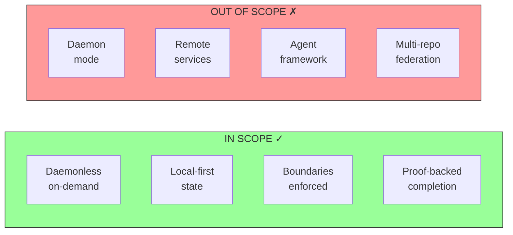

# Intent

## Product Outcome

Decapod is a **daemonless, local-first control plane for AI coding agents**. Agents invoke it on-demand to turn implicit human intent into explicit context, enforce boundaries, and produce proof-backed completion evidence.

### Product View

```mermaid
flowchart TB
    subgraph Human["Human Intent"]
        H[Natural Language Request]
    end

    subgraph Agent["AI Agent Loop"]
        A[Agent Process]
    end

    subgraph Decapod["Decapod Control Plane"]
        D[Runtime<br/>(on-demand process)]
        S[Session Manager]
        W[Workspace Isolation]
        T[Todo Ledger]
        V[Validate Gate]
        K[Knowledge Store]
        C[Context Capsule]
    end

    subgraph Boundary["Store Boundary"]
        direction LR
        US[User Store<br/>~/.decapod]
        RS[Repo Store<br/><repo>/.decapod]
    end

    H --> A
    A -->|"rpc --op agent.init"| D
    A -->|"cli commands"| D
    
    D --> S
    D --> W
    D --> T
    D --> V
    D --> K
    D --> C
    
    D -->|workspace.ensure| W
    W -->|"isolated branch"| W
    
    D -->|todo events| T
    T -->|receipt hash| A
    
    D -->|validate| V
    V -->|proof receipt| A
    
    D <-->|store boundary| Boundary
    
    style D fill:#9f9,stroke:#333
    style V fill:#f99,stroke:#333
    style Boundary fill:#ff9,stroke:#333
```

## Scope

### In Scope

| Capability | Proof Surface |
|------------|---------------|
| Session management | `decapod session acquire` / `decapod session status` |
| Workspace isolation | `decapod workspace ensure` creates branch in `.decapod/workspaces/` |
| Task tracking | `decapod todo add/claim/done/list` with event-sourced ledger |
| Validation gates | `decapod validate` returns pass/fail with typed errors |
| Preflight check | `decapod preflight --op <op>` predicts failures before operation |
| Impact analysis | `decapod impact --changed-files <files>` predicts validate outcomes |
| Knowledge management | `decapod data knowledge add/search/promote` |
| Context capsules | `decapod govern capsule query` returns deterministic scoped docs |
| Policy enforcement | `decapod govern policy` risk classification |
| Health monitoring | `decapod govern health summary` |

### Out of Scope

- **Agent framework**: Decapod does not generate prompts or manage agent loops
- **Daemon mode**: No background process; strictly on-demand invocation
- **Remote services**: All state is local-first; no cloud dependency for core function
- **Multi-repo federation**: Federation is knowledge-graph scoped, not cross-repo state sync

### Non-Goals Visualized



## Constraints

### Technical Constraints

- Single-process invocation model (no daemon)
- SQLite-backed local storage
- Embedded constitution (no external fetching)
- Bounded execution for all validation gates

### Operational Constraints

- Must not pollute user store from repo store
- Must enforce workspace isolation (no main/master mutation)
- All state changes must produce receipt hashes

## Non-Goals (Falsifiable)

| Claim | Verification |
|-------|--------------|
| Decapod never runs in background | No daemon code paths; process exits after each invocation |
| Same inputs produce same outputs | Deterministic schema: `decapod data schema --deterministic` |
| No store contamination | User store (`~/.decapod`) and repo store (`<repo>/.decapod/`) are separate |
| Workspace isolation enforced | Cannot work on main/master; `decapod workspace ensure` required |

## Acceptance Criteria

1. **Installation**: `cargo install decapod && decapod init` succeeds in empty directory
2. **Session**: `decapod session acquire` produces session receipt
3. **Workspace**: `decapod workspace ensure` creates isolated branch in worktree
4. **Task lifecycle**: `decapod todo add` → `claim` → `done` persists to SQLite ledger
5. **Validation gate**: `decapod validate` exits 0 on clean repo, non-zero with typed errors otherwise
6. **Proof receipt**: Validation output includes hashes, touched paths, gate results
7. **Preflight check**: `decapod preflight --op validate` on protected branch returns `WORKSPACE_REQUIRED` + next action
8. **Impact analysis**: `decapod impact --changed-files <files>` on protected branch predicts `will_fail_validate: true`

## First Implementation Slice

1. `decapod init` - scaffold `.decapod/`, create entrypoints
2. `decapod session acquire` - establish agent session with receipt
3. `decapod workspace ensure` - create isolated worktree
4. `decapod todo add/claim/done` - task lifecycle with event sourcing
5. `decapod validate` - deterministic validation gate
