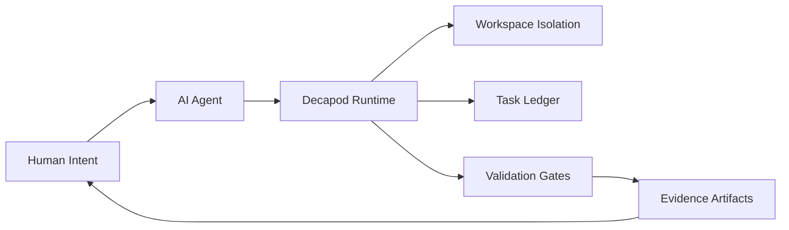

# Intent

## Product Outcome
Decapod is a daemonless local-first control plane that enforces agent workflow discipline so outputs converge on explicit user intent with machine-verifiable proof.

## Product View

## Inferred Baseline
- Repository: decapod
- Product type: control-plane CLI + RPC runtime
- Primary languages: rust
- Detected surfaces: CLI commands, RPC operations, gatekeeper/validate, workspaces

## Scope
| Area | In Scope | Proof Surface |
|---|---|---|
| Intent convergence | Force explicit intent, scope, and done criteria | `decapod context.resolve`, specs drift checks |
| Industry-grade output | Architecture/docs/changelog/tests gate promotion | `decapod validate`, CI checks |
| Agent safety interlocks | Workspace/session/verification/store boundaries | typed interlock codes in validate/preflight |

## Non-Goals (Falsifiable)
| Non-goal | How to falsify |
|---|---|
| Act as an agent framework | If Decapod starts generating prompts/agent loops |
| Permit work on protected branches | If mutate operations succeed on main/master |
| Promote without proof | If done/publish succeeds with failed validation |

## Constraints
- Technical: daemonless process model, deterministic schema and receipts.
- Operational: task ownership, workspace isolation, and evidence-linked completion.
- Security/compliance: strict store boundaries and explicit sensitive-data controls.

## Acceptance Criteria (must be objectively testable)
- [ ] User intent is resolved into scoped actionable context before implementation.
- [ ] `cargo test`, `cargo clippy -- -D warnings`, and `cargo fmt --check` pass.
- [ ] `decapod validate` passes locally and in CI.
- [ ] Architecture diagram, docs, and changelog updates are present for behavioral changes.
- [ ] Completion records link to proof artifacts and typed gate outcomes.

## Tradeoffs Register
| Decision | Benefit | Cost | Review Trigger |
|---|---|---|---|
| Strict governance interlocks | Higher output quality and auditability | Added workflow overhead | contributor friction spikes |
| Local-first state | Reliability and privacy | reduced cloud-native centralization | federation requirements increase |

## First Implementation Slice
- [ ] initialize session/workspace/task lifecycle with typed failure semantics.
- [ ] wire validation gate as blocking precondition for completion.
- [ ] attach provenance artifacts for promotion-ready outputs.

## Open Questions (with decision deadlines)
| Question | Owner | Deadline | Decision |
|---|---|---|---|
| Which new gates should be blocking vs warning by default? | Core maintainers | 2026-03-15 | |
| Which CI evidence artifacts are required for release PRs? | Release owner | 2026-03-22 | |
