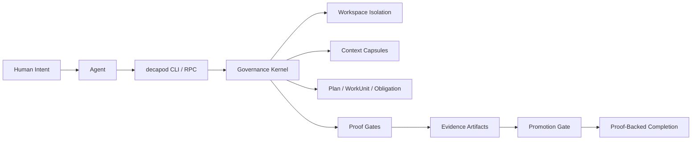

# Intent

<!-- decapod:declared-capabilities:start -->

## Declared Capability Surfaces

- `agent-helper`
- `authentication`
- `authorization`
- `background-processing`
- `control-plane`
- `event-driven`
- `external-integrations`
- `governance-kernel`
- `persistent-state`
- `scheduled-jobs`

<!-- decapod:declared-capabilities:end -->
## Product Outcome
Decapod is the daemonless, local-first governance kernel behind AI coding agents. Agents call it on demand to converge on human intent, shape context before inference, enforce boundaries, and deliver proof-backed completion across concurrent multi-agent work.

## What This Project Is
Decapod is a Rust CLI project that implements a governance runtime for AI agents. It provides:

**Core Runtime:**
- Daemonless CLI invoked by agents on demand (no background processes)
- Dual-store architecture: User store (blank-slate agent-local state) + Repo store (project-scoped dogfood backlog with event sourcing)
- SQLite-backed state with deterministic rebuild from JSONL event logs
- Git worktree isolation + optional Docker container execution for agent workspaces
- Session-token authentication with per-agent passwords (DECAPOD_SESSION_PASSWORD)

**Governance Primitives:**
- **Plan**: Governed execution artifacts with state machine (Draft → Annotating → Approved → Executing → Done)
- **WorkUnit**: Intent/spec/state/proof chain manifests per task with deterministic hashing
- **Obligation Graph**: Dependency-aware, proof-gated work units with derived status (never asserted)
- **Proof System**: Configurable executable checks (cargo test, validate, custom) with audit trail

**Context & Inference Control:**
- Deterministic Context Capsules: immutable originals + structured summaries with cryptographic hashes
- Capsule Policy: risk-tiered token budgets, scope allowlists, write permissions bound to repo revision
- Inference Governance: `infer orientation` (pre-inference context packet), `infer validate` (post-inference verification), `infer budget` (token estimation)
- Preflight/Impact: predict validation failures and validation outcomes for changed files

**Agent Interface:**
- JSON-RPC over stdin/stdout with standard envelope (receipt, context_capsule, allowed_next_ops, blocked_by, interlock, advisory, attestation)
- Capabilities discovery via `decapod capabilities` / `decapod rpc --op agent.init`
- Constitution graph queries (`constitution get`, `constitution links`) with embedded methodology docs

**Validation & Quality Gates:**
- Multi-gate validation: workspace, store integrity, schema, entrypoint invariants, specs sync, proof replay, health purity
- Auto-remediable error codes with agent-actionable guidance
- Promotion evidence artifacts (provenance manifests, proof manifests, validation reports)

## Key Operating Facts
- **Primary language**: Rust (edition 2024, rust-version 1.96.1)
- **Build system**: Cargo
- **Binary name**: `decapod` (also `selective-test` bench binary)
- **Config**: `.decapod/config.toml` (schema_version 1.0.0)
- **State**: `.decapod/data/*.db` + `.decapod/data/*.jsonl` event logs
- **Generated artifacts**: `.decapod/generated/{specs,context,policy,artifacts,artifacts/provenance,artifacts/custody}`

## Product View

```mermaid
flowchart LR
  A[Human Intent] --> B[Agent]
  B --> C[decapod CLI / RPC]
  C --> D[Governance Kernel]
  D --> E[Workspace Isolation]
  D --> F[Context Capsules]
  D --> G[Plan / WorkUnit / Obligation]
  D --> H[Proof Gates]
  H --> I[Evidence Artifacts]
  I --> J[Promotion Gate]
  J --> K[Proof-Backed Completion]
```

## Inferred Baseline
- Repository: decapod
- Product type: CLI governance runtime
- Primary languages: Rust
- Detected surfaces: cargo, git, docker

## Scope
| Area | In Scope | Proof Surface |
|------|----------|---------------|
| Core workflow | Agent invokes decapod → workspace → context → plan/workunit → execute → proofs → publish | Acceptance criteria + integration tests |
| Data contracts | SQLite schemas (4 bins), JSONL event logs, WorkUnit manifests, Context Capsules, Policy bindings | INTERFACES.md schemas + schema validation gates |
| Delivery quality | Block promotion on failed validation, missing proofs, drift | VALIDATION.md blocking gates + provenance manifests |
| Agent interface | JSON-RPC envelope, capabilities discovery, session auth | CLI contracts + RPC schema tests |
| Context governance | Capsule policy (risk tiers, scopes, limits), deterministic hashes, repo-revision binding | Capsule policy schema + lineage verification |

## Non-Goals (Falsifiable)
| Non-goal | How to falsify |
|----------|----------------|
| Background daemon / server mode | Any PR adds long-running process or port listener |
| Cloud-managed state (beyond experimental opt-in) | Cloud sync mutates local `.decapod/data` without explicit user action |
| Replacing agent reasoning | Any PR adds LLM calling or prompt engineering beyond context shaping |
| General-purpose task queue | Any PR adds job scheduling unrelated to governance primitives |

## Constraints
- **Technical**: Daemonless (INV-DAEMONLESS), SQLite WAL mode, git worktree isolation, container runtime optional but gated
- **Operational**: Agents must claim todo before work, session token required, elevated permissions for container commands
- **Security**: No secrets in config.toml, .decapod/ CLI-only access (jail rule), capability-gated external actions

## Acceptance Criteria (Objectively Testable)
- [ ] `decapod validate` passes all blocking gates
- [ ] `cargo test` passes (unit + integration)
- [ ] `cargo clippy -- -D warnings` passes with no denied lints
- [ ] `cargo fmt --check` passes
- [ ] Promotion evidence artifacts present: artifact_manifest.json, proof_manifest.json, validation_report.json
- [ ] Workspace isolation enforced: protected branch blocking, worktree creation, container gating
- [ ] Context capsules deterministic: same inputs → identical capsule_hash
- [ ] Obligation graph: status derived (never asserted), cycles detected, proofs gated
- [ ] Proof replay: `decapod qa verify` reproduces results from evidence

## Epistemic Custody Fields

### Active Assumptions
- Host has functional `git` (verified in workspace preflight)
- Host has functional `docker`/`podman` for container workspaces (optional but gated)
- Agent has write access to `.decapod/` directory
- DECAPOD_SESSION_PASSWORD set per-agent for session acquisition
- Project is a git repository (workspace ensure requires it)

### Confidence & Risk Level
- **Confidence**: High (local coordination, deterministic rebuild, proven workspace isolation)
- **Risk**: Low (local isolation limits blast radius; no background processes)

### Measured vs Inferred Facts
| Fact | Source (Provenance) | Type |
|------|---------------------|------|
| Git is installed | `Command::new("git")` check in workspace.rs | Measured |
| SQLite WAL mode works | `db_connect` with journal_mode=WAL fallback | Measured |
| Isolated branch naming | `workspace::ensure` execution with agent/todo scoping | Measured |
| Deterministic DB rebuild | `todo::rebuild_db_from_events` round-trip test | Measured |
| Capsule hash determinism | `context_capsule::canonical_json_bytes` + SHA256 | Measured |

### Unresolved Contradictions
- Cloud backend experimental opt-in exists but sync/migration not implemented
- Federation (multi-repo knowledge graph) vs single-repo governance boundaries need clarification

### Deferred Questions
- Full cloud synchronization protocol (beyond init registration)
- Cross-repository obligation graphs
- Long-term capsule storage tiering

### Stop Conditions
- SQLite lock contention exceeding retry budget (5 retries with exponential backoff)
- Conflicting todo claims by another active agent session
- Workspace on protected branch with local modifications
- Validation epoch drift detected without refresh

### Proof Required Before Completion
- Green `cargo test` suite (unit + integration)
- Complete spec verification manifest generation
- `decapod validate --refresh-specs` passes
- All promotion gates satisfied with attached evidence

## Tradeoffs Register
| Decision | Benefit | Cost | Review Trigger |
|----------|---------|------|----------------|
| Daemonless CLI vs persistent server | Zero resource when idle; simpler ops | Per-invocation startup latency | Latency regression > 200ms |
| SQLite + JSONL event sourcing | Deterministic rebuild; audit trail | Write throughput ceiling | Contention > 5 retries |
| Git worktrees + containers | Strong isolation; human env preserved | Disk usage; docker daemon req | Workspace creation > 30s |
| Embedded constitution (assets/) | Zero-config methodology access | Binary size (~2MB) | Asset sync drift detected |
| Capability-gated external actions | Supply-chain attack surface reduction | Agent must declare capabilities | New tooling blocked by missing capability |

## First Implementation Slice (Current)
- [x] Daemonless CLI with dual-store architecture
- [x] Git worktree isolation + container workspace
- [x] Todo system with event sourcing + deterministic rebuild
- [x] Plan governance (Draft→Approved→Executing→Done) with scope constraints
- [x] WorkUnit manifests with proof chains
- [x] Obligation graph with derived status
- [x] Deterministic context capsules with policy binding
- [x] Inference governance (orientation/validate/budget)
- [x] Validation harness with auto-remediable errors
- [x] JSON-RPC interface with standard envelope
- [x] Embedded constitution graph with links navigation
- [ ] Cross-repo federation (experimental)
- [ ] Cloud sync (experimental opt-in only)

## Open Questions (with Decision Deadlines)
| Question | Owner | Deadline | Decision |
|----------|-------|----------|----------|
| Cloud sync protocol beyond init registration? | Core team | 2026-Q3 | Deferred |
| Federation trust model for multi-repo? | Core team | 2026-Q3 | Deferred |
| Long-term capsule storage tiering strategy? | Core team | 2026-Q4 | Deferred |

<!-- decapod:codebase-attestation:start -->
## Codebase Attestation

- Repository signal fingerprint: `98e030ec546ff0f38d725a79b1d680ece548ae912f13d7edef84cc7b28ac3321`
- Significant implementation surfaces: `.github/` (8 files), `Cargo.lock/` (1 files), `Cargo.toml/` (1 files), `README.md/` (1 files), `docs/` (1 files), `src/` (91 files), `tests/` (4 files)
- Refreshed from the current codebase by `decapod specs.refresh`
<!-- decapod:codebase-attestation:end -->
