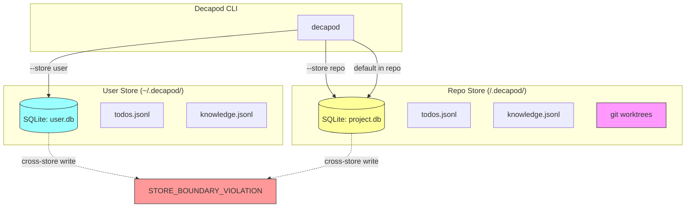

# Interfaces

## Stable Capabilities (ABI)

| Capability | Stability | Description |
|------------|-----------|-------------|
| `preflight.check` | stable | Before any operation, predict what will fail and what context is needed |
| `impact.predict` | stable | Predict validation outcomes for changed files before running validate |
| `daemonless` | stable | Decapod never runs in the background |
| `deterministic` | stable | Same inputs produce identical outputs |

## CLI Command Hierarchy

```mermaid
flowchart TB
    subgraph Root["decapod (root)"]
        init[init]
        session[session]
        workspace[workspace]
        todo[todo]
        validate[validate]
        govern[govern]
        data[data]
        auto[auto]
        qa[qa]
        decide[decide]
        rpc[rpc]
        release[release]
    end

    subgraph Session["session"]
        sacquire[acquire]
        sstatus[status]
        srelease[release]
    end

    subgraph Workspace["workspace"]
        wensure[ensure]
        wstatus[status]
        wpublish[publish]
    end

    subgraph Todo["todo"]
        tadd[add]
        tclaim[claim]
        tdone[done]
        tlist[list]
    end

    subgraph Govern["govern"]
        ghealth[health]
        gpolicy[policy]
        gproof[proof]
        gwatcher[watcher]
        gfeedback[feedback]
        gplan[plan]
        gworkunit[workunit]
        gcapsule[capsule]
    end

    subgraph Data["data"]
        dknowledge[knowledge]
        dcontext[context]
        dschema[schema]
        dbroker[broker]
        daptitude[aptitude]
        dfederation[federation]
        dprimitives[primitives]
    end

    root --> init
    root --> session
    root --> workspace
    root --> todo
    root --> validate
    root --> govern
    root --> data
    root --> auto
    root --> qa
    root --> decide
    root --> rpc
    root --> release

    session --> sacquire
    session --> sstatus
    session --> srelease

    workspace --> wensure
    workspace --> wstatus
    workspace --> wpublish

    todo --> tadd
    todo --> tclaim
    todo --> tdone
    todo --> tlist

    govern --> ghealth
    govern --> gpolicy
    govern --> gproof
    govern --> gwatcher
    govern --> gfeedback
    govern --> gplan
    govern --> gworkunit
    govern --> gcapsule

    data --> dknowledge
    data --> dcontext
    data --> dschema
    data --> dbroker
    data --> daptitude
    data --> dfederation
    data --> dprimitives

    style root fill:#9f9,stroke:#333
    style session fill:#ff9,stroke:#333
    style workspace fill:#ff9,stroke:#333
    style todo fill:#ff9,stroke:#333
    style validate fill:#f99,stroke:#333
    style govern fill:#f9f,stroke:#333
```



## Inbound Contracts

### CLI Surfaces

| Command | Purpose | Stability |
|---------|---------|-----------|
| `decapod init` | Bootstrap `.decapod/` in repository | stable |
| `decapod session acquire` | Establish agent session | stable |
| `decapod session status` | Check current session | stable |
| `decapod workspace ensure` | Create isolated worktree | stable |
| `decapod workspace status` | Show current workspace/branch | stable |
| `decapod todo add <title>` | Add task to ledger | stable |
| `decapod todo claim --id <id>` | Claim task for current agent | stable |
| `decapod todo done --id <id>` | Mark task complete | stable |
| `decapod todo list` | List tasks with status | stable |
| `decapod validate` | Run validation gates | stable |
| `decapod capabilities --format json` | Enumerate capabilities | stable |
| `decapod preflight --op <op>` | Predict what will fail before operation | stable |
| `decapod impact --changed-files <files>` | Predict validation outcomes | stable |
| `decapod data schema --format json --deterministic` | Get entity schemas | stable |

### Preflight Output Schema

```json
{
  "op": "validate",
  "session_id": null,
  "risk_flags": ["protected_branch"],
  "likely_failures": [
    {
      "code": "WORKSPACE_REQUIRED",
      "message": "Cannot operate on protected branch",
      "current_branch": "master"
    }
  ],
  "required_capsules": ["plugins/VERIFY.md"],
  "next_best_actions": ["Run: decapod workspace ensure"],
  "workspace": {
    "git_branch": "master",
    "git_is_protected": true,
    "can_work": false
  }
}
```

### Impact Output Schema

```json
{
  "changed_files": ["src/core/validate.rs"],
  "will_fail_validate": true,
  "predicted_failures": [
    {
      "gate": "workspace_isolation",
      "status": "fail",
      "code": "WORKSPACE_REQUIRED",
      "message": "Operating on protected branch"
    }
  ],
  "validation_predictions": [
    { "gate": "workspace_isolation", "status": "pass" }
  ],
  "workspace": {
    "git_branch": "master",
    "git_is_protected": true,
    "can_work": false
  },
  "recommendation": "Fix workspace issues before running validate"
}
```

### Governance Commands

| Command | Purpose |
|---------|---------|
| `decapod govern health summary` | System health status |
| `decapod govern policy riskmap` | Risk classification |
| `decapod govern watcher run` | Run safety checks |
| `decapod govern capsule query --topic <x> --scope <y>` | Query context capsules |

### Data Commands

| Command | Purpose |
|---------|---------|
| `decapod data knowledge add --id <x> --title <y> --text <z>` | Add knowledge entry |
| `decapod data knowledge search --query <x>` | Search knowledge |
| `decapod data aptitude add --key <x> --value <y>` | Store preference |
| `decapod data context audit` | Audit token usage |

## Outbound Dependencies

- **SQLite**: `.decapod/data/*.db` - persistent state for todos, knowledge, sessions
- **JSONL**: `.decapod/data/*.jsonl` - append-only event logs
- **Git**: Worktree management via `git worktree` for workspace isolation

## Data Ownership

### Store Boundary Model



| Store | Path | Contamination Rule |
|-------|------|-------------------|
| `user` | `~/.decapod/` | Never seeded from repo |
| `repo` | `<repo>/.decapod/` | Never leaks to user store |

### Source-of-Truth Tables

- `todos.jsonl` - Task lifecycle events (append-only)
- `knowledge.promotions.jsonl` - Knowledge promotion events
- `sessions/` - Agent session receipts
- `workspaces/` - Isolated git worktrees

### Cross-Boundary Read Models

- `decapod capabilities --format json` - Read-only capability enumeration
- `decapod data schema --deterministic` - Read-only schema inspection

### Consistency Expectations

- All writes are append-only (no updates/deletes to event logs)
- SQLite transactions for multi-entity consistency
- Receipt hashes for mutation verification

## JSON-RPC Surface

### Required Agent Initialization

```bash
decapod rpc --op agent.init
```

Returns:
```json
{
  "session_id": "ulid",
  "receipt": { "timestamp": "...", "store": "repo|user" },
  "allowed_next_ops": ["workspace.ensure", "todo.add", ...],
  "blocked_by": []
}
```

### Core RPC Operations

| Operation | Parameters | Returns |
|-----------|------------|---------|
| `agent.init` | - | Session receipt |
| `context.resolve` | `{ "op": "todo.add" }` | Relevant constitution fragments |
| `context.scope` | `{ "query": "validation", "limit": 8 }` | Scoped docs |
| `validate.run` | `{ "store": "repo" }` | Gate results with pass/fail |
| `workspace.ensure` | `{ "branch": "feature/x" }` | Worktree path |
| `store.upsert` | `{ "entity": "todo", "data": {...} }` | Write receipt |
| `schema.get` | `{ "entity": "todo" }` | JSON schema |

### Error Response Schema

All RPC errors include:
```json
{
  "error": {
    "code": "VALIDATE_TIMEOUT_OR_LOCK | WORKSPACE_REQUIRED | VERIFICATION_REQUIRED",
    "message": "human-readable",
    "remediation": "suggested action"
  }
}
```

### Error Flow

```mermaid
flowchart TD
    subgraph Request["RPC Request"]
        R[op: agent.init<br/>params: {...}]
    end

    subgraph Process["Runtime"]
        P[Parse & Validate]
        A[Auth Check]
        E[Execute]
    end

    subgraph Response["Response"]
        S[Success<br/>{...}]
        F[Error<br/>{code, message, remediation}]
    end

    R --> P
    P -->|valid| A
    P -->|invalid| F
    A -->|ok| E
    A -->|no session| F
    E -->|success| S
    E -->|failure| F

    style F fill:#f99,stroke:#333
    style S fill:#9f9,stroke:#333
```

## Data Store Schema

### Two Stores (Strictly Separated)

| Store | Path | Purpose | Contamination Rule |
|-------|------|---------|-------------------|
| user | `~/.decapod/` | Personal blank-slate tasks | Never seeded from repo |
| repo | `<repo>/.decapod/` | Project dogfood backlog | Never leaks to user store |

### Core Entities

**Todo** (`decapod data schema --subsystem todo`):
```json
{
  "id": "ulid",
  "status": "draft|claimed|executing|verified",
  "intent": "string",
  "spec": "string (optional)",
  "created_by": "session_id",
  "events": [{ "type": "created|claimed|done", "ts": "timestamp" }]
}
```

**Knowledge Entry**:
```json
{
  "id": "ulid",
  "title": "string",
  "text": "string",
  "provenance": "string",
  "claim_id": "ulid (optional)",
  "promoted": "boolean"
}
```

## Failure Semantics

| Failure Type | Condition | Remediation |
|--------------|-----------|-------------|
| `VALIDATE_TIMEOUT_OR_LOCK` | DB contention > timeout | Retry with backoff |
| `WORKSPACE_REQUIRED` | Operating on main/master | Run `decapod workspace ensure` |
| `VERIFICATION_REQUIRED` | Claiming done without proof | Run `decapod validate` |
| `STORE_BOUNDARY_VIOLATION` | Cross-store contamination detected | Use explicit `--store` flag |

## Output Formats

- `--format text` (default): Human-readable
- `--format json`: Machine-parseable for automation
- `--deterministic`: Removes volatile timestamps for reproducible outputs
