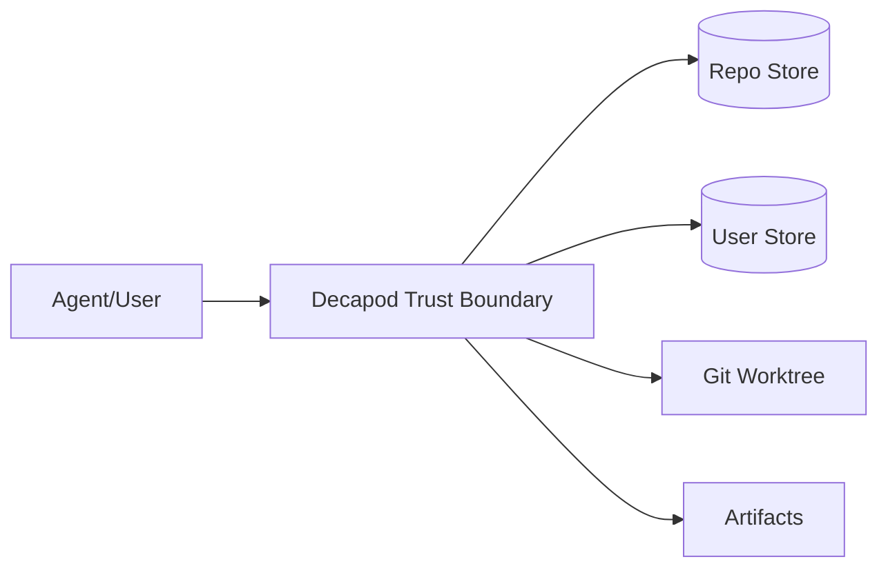

# Security

## Threat Model

## STRIDE Table
| Threat | Surface | Mitigation | Validation |
|---|---|---|---|
| Spoofing | session/auth boundary | session token + password gate | session tests |
| Tampering | task/proof artifacts | append-only logs + hash receipts | validate + hash checks |
| Repudiation | task completion claims | claim/done audit trail | ledger review |
| Information Disclosure | logs/artifacts | secret redaction + classification | security scan |
| DoS | validate/store contention | bounded timeouts + retry policy | timeout gate |
| Elevation of Privilege | protected branch/store boundaries | interlock enforcement | interlock tests |

## Authentication
- Session acquisition required for privileged operations.
- `DECAPOD_SESSION_PASSWORD` gate enforced when configured.
- Session lifecycle is explicit (`acquire`, `status`, `release`).

## Authorization
- Task ownership controls claim/done transitions.
- Store mode limits write scope (repo vs user).
- Protected branches block mutate operations.

## Data Classification
| Class | Examples | Handling |
|---|---|---|
| Public | docs/spec text | normal repo controls |
| Internal | operational logs/metrics | least privilege access |
| Sensitive | credentials/tokens/session secrets | redacted logs, restricted storage |

## Sensitive Data Handling
- Never log raw tokens/secrets.
- Store sensitive values in env/secure stores only.
- Redact secrets in traces and diagnostics artifacts.

## Supply Chain Security
- Rust toolchain: `cargo audit`, `cargo deny`, `cargo vet`.
- CI must surface critical/high vulnerabilities as blockers.
- Release artifacts should include provenance and checksums.

## Secrets Management
| Secret | Source | Rotation | Consumer |
|---|---|---|---|
| Session password | environment/secret manager | periodic | session gate |
| API credentials | environment/secret manager | periodic | external dependency integrations |

## Security Testing
| Test Type | Cadence | Tooling |
|---|---|---|
| Dependency vulnerability scan | per PR + scheduled | cargo-audit/cargo-deny |
| Interlock regression tests | per PR | cargo test suites |
| Secret redaction checks | per PR | test fixtures + grep rules |

## Compliance
- Evidence artifacts must trace security-relevant gate outcomes.
- Security exceptions require documented owner, reason, and expiry.

## Pre-Promotion Security Checklist
- [ ] Threat model updated for changed trust boundaries.
- [ ] Auth/authz and interlock tests pass.
- [ ] Dependency scan has no unresolved critical/high findings.
- [ ] Sensitive data handling and redaction checks pass.
