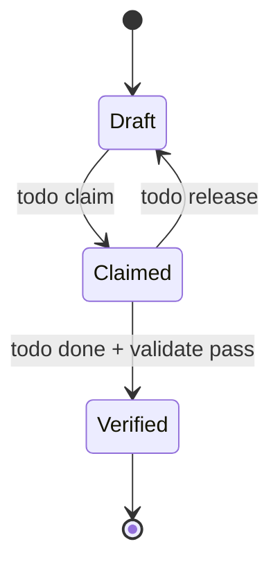

# Semantics

## State Machines

| From | Event | To | Guard | Side Effect |
|---|---|---|---|---|
| Draft | `todo claim` | Claimed | active session + workspace | assign owner |
| Claimed | `todo done` | Verified | blocking gates pass | persist proof receipt |
| Claimed | `todo release` | Draft | current owner releases | clear ownership |

## Invariants
| Invariant | Type | Validation |
|---|---|---|
| Protected branches cannot mutate | System | workspace interlock gate |
| Verified status requires proof | System | validate + proof_plan checks |
| Store boundaries remain isolated | Data | store boundary checks |
| Mutation receipts are deterministic | Data | canonical hash generation |

## Event Sourcing Schema
| Field | Type | Meaning |
|---|---|---|
| event_id | ULID/string | unique event identifier |
| task_id | string | aggregate root |
| action | string | state transition action |
| actor | string | who triggered change |
| occurred_at | timestamp | ordering marker |
| payload | json | transition metadata |

## Replay Semantics
- Replay uses append order from canonical JSONL logs.
- Determinism target: same event sequence yields same task states and proof hashes.
- Lock/contention does not reorder committed events.

## Error Code Semantics
- `WORKSPACE_REQUIRED`: mutation attempted on protected branch.
- `VERIFICATION_REQUIRED`: completion attempted without proof pass.
- `STORE_BOUNDARY_VIOLATION`: cross-store write attempted.
- `VALIDATE_TIMEOUT_OR_LOCK`: bounded execution exceeded or lock unresolved.

## Domain Rules
- A task has exactly one active primary owner at a time.
- Completion is invalid unless proof receipts are current.
- Governance artifacts are append-only and auditable.

## Idempotency Contracts
| Operation | Idempotency Key | Duplicate Behavior |
|---|---|---|
| `todo claim` | task_id + agent_id | no-op if already claimed by same agent |
| `todo done` | task_id + latest proof receipt | no-op if already verified with same proof |
| `session acquire` | session token | returns active session envelope |
