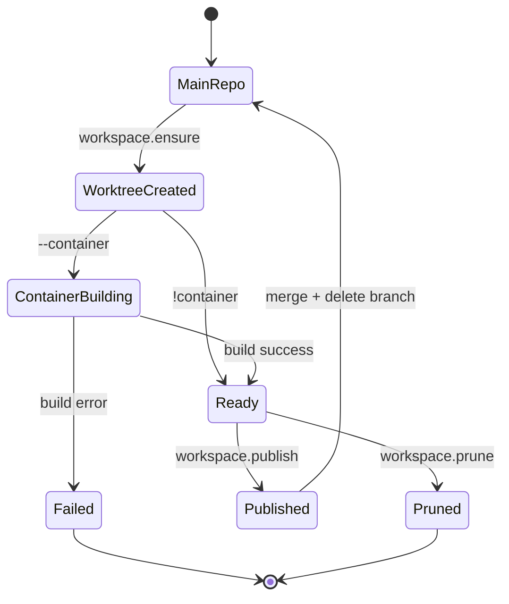
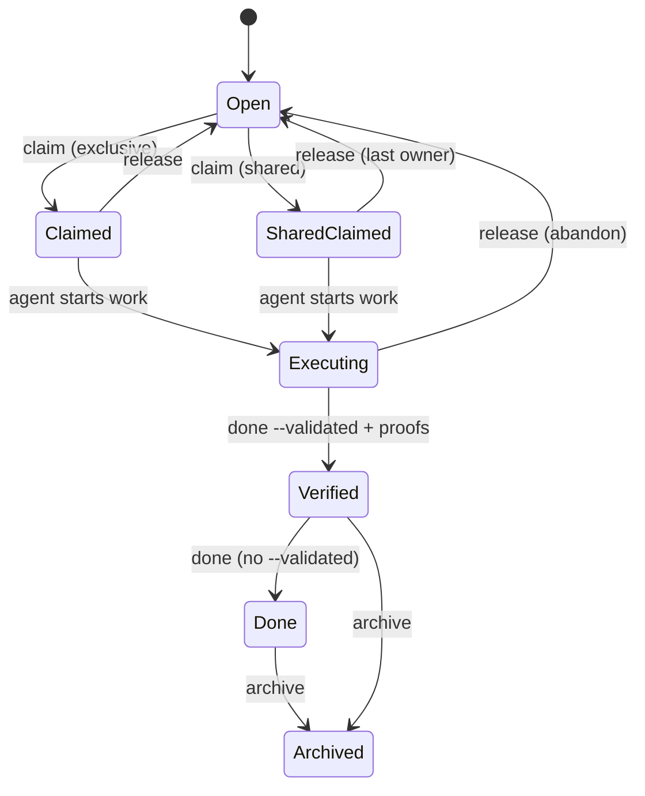
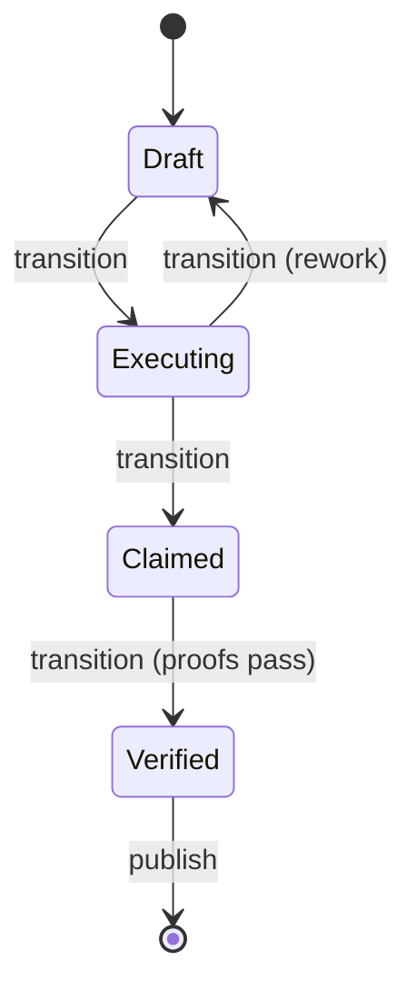
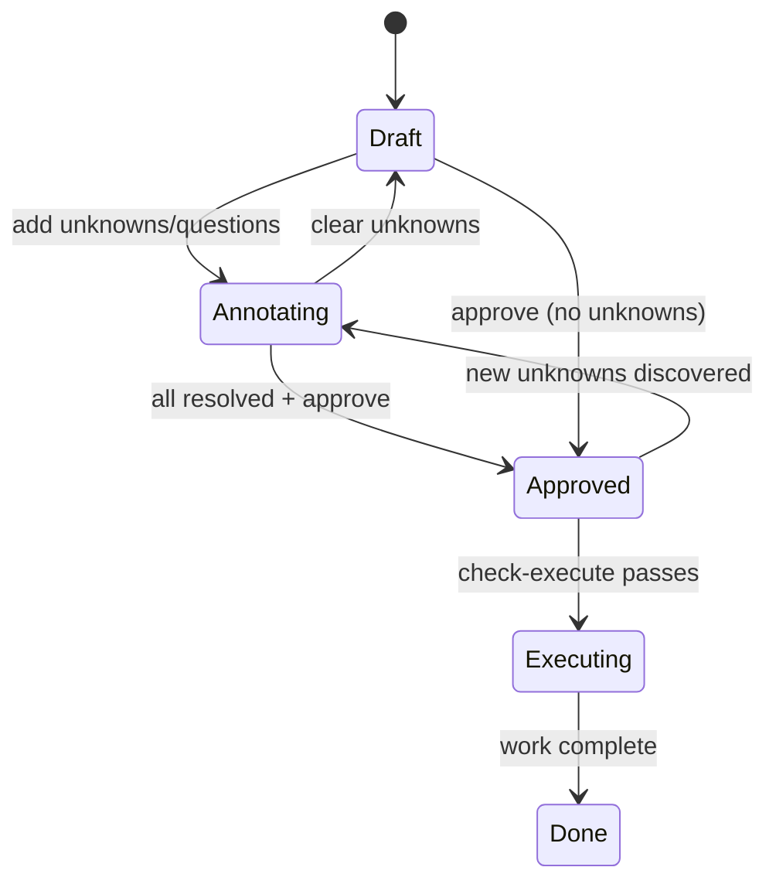
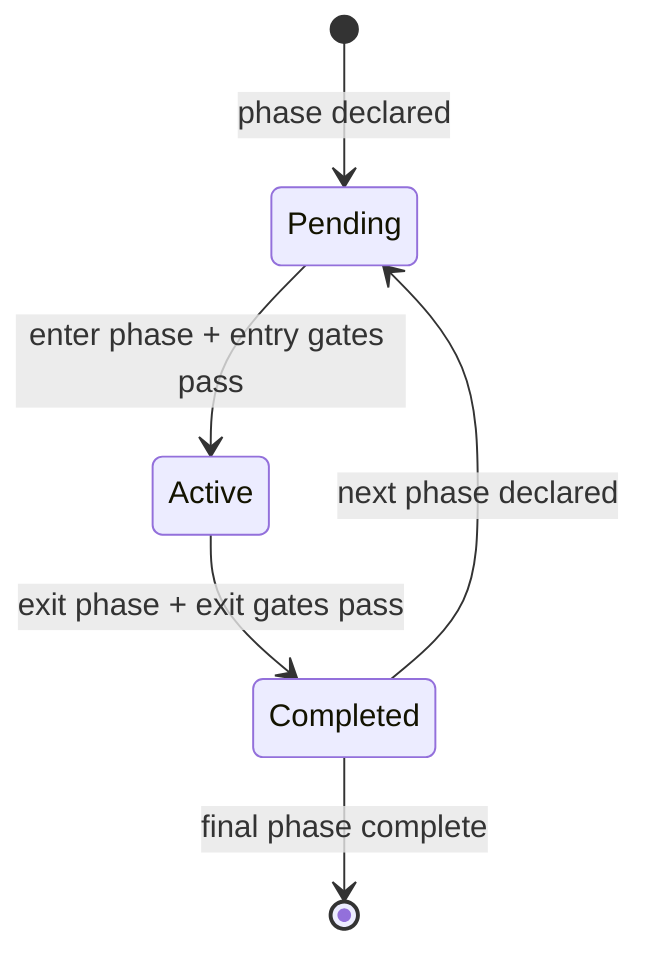
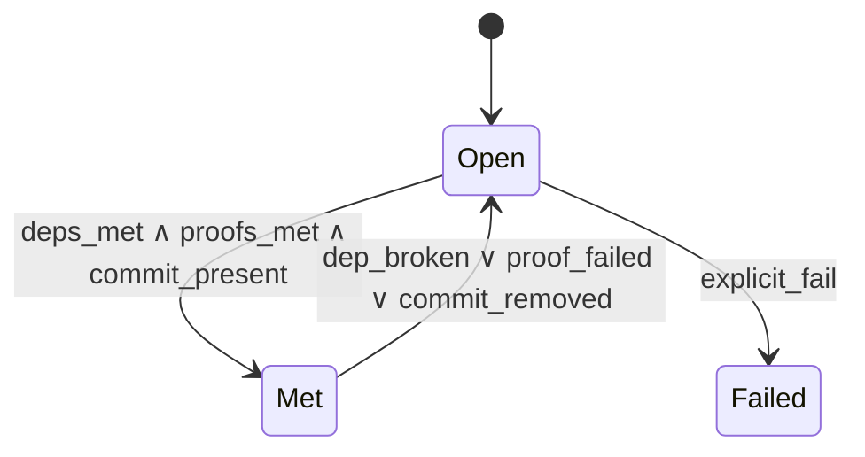
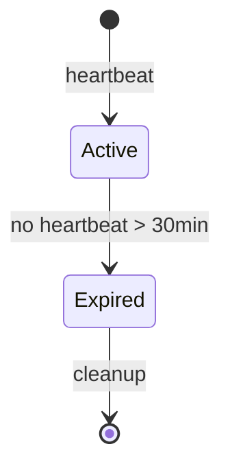

# Semantics

## Capability Semantics

Capability labels are canonicalized for deterministic projection but preserve their human-defined meaning. Recognized packs contribute obligations and negative constraints; unknown labels remain valid context. Persistent-state semantics require migration treatment and executable validation, while event-driven/background-processing semantics require the project to declare delivery, retry, idempotency, and recovery behavior rather than inheriting universal guarantees.

## State Machines

### Workspace State

```mermaid
stateDiagram-v2
    [*] --> MainRepo
    MainRepo --> WorktreeCreated: workspace.ensure
    WorktreeCreated --> ContainerBuilding: --container
    WorktreeCreated --> Ready: !container
    ContainerBuilding --> Ready: build success
    ContainerBuilding --> Failed: build error
    Ready --> Published: workspace.publish
    Ready --> Pruned: workspace.prune
    Published --> MainRepo: merge + delete branch
    Failed --> [*]
    Pruned --> [*]
```

### Todo/Task State

```mermaid
stateDiagram-v2
    [*] --> Open
    Open --> Claimed: claim (exclusive)
    Open --> SharedClaimed: claim (shared)
    Claimed --> Executing: agent starts work
    SharedClaimed --> Executing: agent starts work
    Executing --> Verified: done --validated + proofs
    Executing --> Open: release (abandon)
    Claimed --> Open: release
    SharedClaimed --> Open: release (last owner)
    Verified --> Done: done (no --validated)
    Done --> Archived: archive
    Verified --> Archived: archive
```

### WorkUnit State

```mermaid
stateDiagram-v2
    [*] --> Draft
    Draft --> Executing: transition
    Executing --> Claimed: transition
    Claimed --> Verified: transition (proofs pass)
    Executing --> Draft: transition (rework)
    Verified --> [*]: publish
```

### Plan State

```mermaid
stateDiagram-v2
    [*] --> Draft
    Draft --> Annotating: add unknowns/questions
    Annotating --> Approved: all resolved + approve
    Draft --> Approved: approve (no unknowns)
    Approved --> Executing: check-execute passes
    Executing --> Done: work complete
    Annotating --> Draft: clear unknowns
    Approved --> Annotating: new unknowns discovered
```

### Plan Phase State

```mermaid
stateDiagram-v2
    [*] --> Pending: phase declared
    Pending --> Active: enter phase + entry gates pass
    Active --> Completed: exit phase + exit gates pass
    Completed --> Pending: next phase declared
    Completed --> [*]: final phase complete
```
- Declared phases are entered and completed in order; only one phase may be active.
- A phase-bearing plan cannot reach `DONE` until every phase is completed.
- Entry and exit gates are explicit proof checkpoints; artifact requirements are checked at transition time.

### Obligation State (Derived, Never Asserted)

```mermaid
stateDiagram-v2
    [*] --> Open
    Open --> Met: deps_met ∧ proofs_met ∧ commit_present
    Met --> Open: dep_broken ∨ proof_failed ∨ commit_removed
    Open --> Failed: explicit_fail
```

### Agent Presence

```mermaid
stateDiagram-v2
    [*] --> Active: heartbeat
    Active --> Expired: no heartbeat > 30min
    Expired --> [*]: cleanup
```

## Invariants

| Invariant | Type | Validation |
|-----------|------|------------|
| No promoted change without proof | System | `workspace.publish` requires proof_manifest + artifact_manifest + workunit VERIFIED |
| Canonical source-of-truth per entity | Data | Single store root per kind; `validate` checks no external `.db`/`.jsonl` |
| Mutation events are replayable | Data | `todo rebuild` + `broker verify` round-trip; deterministic JSONL |
| Workspace isolation enforced | System | `workspace.status` blocks protected branch + main repo work |
| Context capsules deterministic | Data | `canonical_json_bytes` + SHA256; policy binding includes repo_revision |
| Obligation status derived, never asserted | Data | `obligation verify` computes from deps/proofs/commit |
| Session required for mutations | Auth | Broker rejects mutating ops without valid session |
| Capability-gated external actions | Security | Every `git`/`docker`/`cargo` call declares capability |
| No secrets in config.toml | Security | `validate` config gate rejects forbidden keys |
| Specs manifest tracks template drift | Governance | `validate` specs gate fails on stale template_hash |
| Ordered phase completion | Governance | Phase transitions reject out-of-order, concurrent, or incomplete execution |

## Event Sourcing Schema

### Common Event Fields
| Field | Type | Description |
|-------|------|-------------|
| `event_id` | string (ULID) | Globally unique event ID |
| `ts` | string (ISO8601/Z) | Append timestamp |
| `event_type` | string | Semantic transition (e.g., `task.add`, `task.claim`) |
| `task_id` | string? | Entity/workflow ID |
| `payload` | object | Transition data |
| `actor` | string | Agent/human identifier |

### Todo Events (`todo.events.jsonl`)
| Event Type | Payload | Trigger |
|------------|---------|---------|
| `task.add` | `{id, title, priority, scope, ref, ...}` | `todo add` |
| `task.claim` | `{id, agent, mode}` | `todo claim` |
| `task.release` | `{id, agent, reason}` | `todo release` |
| `task.done` | `{id, validated, artifacts[]}` | `todo done` |
| `task.edit` | `{id, field, old, new}` | `todo edit` |
| `task.archive` | `{id}` | `todo archive` |
| `task.comment` | `{id, comment, kind}` | `todo comment` |
| `agent.heartbeat` | `{agent_id}` | `todo heartbeat` |
| `agent.session.cleanup` | `{agent_id, reason}` | Stale agent cleanup |
| `task.dependency.add` | `{task_id, depends_on}` | `todo add --depends-on` |

### Broker Events (`broker.events.jsonl`)
| Event Type | Payload | Trigger |
|------------|---------|---------|
| `mutation` | `{op, entity, id, before, after}` | Any store mutation |
| `schema_migration` | `{from, to, tables[]}` | Migration run |

### Proof Events (`proof.events.jsonl`)
| Event Type | Payload | Trigger |
|------------|---------|---------|
| `proof.run` | `{run_id, proof_name, command, exit_code, duration_ms, passed}` | `proof run` / `govern proof run` |

### Federation Events (`federation.events.jsonl`)
| Event Type | Payload | Trigger |
|------------|---------|---------|
| `node.add` | `{node_id, type, title}` | `data federation add` |
| `edge.add` | `{edge_id, source, target, type}` | `data federation add` (relation) |
| `node.update` | `{node_id, field, old, new}` | Knowledge promotion/update |

### Attestation Events (`assurance_attestations.jsonl`)
| Event Type | Payload | Trigger |
|------------|---------|---------|
| `attestation` | `{id, op, timestamp, input_hash, touched_paths[], interlock_code?, outcome}` | `assurance.evaluate` |

## Replay Semantics

### Todo Rebuild
- **Order**: FIFO by `ts` (event log order)
- **Conflict Resolution**: Last-write-wins per task ID (events are append-only)
- **Snapshot Cadence**: None (full rebuild from genesis on demand)
- **Determinism Proof**: `todo rebuild` produces byte-identical `todo.db` from same `todo.events.jsonl`

### Broker Verify
- **Order**: FIFO by event sequence
- **Conflict Detection**: Divergence = pending mutations at crash (detected via `verify_replay`)
- **Resolution**: Manual reconciliation; `broker verify` reports gaps

### Obligation Graph
- **Order**: Topological (dependencies before dependents)
- **Conflict**: Cycles detected at add-time (`detect_cycle`)
- **Resolution**: Reject add; human must restructure

## Error Code Semantics

### Namespace
`DECAPOD_ERROR` prefix for all structured errors.

### Stability Window
Error codes stable within major version (0.x may add codes; 1.0+ semver).

### Mapping to Retry/Degrade
| Code Pattern | Retry | Degrade | Agent Action |
|--------------|-------|---------|--------------|
| `AUTOREMEDIABLE_*` | Yes (after action) | N/A | Execute `agent_action` |
| `*_PREFLIGHT_FAILED` | Yes (exponential) | Read-only mode | Wait + retry |
| `WORKSPACE_*` | No | Blocked | `workspace.ensure` |
| `SESSION_*` | No | Blocked | `session.acquire` |
| `VALIDATION_*` | No | Blocked | Fix + re-validate |
| `STORAGE_*` | Yes (5x) | Read-only | Check disk/perms |

## Domain Rules

### Workspace Rules
1. **Protected Branch Block**: `main`, `master`, `production`, `stable`, `release/*`, `hotfix/*` — no work allowed
2. **Main Repo Block**: Human's checkout — agents must use worktree
3. **Worktree Required**: Every agent session → isolated branch with todo scope in name
4. **Container Gate**: `--container` requires elevated perms + docker availability
5. **Todo-Scoped Branch**: Branch name MUST contain claimed todo ID or hash

### Todo Rules
1. **Claim Before Work**: `todo claim` required before meaningful ops
2. **Exclusive Default**: `claim` mode=exclusive prevents parallel work
3. **Done Requires Proof**: `--validated` requires `--artifact` (default AGENTS.md)
4. **Event Sourcing**: All mutations → `todo.events.jsonl` + SQLite
5. **Deterministic Rebuild**: `todo rebuild` must reproduce DB exactly
6. **Category Ownership**: Agents register categories; tasks auto-route

### WorkUnit Rules
1. **Intent Ref Required**: Links to governing intent (Plan, ADR, or raw)
2. **Spec/State Refs**: Track constitution specs and context capsules
3. **Proof Plan Gates**: Declarative list of required proof names
4. **Proof Results**: Recorded per gate with pass/fail + artifact ref
5. **Verified Transition**: Only allowed when all proof_plan gates have `pass` result
6. **Capsule Lineage**: `state_refs` must include deterministic context capsule for task

### Obligation Rules
1. **Status Derived**: Never set directly; computed from deps + proofs + commit
2. **Cycle Prevention**: `add` rejects if `depends_on` creates cycle
3. **Proof Gating**: `required_proofs` must be `VERIFIED` in health cache
4. **State Commit**: `state_commit_root` required for `Met` status
5. **Graph Validation**: `validate-graph` checks cycles, unmet deps, missing proofs, missing commits

### Context Capsule Rules
1. **Deterministic**: `canonical_json_bytes` + SHA256 = `capsule_hash`
2. **Policy Bound**: `risk_tier` → allowed scopes, max limit, write permission
3. **Repo Revision Binding**: Policy hash includes `repo_revision` (HEAD)
4. **Write Gate**: `write=true` requires tier `allow_write=true`
5. **Lineage**: WorkUnit `state_refs` must match capsule path for publish

### Plan Rules
1. **Draft → Approved**: Requires non-empty intent, no unknowns, no human questions
2. **Approved → Executing**: `check-execute` verifies todo exists, scope constraints met
3. **Scope Constraints**: `forbidden_paths` + `file_touch_budget` enforced at execute
4. **Stop Conditions**: Block execution if matched (e.g., "tests fail")

### Validation Rules
1. **Blocking Gates**: All must pass for promotion
2. **Auto-Remediable**: Errors include `agent_action` for self-correction
3. **Specs Sync**: Template drift = fail (or `--refresh-specs` to acknowledge)
4. **Config Schema**: `schema_version=1.0.0` required; forbidden keys rejected

## Idempotency Contracts

| Operation | Idempotency Key | Duplicate Behavior |
|-----------|-----------------|-------------------|
| `todo add` | `ref` (external tracker ID) | Returns existing task if `ref` matches |
| `todo claim` | `task_id + agent_id` | Returns current claim status |
| `workspace ensure` | `branch` (todo-scoped) | Returns existing worktree status |
| `capsule query --write` | `topic+scope+task_id+risk_tier` | Overwrites existing capsule |
| `workunit init` | `task_id` | Fails if exists |
| `obligation add` | `intent_ref + risk_tier + depends_on` | Fails if duplicate intent |
| `proof run` | `run_id` (ULID) | New run each invocation |
| `session acquire` | `agent_id` (from password) | Returns existing token |
| `data knowledge add` | `id` (ULID) | Fails if ID exists |
| `broker mutation` | `op+entity+id` | Append-only event log |

## Language Note
- Primary language: Rust (edition 2024, rust-version 1.96.1)
- Schema definitions: Rust structs + serde + SQL DDL in `schemas.rs`
- CLI: Clap 4 derive
- RPC: JSON over stdin/stdout (no HTTP)
- Event logs: JSONL (one JSON object per line)

<!-- decapod:codebase-attestation:start -->
## Codebase Attestation

- Repository signal fingerprint: `27cc0f02dc7957543cdbdf24ea2c9c76ba799689d10f465ebee32f3aa6ef28bf`
- Significant implementation surfaces: `.github/` (8 files), `Cargo.lock/` (1 files), `Cargo.toml/` (1 files), `README.md/` (1 files), `docs/` (1 files), `src/` (85 files), `tests/` (3 files)
- Refreshed from the current codebase by `decapod specs.refresh`
<!-- decapod:codebase-attestation:end -->
