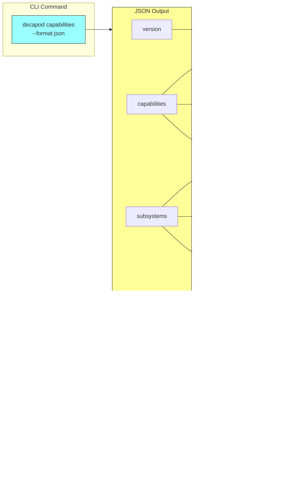

# Semantics

## State Machines

### WorkUnit Status Machine


**States**:
| State | Meaning | CLI Transition | Enforced By |
|-------|---------|----------------|-------------|
| `Draft` | Task created, not yet started | `todo add` | Binary |
| `Claimed` | Agent has claimed this task | `todo claim` | Binary |
| `Verified` | All proof gates passed + `todo done` | `todo done` (gated by validate) | Binary |
| `Archived` | Task completed and archived | `todo archive` | Binary |

**Actual Transitions** (from code analysis):
- `Draft` → `Claimed` via `decapod todo claim`
- `Claimed` → `Verified` via `decapod todo done` (requires passing `decapod validate`)
- `Claimed` → `Draft` via `decapod todo release`

**Note**: `Executing` is an agent-local internal state, NOT persisted in the ledger. Agents track "work in progress" locally; the ledger only knows `Claimed`.

**Invariant**: Cannot transition to `Verified` without:
1. Passing `decapod validate` first
2. All gates in `proof_plan` have passing `proof_results`

### Store Boundary Enforcement


**Invariant**: Explicit `--store` flag required. Cross-store writes produce `STORE_BOUNDARY_VIOLATION`.

## Invariants (Machine-Checkable)


| Invariant | Verification Command | Failure Code |
|-----------|---------------------|--------------|
| No mutation on protected branch | `decapod workspace status` → `git_is_protected` | `WORKSPACE_REQUIRED` |
| Verified requires passing proof gates | `decapod validate` | `VERIFICATION_REQUIRED` |
| Store boundary not crossed | `decapod validate` | `STORE_BOUNDARY_VIOLATION` |
| Validate terminates boundedly | `decapod validate` (30s timeout) | `VALIDATE_TIMEOUT_OR_LOCK` |
| Session required for operations | `decapod session status` | `SESSION_REQUIRED` |

## Event Log Semantics

### Event Flow


### Append-Only Rule

All state changes are logged as events in JSONL files:

- `.decapod/data/todos.jsonl` - Task lifecycle events
- `.decapod/data/knowledge.promotions.jsonl` - Knowledge promotions
- `.decapod/data/decisions.jsonl` - Agent decisions

### Receipt Hashing

Every mutation produces a SHA256 receipt:

```rust
// From workunit.rs
pub fn canonical_hash_hex(&self) -> String {
    let bytes = self.canonical_json_bytes()?;
    let mut hasher = Sha256::new();
    hasher.update(&bytes);
    format!("{:x}", hasher.finalize())
}
```

**Invariant**: Receipt hash is computed from canonicalized JSON (sorted keys, deduplicated arrays).

### Deterministic Replay

Given the same event log sequence, replay must produce identical state hashes.

## Proof Surface Semantics

### Validation Gate Contract

```
decapod validate --store repo --format json
```

**Output Schema**:
```json
{
  "gate": "validate",
  "timestamp": "ISO8601",
  "results": [
    { "name": "workspace_isolation", "status": "pass|fail", "detail": "..." }
  ],
  "receipt": {
    "hash": "sha256:...",
    "touched_paths": ["path1", "path2"]
  }
}
```

**Bounded Execution**: Must terminate within 30 seconds or return `VALIDATE_TIMEOUT_OR_LOCK`.

### Capabilities Contract



```
decapod capabilities --format json
```

**Output Schema**:
```json
{
  "version": "semver",
  "capabilities": [
    { "name": "...", "description": "...", "stability": "stable|beta" }
  ],
  "subsystems": [
    { "name": "...", "status": "active", "ops": ["op1", "op2"] }
  ],
  "interlock_codes": ["WORKSPACE_REQUIRED", "VERIFICATION_REQUIRED", ...]
}
```

**Invariant**: Adding a new capability/subsystem/op requires updating this output.

### Schema Contract

```
decapod data schema --format json --deterministic
```

**Output**: JSON schema for all entities with volatile fields (timestamps) removed when `--deterministic` is passed.

**Invariant**: Schema changes are breaking changes and require version bump.

## Error Code Semantics

| Code | Trigger Condition | Remediation |
|------|------------------|--------------|
| `WORKSPACE_REQUIRED` | Operating on protected branch | Run `decapod workspace ensure` |
| `VERIFICATION_REQUIRED` | Claiming done without proof | Run `decapod validate` |
| `STORE_BOUNDARY_VIOLATION` | Cross-store write detected | Use explicit `--store` flag |
| `VALIDATE_TIMEOUT_OR_LOCK` | DB contention > timeout | Retry with backoff |
| `SESSION_REQUIRED` | No active session | Run `decapod session acquire` |

## Agent Loop Semantics

### Complete Agent Workflow


### Step-by-Step Contract

```
1. decapod rpc --op agent.init
   → Returns: session_id, allowed_next_ops, context_capsule

2. decapod workspace ensure
   → Returns: branch_name, worktree_path
   → Invariant: Cannot be on main/master

3. decapod todo add --text "..."
   → Returns: task_id, events[]
   → Creates: Draft status

4. (repeat)
   decapid <task_idod todo claim -->
   → Transitions: Draft → Claimed

5. decapod todo done --id <task_id>
   → Transitions: Claimed → Verified
   → Requires: proof_plan gates passed

6. decapod validate
   → Returns: pass/fail with receipt
   → Invariant: Must pass before claiming done
```
