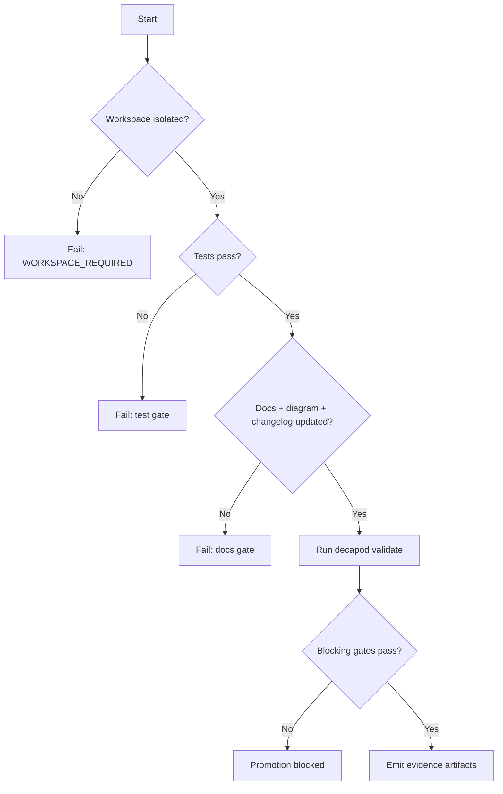

# Validation

## Validation Philosophy
> Validation is a mandatory release gate: if proof is missing, completion is invalid.

## Validation Decision Tree

## Promotion Flow

## Proof Surfaces
- `decapod validate`
- Required test commands:
- `cargo test`
- `cargo clippy -- -D warnings`
- `cargo fmt --check`
- Required integration/e2e commands:
- `cargo test --test '*'`

## Promotion Gates

## Blocking Gates
| Gate | Command | Evidence |
|---|---|---|
| Workspace/session interlocks | `decapod validate` | validate output |
| Test suite pass | cargo commands | test logs |
| Docs + architecture + changelog coverage | repo checks | PR diff |
| Security critical checks | security scanner set | scanner artifacts |

## Warning Gates
| Gate | Trigger | Follow-up SLA |
|---|---|---|
| Coverage drift | coverage below target but above floor | 48h |
| Non-critical performance regression | p95 drift below hard limit | 72h |
| Non-blocking spec staleness | section drift detected | next task cycle |

## Evidence Artifacts
| Artifact | Path | Purpose |
|---|---|---|
| Validation receipt | `.decapod/generated/artifacts/provenance/` | gate pass/fail proof |
| Test output | CI artifacts | reproducible verification |
| Architecture/docs proof | spec files + changelog | design/runtime traceability |
| Task completion linkage | todo/workunit records | intent-to-evidence chain |

## Regression Guardrails
- Baseline references:
- Statistical thresholds (if non-deterministic):
- Rollback criteria:

## Bounded Execution
| Operation | Timeout | Failure Mode |
|---|---|---|
| `decapod validate` | 30s | `VALIDATE_TIMEOUT_OR_LOCK` |
| `cargo test` | CI bounded timeout | non-zero exit |
| Integration suite | CI bounded timeout | non-zero exit |

## Coverage Checklist
- [ ] Unit tests cover critical branches and interlocks.
- [ ] Integration tests cover end-to-end task lifecycle.
- [ ] Failure-path tests cover lock contention and policy failures.
- [ ] Docs, architecture diagram, and changelog updated for behavior changes.
- [ ] Local and CI validation receipts attached before promotion.
