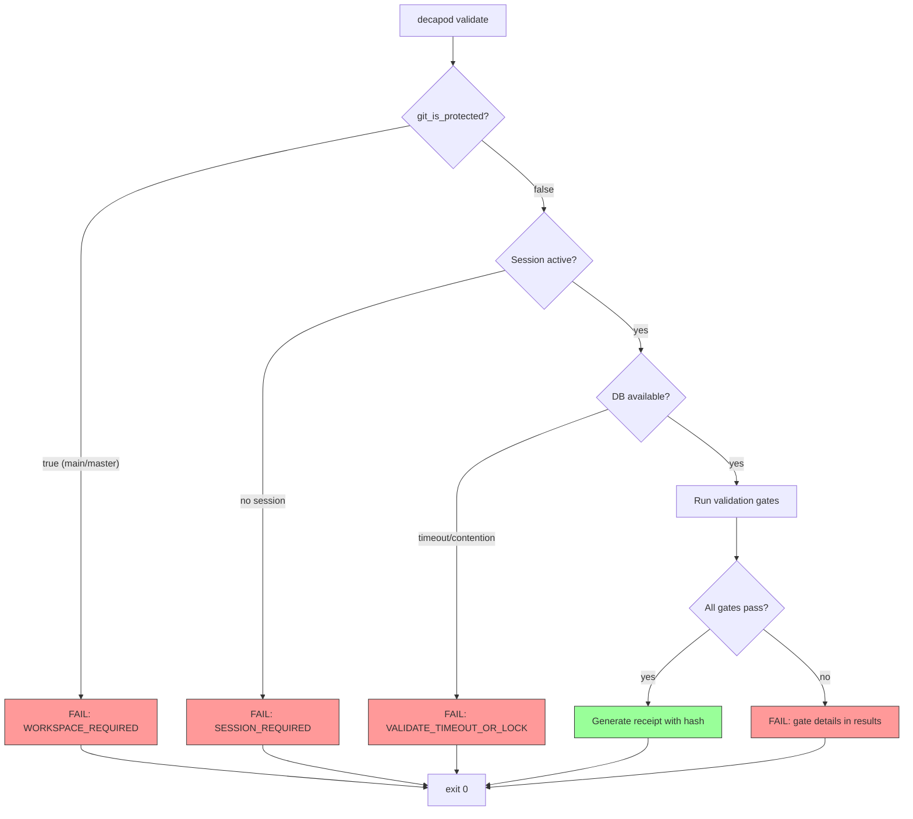
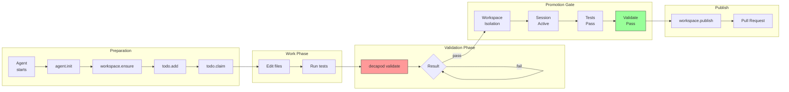

# Validation

## Proof Surfaces (Authoritative)

### Validation Decision Tree



### Primary Gate: `decapod validate`

```bash
decapod validate [--store repo|user] [--format json|text] [-v]
```

**Exit codes**:
- `0`: All gates passed
- `non-zero`: At least one gate failed

**Output shape** (JSON):
```json
{
  "gate": "validate",
  "timestamp": "2024-01-15T10:30:00Z",
  "results": [
    { "name": "workspace_isolation", "status": "pass", "detail": "branch: feature/task-123" },
    { "name": "session_active", "status": "pass", "detail": "session_id: 01ARZ3NDEKTSV4RRFFQ69G5FAV" },
    { "name": "todo_chain_complete", "status": "fail", "detail": "2 tasks in draft state" }
  ],
  "receipt": {
    "hash": "sha256:...",
    "touched_paths": [".decapod/data/todos.jsonl"]
  }
}
```

### Required Test Commands

| Command | Purpose | Expected Output |
|---------|---------|-----------------|
| `cargo test` | Unit/integration tests | Exit 0 = pass |
| `cargo build` | Compilation | Exit 0 = pass |
| `cargo clippy` | Linting | Exit 0 = pass |
| `cargo fmt --check` | Format check | Exit 0 = pass |

### Integration Test Suite

```bash
# All integration tests
cargo test --test '*'

# Specific subsystems
cargo test --test plugins_todo_tests
cargo test --test plugins_policy_tests
cargo test --test core_tests
```

## Promotion Gates

### Promotion Flow



### Blocking Gates (Must Pass)

| Gate | Command | Failure Mode |
|------|---------|--------------|
| Workspace isolation | `decapod validate` | `WORKSPACE_REQUIRED` if on main/master |
| Session active | `decapod session status` | Exit non-zero if no session |
| Validation pass | `decapod validate` | Exit non-zero with gate details |
| Required tests | `cargo test` | Exit non-zero on failure |

### Warning Gates (Non-Blocking)

| Gate | Command | Warning Code |
|------|---------|---------------|
| Schema drift | `decapod data schema --deterministic` | Schema version mismatch |
| Knowledge gap | `decapod data knowledge search --query "..."` | No relevant entries |

## Evidence Artifacts

### Required for Promotion

| Artifact | Path | Purpose |
|----------|------|---------|
| Validation receipt | stdout/stderr of `decapod validate` | Proof of gate pass |
| Session receipt | `decapod session status --format json` | Agent identity |
| Worktree state | `decapod workspace status --format json` | Branch isolation |

### Provenance Tracking

All mutations are logged to:
- `<store>/data/todos.jsonl` - Task events
- `<store>/data/knowledge.promotions.jsonl` - Knowledge promotions
- `<store>/data/decisions.jsonl` - Agent decisions

## Regression Guardrails

### Baseline References

```bash
# Capture baseline
decapod validate --format json > baseline.json

# Compare against baseline
diff <(jq -S '.results' baseline.json) <(jq -S '.results' <(decapod validate --format json))
```

### Bounded Execution

| Operation | Timeout | Failure |
|-----------|---------|---------|
| `decapod validate` | 30s default | `VALIDATE_TIMEOUT_OR_LOCK` |
| `decapod session acquire` | 10s | Session acquisition failure |
| `decapod workspace ensure` | 60s | Git worktree failure |

### Rollback Criteria

- Validation receipt hash mismatch → reject promotion
- Session not active → reject promotion  
- Operating on protected branch (main/master) → reject

## Typed Error Codes

| Code | Trigger | Remediation |
|------|---------|-------------|
| `VALIDATE_TIMEOUT_OR_LOCK` | DB contention | Retry with backoff |
| `WORKSPACE_REQUIRED` | On main/master | `decapod workspace ensure` |
| `VERIFICATION_REQUIRED` | Claiming done | `decapod validate` |
| `STORE_BOUNDARY_VIOLATION` | Cross-store write | Use explicit `--store` |
| `SESSION_REQUIRED` | No session | `decapod session acquire` |
