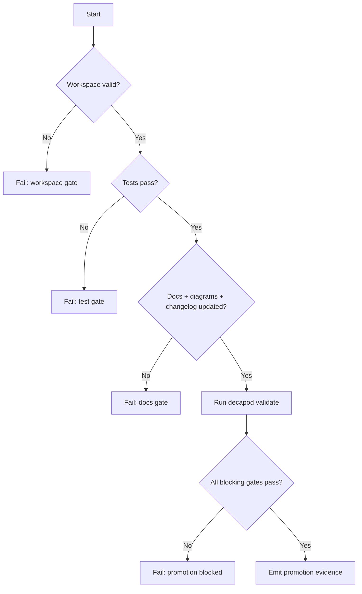

# Validation

<!-- decapod:capability-overlay:background-processing:start -->

## Background Processing Validation Overlay

### Duplicate Delivery Tests
- Same message delivered multiple times MUST produce same result
- Idempotency key verification
- Verify the declared delivery guarantee; do not claim exactly-once behavior without proof

### Retry Tests
- Configured retry/backoff policy verified
- Configured retry bound or unbounded policy verified
- Poison-work handling verified when the project declares it

### Shutdown Tests
- Graceful drain on signal
- In-flight job completion or safe requeue
- No data loss on forced termination
<!-- decapod:capability-overlay:background-processing:end -->

<!-- decapod:capability-overlay:persistent-state:start -->

## Persistent State Validation Overlay

### Migration Proof Command
- Configure `repo.migration_validation.command` and its arguments as the executable migration proof; file presence is not proof
- The configured command MUST define its working directory, timeout, expected exit code, and evidence output

### Migration Tests
- All migrations MUST have integration tests
- Rollback procedures MUST be tested
- Data integrity checks post-migration

### Persistence Integration Tests
- Repository abstraction tested against real database
- Transaction boundary tests
- Concurrency conflict tests
- Data integrity validation after recovery
<!-- decapod:capability-overlay:persistent-state:end -->

## Capability Proof Requirements

When `persistent-state` is declared, validation executes the human-governed `[repo.migration_validation]` command from `.decapod/config.toml`. The command defines its arguments, repository-relative working directory, timeout, expected exit code, and bounded evidence output. A non-empty migration file or recognized migration layout never satisfies this gate independently. Missing configuration, startup failure, timeout, unexpected exit status, or evidence-recording failure blocks validation.

## Validation Philosophy
> Validation is a release gate, not documentation theater.

## Validation Harness
Decapod's validation suite (`src/core/validate.rs`) enforces methodology compliance through deterministic, bounded gates.

### Key Features
- **Automated Gates**: 20+ validation gates covering workspace, store, schema, entrypoints, specs, health, generated artifacts
- **Auto-Remediable Errors**: Structured error codes with `agent_action` and `user_note` for self-correction
- **Bounded Execution**: `INV-BOUNDED-VALIDATE` — validation terminates within 30s
- **Spec Refresh**: `--refresh-specs` regenerates stale scaffold templates
- **Dual Store Modes**: `user` (blank slate) and `repo` (dogfood backlog)

## Generated Spec Refresh Gates
Decapod keeps generated specs synchronized at governance pressure points. When repository surfaces change, validation either fails with a concrete refresh instruction or, when explicitly requested, regenerates spec files and updates the manifest fingerprint.

### Refresh-Capable Paths
- `decapod validate --refresh-specs`
- `decapod rpc --op specs.refresh`
- Initialization/scaffold refresh paths that regenerate `.decapod/generated/specs/*.md`

### Refresh Output Requirements
- Preserve hand-maintained epistemic custody fields where possible
- Blend repo context into existing canonical spec files
- Update `.decapod/generated/specs/.manifest.json` after writing files
- Avoid adding parallel project-state or architecture-survey documents outside the canonical spec set

## Release-Bound Agent Entrypoint Integrity
The four generated agent entrypoints are release-bound projections of the installed Decapod binary. Each file records the producing release and compiled binary SHA-256; `.decapod/generated/specs/.manifest.json` records the same release identity plus `template_hash` and `content_hash` entries for `AGENTS.md`, `CLAUDE.md`, `GEMINI.md`, and `CODEX.md`. Default validation independently checks the compiled release contract, declared metadata, canonical payload, regular-file type, and manifest synchronization. Regeneration must be explicit through the installed Decapod release.

## Validation Decision Tree

```mermaid
flowchart TD
    S[Start] --> W{Workspace valid?}
    W -->|No| F1[Fail: workspace gate]
    W -->|Yes| T{Tests pass?}
    T -->|No| F2[Fail: test gate]
    T -->|Yes| D{Docs + diagrams + changelog updated?}
    D -->|No| F3[Fail: docs gate]
    D -->|Yes| V[Run decapod validate]
    V --> P{All blocking gates pass?}
    P -->|No| F4[Fail: promotion blocked]
    P -->|Yes| E[Emit promotion evidence]
```

## Promotion Flow

```mermaid
flowchart LR
    A[Plan] --> B[Implement]
    B --> C[Test]
    C --> D[Validate]
    D --> E[Assemble Evidence]
    E --> F[Promote]
```

## Proof Surfaces
- `decapod validate` (primary)
- Required test commands:
  - `cargo test --locked`
  - `cargo clippy -- -D warnings`
  - `cargo fmt --check`
- Required integration/e2e commands:
  - `decapod qa verify` (proof replay + drift check)
  - `decapod workspace publish` (provenance gates)

## Promotion Gates

### Plan Phase Governance Gate
| Check | Failure Mode |
|-------|--------------|
| Phase IDs are unique and non-empty | Fail |
| Phases enter and complete in declaration order | Fail |
| Only one phase is active at a time | Fail |
| Entry and exit gates pass before transition | Fail |
| Phase-bearing plans cannot bypass incomplete phases to `DONE` | Fail |
| Required artifact gates exist at transition time | Fail |

### Blocking Gates (Must Pass)
| Gate | Command | Evidence |
|------|---------|----------|
| Architecture + interface drift check | `decapod validate` | Gate output + validation report |
| Tests pass | `cargo test --locked` | CI + local logs |
| Lint clean | `cargo clippy -- -D warnings` | CI output |
| Format clean | `cargo fmt --check` | CI output |
| Docs + changelog current | `decapod validate` (docs gates) | PR diff |
| Security critical checks | `cargo audit` + `cargo deny check` | Scanner reports |
| Workspace isolation | `decapod workspace status` | WorkspaceStatus.can_work = true |
| Session auth | `decapod session status` | Valid session token |
| Specs manifest sync | `decapod validate` (specs gate) | `.manifest.json` fingerprints match |
| Capsule policy lineage | `decapod govern capsule query --write` | Policy hash binds to HEAD |
| Completion evidence integrity | `decapod qa verify completion <ID>` | Canonical record, artifact, epoch, and receiver-local checks |

### Warning Gates (Non-Blocking, SLA Tracked)
| Gate | Trigger | Follow-up SLA |
|------|---------|---------------|
| Coverage regression | Coverage drops below target | 48h |
| Non-blocking perf drift | P95 validation > 25s | 72h |
| Spec template stale | `template_version` < current | Next promotion |
| Untouched scaffold specs | `template_hash` == `content_hash` | Before implementation |

## Evidence Artifacts
| Artifact | Path | Required For |
|----------|------|--------------|
| Validation report | `.decapod/generated/artifacts/provenance/validation_report.json` | Promotion |
| Proof manifest | `.decapod/generated/artifacts/provenance/proof_manifest.json` | Promotion |
| Artifact manifest | `.decapod/generated/artifacts/provenance/artifact_manifest.json` | Promotion |
| Completion evidence | `.decapod/generated/artifacts/provenance/completion_evidence/*.json` | Reproducible completion review |
| Imported completion evidence | `.decapod/generated/artifacts/provenance/completion_evidence/imports/*.json` | Untrusted external evidence inspection |
| Test logs | CI artifact store | Promotion |
| Architecture diagram | `ARCHITECTURE.md` (in specs) | Promotion |
| Changelog entry | `CHANGELOG.md` | Promotion |
| Flight recorder transcript | `decapod trace flight-recorder transcript` | Post-mortem |
| Broker audit log | `.decapod/data/broker.events.jsonl` | Audit |

## Regression Guardrails
- **Baseline references**: Validation report includes gate timings; P95 tracked per gate
- **Statistical thresholds**: Validation must complete < 30s (P95)
- **Rollback criteria**: Any blocking gate failure blocks promotion; `workspace prune --force` + git reset for workspace issues

## Bounded Execution
| Operation | Timeout | Failure Mode |
|-----------|---------|--------------|
| Validation | 30s | timeout or lock |
| Unit test suite | Project-defined | non-zero exit |
| Integration suite | Project-defined | non-zero exit |
| Workspace ensure | 30s (no container) / 300s (container) | interlock |
| Proof execution | Per proof (configurable) | gate failure |

## Coverage Checklist
- [ ] Unit tests cover critical branches
- [ ] Integration tests cover key user flows
- [ ] Failure-path tests cover retries/timeouts
- [ ] Docs/diagram/changelog updates included

## Gate Catalog (from validate.rs)

### Store Gates
| Gate | Description | Failure Mode |
|------|-------------|--------------|
| `Store: user (blank-slate)` | Fresh user store has 0 tasks | Fail if seeded |
| `Store: repo (dogfood)` | Repo store event log + DB integrity | Fail if rebuild mismatches |

### Workspace Gates
| Gate | Description | Failure Mode |
|------|-------------|--------------|
| `Workspace Preflight` | Store root writable, local fs, not network | Auto-remediable |
| `Protected Branch` | Not on main/master/production/release*/hotfix* | Interlock: `workspace_required` |
| `Main Repo Work` | Must use worktree for agent work | Interlock: `workspace_required` |

### Schema Gates
| Gate | Description | Failure Mode |
|------|-------------|--------------|
| `Schema: todo` | Schema version current, migrations applied | Fail |
| `Schema: knowledge` | Knowledge DB initialized | Warn |
| `Schema: decide` | Decisions DB initialized | Warn |
| `Schema: governance` | Obligations/approvals DB initialized | Warn |

### Entrypoint Gates
| Gate | Description | Failure Mode |
|------|-------------|--------------|
| `Entrypoint: AGENTS.md` | Present in root | Fail |
| `Entrypoint: CLAUDE.md` | Present, defers to AGENTS.md | Fail |
| `Entrypoint: GEMINI.md` | Present, defers to AGENTS.md | Fail |
| `Entrypoint: CODEX.md` | Present, defers to AGENTS.md | Fail |
| `Entrypoint: .decapod/README.md` | Present | Fail |
| `Forbidden: .decapod/docs/` | Must not exist | Fail |
| `Forbidden: .decapod/projects/` | Must not exist | Fail |

### Four Invariants Gate (AGENTS.md)
| Invariant | Check | Failure Mode |
|-----------|-------|--------------|
| Router pointer | Contains `core/decapod` | Fail |
| Version gate | Contains `cargo install decapod` | Fail |
| Validation gate | Contains `decapod validate` | Fail |
| Constitution ingestion | Contains `decapod constitution get core/decapod` | Fail |
| Stop-if-missing | Contains `stop if` | Fail |
| Docker workspaces | Contains `Docker git workspaces` | Fail |
| Task claim mandate | Contains `decapod todo claim --id <task-id>` | Fail |
| Elevated perms | Contains `request elevated permissions` | Fail |
| Session password | Contains `DECAPOD_SESSION_PASSWORD` | Fail |
| CLI-only jail | Contains `via decapod cli` | Fail |
| Interface abstraction | Contains `interface abstraction boundary` | Fail |
| Strict dependency | Contains `strict dependency: you are strictly bound to the decapod governance kernel` | Fail |
| Checklist format | Contains `✅` markers | Fail |
| Line count | ≤ 120 lines | Fail |
| Legacy routers | No `MAESTRO.md`, `GLOBEX.md`, `CODEX.md` as router | Fail |

### Agent-Specific Gates (per entrypoint)
| Check | Failure Mode |
|-------|--------------|
| Defers to AGENTS.md | Fail |
| References core/DECAPOD | Fail |
| Uses constitution.get RPC | Fail |
| No docs CLI / direct constitution paths | Fail |
| CLI-only jail rule marker | Fail |
| Docker workspace mandate | Fail |
| Elevated perms mandate | Fail |
| Session password mandate | Fail |
| Claim-before-work mandate | Fail |
| Task creation mandate | Fail |
| Canonical workspace path | Fail |
| Forbids .claude/worktrees | Fail |
| Core constitution ingestion | Fail |
| Version update step | Fail |
| Line count ≤ 70 | Fail |
| No duplicated contract details | Fail |

### Health Purity Gate
No manual `(health: VERIFIED|ASSERTED|STALE|CONTRADICTED)` markers in authoritative docs (excluding `.decapod/generated/`)

### Project-Scoped State Gate
No `.db` or `.jsonl` files outside `.decapod/` in project root

### Generated Artifact Whitelist Gate
| Check | Failure Mode |
|-------|--------------|
| `.gitignore` has all `DECAPOD_GITIGNORE_RULES` | Fail |
| Tracked files in `.decapod/generated/` / `.decapod/data/` match whitelist | Fail |

Whitelisted tracked paths:
- `.decapod/generated/Dockerfile`
- `.decapod/data/knowledge.promotions.jsonl`
- `.decapod/generated/specs/.manifest` / `.manifest.json`
- `.decapod/generated/policy/context_capsule_policy.json`
- `.decapod/generated/artifacts/provenance/kcr_trend.jsonl`
- `.decapod/generated/context/*.json`
- `.decapod/generated/artifacts/provenance/*.json`
- `.decapod/generated/specs/*.md`
- `.decapod/generated/artifacts/custody/*.md`

### Project Config Gate
| Check | Failure Mode |
|-------|--------------|
| `.decapod/config.toml` exists | Warn |
| `schema_version = "1.0.0"` | Fail |
| Has `[repo]` and `[init]` tables | Fail |
| `repo.product_summary` non-empty | Fail |
| `repo.architecture_direction` non-empty | Fail |
| `repo.done_criteria` non-empty | Warn |
| No cloud secrets in config | Fail |
| Cloud opt-in: experimental + provider + api_url | Fail if enabled but incomplete |

### Project Specs Architecture Gate
| Check | Failure Mode |
|-------|--------------|
| All `LOCAL_PROJECT_SPECS` files present | Fail (core) / Warn (expanded) |
| Manifest schema_version current | Warn |
| Template version current | Fail (or auto-refresh with `--refresh-specs`) |
| No untouched templates (template_hash == content_hash) | Warn |
| No out-of-sync specs (content_hash != manifest) | Fail |

### Interface Contract Bootstrap Gate (Decapod repo only)
| Check | Failure Mode |
|-------|--------------|
| `interfaces/RISK_POLICY_GATE` embedded | Fail |
| `interfaces/AGENT_CONTEXT_PACK` embedded | Fail |
| Required markers in each | Fail |

### Embedded Self-Contained Gate (Decapod repo only)
No invalid `.decapod/` references in embedded constitution (allowed: documentation patterns, override docs)

### Namespace Purge Gate
No legacy `globex` or `codex` namespace references in repo text sources

### CI/CD Gates
| Gate | Description |
|------|-------------|
| `GitHub Actions workflow` | `.github/workflows/validate.yml` present |
| `Workflow has validate job` | Runs `decapod validate` |
| `Workflow has test job` | Runs `cargo test` |
| `Workflow has clippy job` | Runs `cargo clippy -- -D warnings` |
| `Workflow has fmt job` | Runs `cargo fmt --check` |

## Validation Report Schema
```json
{
  "status": "pass|fail",
  "validation_epoch": { "epoch_id": "...", "timestamp": "...", "schema_version": "..." },
  "elapsed_ms": 12345,
  "pass_count": 42,
  "fail_count": 0,
  "warn_count": 3,
  "failures": [],
  "warnings": ["Spec template stale for INTENT.md"],
  "gate_timings": [
    { "name": "Workspace Preflight", "elapsed_ms": 123 },
    { "name": "Four Invariants", "elapsed_ms": 456 }
  ]
}
```

<!-- decapod:codebase-attestation:start -->
## Codebase Attestation

- Repository signal fingerprint: `28cd9ff0be0f7e489448c616bd79bd32f020e520263d0e2fcb9ff84f8d9ae419`
- Significant implementation surfaces: `.github/` (8 files), `Cargo.lock/` (1 files), `Cargo.toml/` (1 files), `README.md/` (1 files), `docs/` (1 files), `src/` (90 files), `tests/` (4 files)
- Refreshed from the current codebase by `decapod specs.refresh`
<!-- decapod:codebase-attestation:end -->
