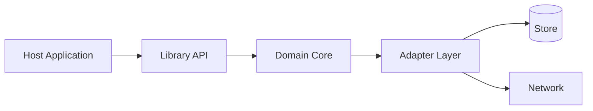
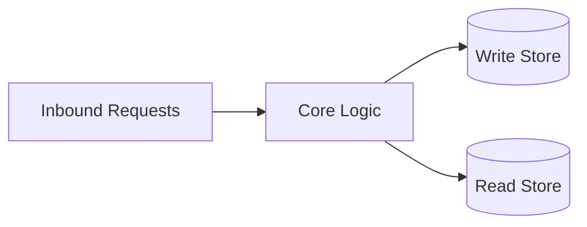
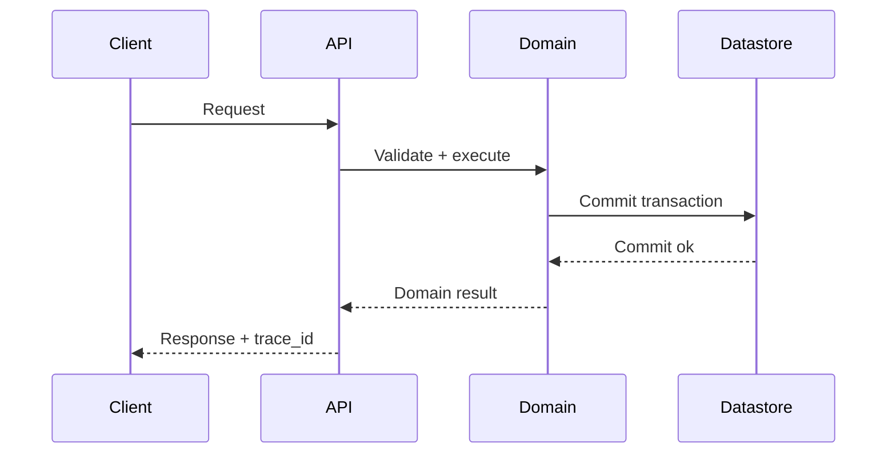
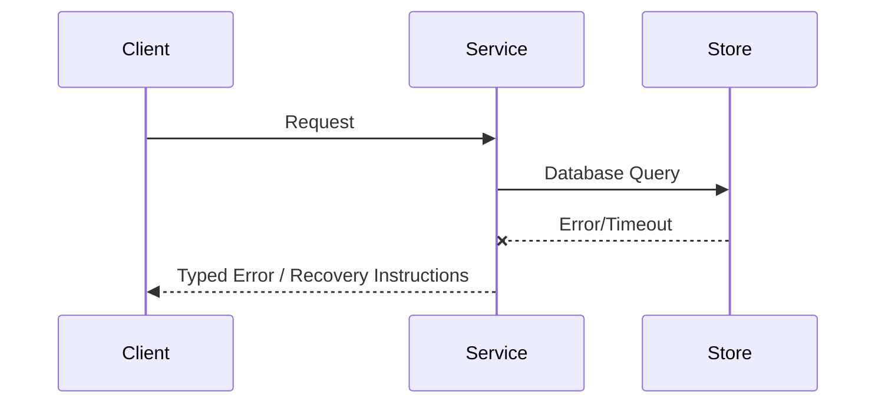

# Architecture

## Direction
cli

## What This Project Is
decapod is a service_or_library project built using Rust, rust.
cli

Architectural principles:
- **Simplicity**: Keep components focused and reusable.
- **Modularity**: Clearly defined interface boundaries and dependency separation.
- **Reliability**: Graceful failure handling and thorough verification.

## Current Facts
- Runtime/languages: Rust, rust
- Detected surfaces/framework hints: cargo, rust
- Product type: service_or_library

## Architecture Map
This project's architecture consists of the following key layers/directories:
- `src/`: Main source directory containing primary logic.
- `tests/`: Integration and unit test suite.

## Data Flows
- Inbound request/command parses and validates at the entrypoint.
- Core runtime handles business logic and initiates queries or state changes.
- Storage adapter reads or writes data to the underlying persistence layers.

## Strongest Existing Primitives
- `core::error::StorageFailureKind` is the application-owned classification seam for contention, storage I/O, constraint, query, value, capability, and unknown failures. Retry and governance callers do not select behavior by backend name; Dactyl errors are normalized at this boundary.
- `core::migration` separates version-gated pending-plan selection and applied-ledger recording from migration execution. Decapod decides when a legacy store may be admitted and copies compatible rows through the Dactyl facade; Dactyl performs physical execution and atomicity, while Decapod retains migration, backup, and recovery policy.
- `DbBroker::execute_write_sync` returns affected rows. Decapod callers own stable IDs rather than reading ambient connection-generated row IDs.
- `DbBroker::with_transaction` is the Decapod-owned atomic mutation seam. The facade keeps a connection-scoped local transaction on Dactyl's physical connection for existing callers, while Dactyl owns the execution and rollback mechanics; cloud callers must use Dactyl's ordered atomic operation contract.
- `core::backend::BackendSelection` is the provider-neutral route seam: it reads `repo.backend`, uses the Git `origin` remote for cloud repository scope, binds local to `.decapod/data/decapod.db`, and passes a session-supplied cloud URI through as opaque data for Dactyl. Ordinary Decapod persistence does not construct a Propodus, Vercel, or Neon path.
- `core::dactyl_db` is the single application-facing relational facade for Dactyl v0.8.2. It exposes the narrow query/row/parameter compatibility surface used by existing domain code while keeping Dactyl's connection and result types behind the Decapod boundary. For a new read-write path it seeds only the empty filesystem target required by Dactyl v0.8.2's pre-open header check; Dactyl still owns the connection, validation, and execution. `core::dactyl::DactylBridge` is the explicit route/context seam for operation batches, access mode, typed errors, and portable schema inspection. `open_canonical` opens the ordinary `.decapod/data/decapod.db` file through Dactyl's host runtime; there is no snapshot-format rejection or legacy-import feature in Decapod.
- The Cargo dependency is resolved as the published crates.io `dactyl-db` v0.8.2 package with Decapod's `sqlite` and `neon` features recorded in `Cargo.lock`. This preserves the same local facade while making release packaging and Nix vendoring registry-backed instead of dependent on a Git source hash.
- `core::backend::StorageContext` is the versioned Decapod-owned handoff between logical selection and physical execution. Local contexts contain only the canonical repository path; remote contexts contain the opaque route, logical repository scope, and an in-memory bearer that is excluded from serialization. Organization membership and repository authorization remain Propodus concerns.
- Cloud todo composition is deliberately layered: `backend=cloud` and Git `origin` select the repository-scoped route; Propodus resolves the machine session and authorization; `core::dactyl::DactylBridge` opens Dactyl with the context; `core::dactyl_todo::DactylTodoStore` issues backend-neutral SQL through Dactyl `/query` and `/batch`. No cloud todo code calls the legacy Propodus `/api/todos` resource route.
- The cloud todo adapter reopens the non-thread-safe Dactyl connection per operation while retaining only the route/context in the `Send + Sync` store object. Each mutation requests one physical batch containing the conditional task write and its committed row observation. Remote events and server-side tenancy/version assignment are owned by the hosted Dactyl/Propodus implementation and are not inferred locally.
- Read-only domain operations skip schema initialization and migration writes; those changes remain owned by the write-side initialization path before a read connection is opened. This keeps Dactyl's read-only enforcement meaningful while allowing validation, RPC, and Markdown primitive reads to use the same facade.
- Session custody is machine-local for both backend choices: the Decapod agent-session record is stored under the machine config directory, uses `local_`/`cloud_` token prefixes to detect backend changes, and defaults to a four-hour TTL bounded between 30 minutes and six hours. Cloud access and refresh tokens are stored separately under the machine data directory and refreshed before the remaining lifetime falls below 30 minutes.
- Native local storage readiness is machine-local rather than repository-local. Before stateful commands use Dactyl with `backend=local`, Decapod honors `DACTYL_SQLITE_LIBRARY` or `~/.config/decapod/runtime.toml`, discovers a non-standard host SQLite library only when neither is configured, and persists a discovered path for reuse across projects on that machine. Cloud-backed startup skips this capability entirely.

## Local-Clone Publication and Store Binding (#1259)
- A container local-clone under `.decapod/workspaces/*` has its own `.git`
  whose `origin` is the parent filesystem path. `get_main_repo_root` walks
  out of that path so todo/session store operations hit the host
  `.decapod/data`, not an empty clone copy.
- `prepare_workspace_clone` fetches `origin/<base>` on the parent, checks
  the feature branch out at that OID, and copies the parent's network remotes
  onto the clone as `upstream`.
- `resolve_publish_remote` first uses a network remote already on the
  workspace; if none exist it walks local remotes and the canonical host
  checkout, adds `upstream`, and pushes there.

## Isolated Workspace Ownership for Spec Projections (#1255)
- Mutation of `.decapod/managed/specs/*` is a custody operation, not a
  convenience rewrite of the host checkout. The control-plane identity is
  the Git worktree root, never `DECAPOD_WORKSPACE` or the current branch
  name alone.
- `workspace::ensure_isolated_workspace_for_projection_mutation` is the
  choke point in front of `refresh_specs_from_codebase`. Protected
  `main`/`master` roots fail closed with `workspace_required`. Isolated
  clones and git worktrees under `.decapod/workspaces/` are the only
  permitted writers.
- `workspace status` must not pass `refresh_specs=true`. Status reports
  drift; the claimed workspace repairs it. Publication then requires the
  managed spec files to appear in the same `base...HEAD` diff as the
  code that caused the projection change.

## Publication Bundle Currency Architecture (#1232)
- `core::validate::validate_publication_bundle_currency` proves presence and
  version-stability at HEAD for the publication bundle. It replaced the
  per-commit `diff-tree` participation model (`PER_COMMIT_PUBLICATION_BUNDLE`)
  that forced artificial churn on long-lived consumer releases.
- Sibling gates remain authoritative for fingerprint integrity, material
  living-spec mutation, and specs-manifest freshness. The currency gate adds
  the explicit rule: when base `AGENTS.md` release pin differs from
  `RELEASE_VERSION`, release-bound paths must appear in `base...HEAD`.
- `workspace::ensure_required_governance_artifacts_in_pr` and the CI
  `governance-artifacts` job require present+valid artifacts, not mandatory
  PR-diff membership. `governance_artifacts::run_inventory` treats
  `all_in_pr_diff` as informational only.

## Topology

## Store Boundaries

## Happy Path Sequence

## Error Path

## Execution Path
- Ingress parse + validation:
- Policy/interlock checks:
- Core execution + persistence:
- Verification and artifact emission:

## Concurrency and Runtime Model
- Execution model:
- Isolation boundaries:
- Backpressure strategy:
- Shared state synchronization:

## Deployment Topology
- Runtime units:
- Region/zone model:
- Rollout strategy (blue/green/canary):
- Rollback trigger and blast-radius scope:

## Data and Contracts
- Inbound contracts (CLI/API/events):
- Outbound dependencies (datastores/queues/external APIs):
- Data ownership boundaries:
- Schema evolution + migration policy: Decapod owns migration identity, ordering, version gates, applied-ledger persistence, backup/restore, and legacy-row translation. Dactyl owns physical execution and normalized results; storage execution remains a replaceable boundary.

## Current PR Control-Plane Sequence
1. Bootstrap discovery and diagnostics (`capabilities`, constitution lookup,
   embedded docs, and version inspection) dispatch before stateful setup so a
   damaged or missing datastore cannot hide the recovery instructions.
2. For stateful commands, the CLI resolves the repository governance root and
   creates the local data directory when required.
3. Before stateful command dispatch, migration reconciliation runs against the
   version-counter and applied-migration ledger.
4. Successful version transitions return a report; the agent-facing command
   emits a warning/instruction naming the applied migrations and inspection
   paths.
5. Trajectory initialization validates the requested run only when the existing
   cookie is a valid same-run artifact, then atomically replaces the single
   tracked JSON file.
6. Validation and publication consume the resulting artifact; no runtime
   reader treats appended JSON values as history.

## Artifact Ownership Matrix
| Artifact | Authority | Update Mechanism | Failure Policy | Historical Record |
|---|---|---|---|---|
| Managed spec authored sections | Project/user contract | Agent-authored PR edit | Material change required when affected | Git history |
| Specs attestation/manifest | Decapod projection | Governed refresh | Validation blocks stale/malformed projection | Git history |
| Managed migration ledger/catalog | Migration history | Startup migration check | Backup/restore and visible failure | Git history |
| Governance trajectory file | Current run evidence | Atomic replace/update | Invalid legacy cookie is replaced by explicit init | Git history |

## Governance Authority and Evidence Boundaries
- Each exact registered directive H3 in `.decapod/OVERRIDE.md` owns a fenced human-authored documentation body. The scaffold uses a four-backtick Markdown source block so headings and nested triple-backtick examples do not render as outer document structure. `core::assets` extracts the wrapper-free body, preserves legacy body bytes during upgrade, and fails the whole overlay on unclosed wrappers, duplicate exact IDs, or non-empty unknown Decapod-namespaced IDs.
- Context resolution and context capsules carry derived authority evidence: directive ID, source path, source hash, body hash, byte count, and precedence.
- `core::events` is the semantic read/write boundary for append-only runtime evidence. Callers do not bind to per-stream tables, a future consolidated table, or legacy JSONL.
- Startup migration reconciles unproven legacy JSONL and legacy local database rows into the canonical Dactyl-backed store idempotently before governed consumers run. A successful single-datastore migration is durable proof that its JSONL inputs are retired. Legacy database rows are read and written through the Dactyl facade; Decapod owns compatibility, backup, and recovery policy. Fresh conflicts fail visibly.

## ADR Register
| ADR | Title | Status | Rationale | Date |
|---|---|---|---|---|
| ADR-001 | Initial topology choice | Proposed | Define first stable architecture | YYYY-MM-DD |

## Delivery Plan (first 3 slices)
- Slice 1 (ship first):
- Slice 2:
- Slice 3:

## Risks and Mitigations
| Risk | Likelihood | Impact | Mitigation |
|---|---|---|---|
| Contract drift across components | Medium | High | Spec + schema checks in CI |
| Runtime saturation under peak load | Medium | High | Capacity model + load tests |

<!-- decapod:capability-overlay:persistent-state:start -->

## Persistent State Architecture Overlay

### State Ownership
- Each entity type MUST have a designated state owner
- State ownership boundaries MUST be explicitly documented
- Cross-boundary state access MUST go through defined interfaces

### Transaction Boundaries
- All multi-entity mutations MUST occur within explicit transactions
- Transaction boundaries MUST be documented in ARCHITECTURE.md
- Compensating transactions for distributed operations

### Storage Abstraction
- Storage ownership, consistency behavior, and access boundaries MUST be explicit
- Portability or swappable implementations are project decisions, not universal requirements
- Migration and rollback treatment MUST match the selected storage technology
<!-- decapod:capability-overlay:persistent-state:end -->

<!-- decapod:codebase-attestation:start -->

## Codebase Attestation

- Repository signal fingerprint: `c84c21f8a0950bbe6b78afb7907b4189e591d8b65cbfd062526c7827bce17941`
- Significant implementation surfaces: `.github/` (9 files), `Cargo.lock/` (1 files), `Cargo.toml/` (1 files), `README.md/` (1 files), `docs/` (1 files), `src/` (104 files), `tests/` (4 files)
- Refreshed from the current codebase by `decapod specs.refresh`
<!-- decapod:codebase-attestation:end -->
