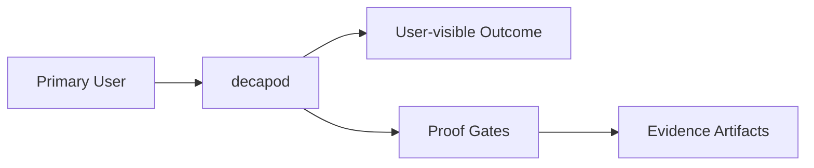

# Intent

<!-- decapod:declared-capabilities:start -->

## Declared Capability Surfaces

- `agent-helper`
- `authentication`
- `authorization`
- `background-processing`
- `control-plane`
- `event-driven`
- `external-integrations`
- `governance-kernel`
- `persistent-state`
- `scheduled-jobs`

<!-- decapod:declared-capabilities:end -->

## Product Outcome
- Decapod is a repo-native governance kernel for bounded, provable, shippable AI coding work. It turns human intent into durable, proof-backed agent execution that can leave the branch as a reviewable, publishable change—not only agent activity in a session.
- Living-spec projections are part of that publishable change: when code changes the attestation, Decapod writes `.decapod/managed/specs/*` only inside the claimed isolated workspace so the same PR carries both the code and its specs. Root-checkout generation is a custody failure (GitHub #1255), not a cleanup chore.
- Public positioning (README tagline, 0.96.18 era): governance for **bounded** work (explicit intent and boundaries), **provable** work (evidence and gates before completion claims), and **shippable** work (publication as a governed state transition, not thrash of already-current release surfaces).
- Reliable convergence is the outcome: the agent preserves accepted intent, stays within explicit boundaries, maintains durable state, responds to validation, remediates supported failures, and produces evidence before completion.
- Product ontology: models produce intelligence; agents perform work; repositories preserve state; Decapod governs the transition from intent to proof.
- Reliability is designed, not hoped for. Trust in generated work follows from explicit intent, boundaries, durable state, validation, supported recovery, and evidence rather than generation capability alone.

## Current Storage Cutover Intent
- The Decapod-owned portion of the dactyl migration is intentionally incremental: application policy must become backend-neutral before storage execution is replaced.
- Decapod owns bounded retry/contention policy, stable identifier generation, migration planning, applied-ledger state, backup/restore, and legacy import. A future dactyl implementation owns only the physical storage guarantees behind those contracts.
- The current PR adds `core::dactyl::DactylBridge` and proves the Dactyl physical contract for explicit caller-owned IDs, atomic rollback, read-only enforcement, and normalized errors in an isolated adapter store. It does not claim canonical local migration or cloud parity: those remain gated by the Dactyl conformance work in [Dactyl #57](https://github.com/DecapodLabs/dactyl/issues/57) and the live Propodus route/schema proofs in [Propodus #55](https://github.com/DecapodLabs/propodus/issues/55), [#71](https://github.com/DecapodLabs/propodus/issues/71), and [#79](https://github.com/DecapodLabs/propodus/issues/79).
- `core::backend::StorageContext` is the versioned handoff for #1254: local contexts carry only the repository-local path, while remote contexts require an opaque authenticated session and a logical repository target. The bearer is memory-only and Dactyl receives it without learning organization, membership, or authorization semantics.
- `core::backend::BackendSelection` maps the project `repo.backend` choice to a repository-scoped route. Local resolves to `.decapod/data/decapod.db`; cloud derives `owner/repository` from the Git `origin` remote and accepts an opaque remote URI only after the authenticated/session boundary supplies it. Decapod does not assemble or interpret a provider-specific cloud URI for ordinary state.
- Local and cloud Decapod agent sessions are machine-local, backend-discriminated (`local_` or `cloud_`), and long-lived enough for an agent run: four hours by default, with a 30-minute minimum and six-hour maximum. Cloud access/refresh credentials remain opaque and are persisted separately from repository state.

## Shared-State Durability Intent
- Material TODO lifecycle mutations are compare-and-swap operations over `(task.id, task.status, task.revision)`. A stale agent receives an explicit conflict and must not create a success event.
- Decapod increments task revisions for durable task mutations, attributes lifecycle events to the actor supplied by the operation or `DECAPOD_AGENT_ID`, and commits state-plus-event writes atomically through the broker transaction boundary.
- The local coordination slice applies that same atomicity rule to agent category/expertise registration, heartbeats, stale-session cleanup, lease yield/handoff, and task-owner add/remove; read-only fleet, presence, ownership, and expertise projections remain non-mutating reads.
- Event stream sequence allocation is idempotent by event identity and protected by a unique `(stream, seq)` invariant. These are Decapod semantics that a future Dactyl/Propodus backend must preserve; they are not Propodus governance rules.

## Release pin flywheel
- Master entrypoint/Dockerfile/manifest pins record the Decapod version that generated that tip. Cargo-only releases do not rewrite pins. Release Artifact Sync is removed. The first user/agent PR evaluating a newer installed Decapod must refresh all four entrypoints, the managed Dockerfile pin, and the specs manifest.

## Current Governance Artifact Intent
- Managed specs are living project contracts: fresh scaffolds must be
  substantially explanatory, while refresh must preserve authored meaning and
  update only bounded Decapod-owned projections.
- A trajectory is a single run cookie for the current branch/PR. It is
  replaced atomically when a new run is initialized; historical runs belong in
  Git history and must never be represented by concatenated JSON documents.
- Migration work is agent-visible. The first governed command after a detected
  Decapod version transition reports the previous/current release, applied
  migrations, and the ledger/catalog paths the agent must inspect.

## Publication Bundle Currency Intent (#1232)
- Publication and validation prove that release-bound entrypoints, the managed
  Dockerfile pin, the specs manifest, living specs, and governance artifacts are
  **present and current for the published repository state**.
- Unchanged artifacts inherited from the base branch are sufficient when their
  release pins and provenance still validate. Consumer repos that stay on one
  Decapod release for a long time must not be forced to invent textual or mode
  churn solely so those paths appear in every commit or PR diff.
- When the installed Decapod release advances past the base pin, or when a code
  change invalidates an artifact's governed dependency surface, prior proof is
  insufficient: the affected surfaces must be refreshed and revalidated before
  publication.
- Material authored living-spec rewrites remain required for non-release PRs;
  fingerprint-only attestation refresh is never enough (`FINGERPRINT_ONLY_SPECS`).

## Issue Acceptance Contract (#1226 and #1228)
| Requirement | Implementation Obligation | Proof |
|---|---|---|
| Verbose managed specs | Bump the scaffold contract and add explicit intent, topology, interface, proof, state, operations, and security sections | Fresh-init scaffold regression |
| Iterative spec hygiene | Preserve authored prose while refreshing bounded attestations/manifests | Existing refresh-preservation tests plus material spec diff |
| Single trajectory JSON | Replace the cookie atomically and recover from legacy appended/malformed content on explicit init | Unit regression plus CLI trajectory coverage |
| Agent-triggered migrations | Run the migration check on every local command and announce version/migration transitions | Migration report regression and command-path review |

## What This Project Is
Decapod is a Rust governance kernel invoked by agents through ephemeral CLI and structured RPC processes. It is intentionally daemonless. The repository is the durable execution surface, so one task can continue across processes, models, harnesses, and Decapod invocations.

The human expresses intent and provides judgment. The agent interprets the repository, performs the work, authors living specifications, follows validation feedback, and gathers evidence. Decapod governs accepted work, validates invariants, maintains governance state, refreshes supported projections, and blocks publication while required conditions are unsatisfied.

Decapod is not an autonomous coding agent, LLM, inference engine, orchestration framework, daemon, prompt library, coding assistant, project-management system, or replacement for an agent harness.

Key operating facts:
- **Primary languages**: Rust, rust
- **Detected surfaces**: cargo, rust

## Product View

## Inferred Baseline
- Repository: decapod
- Product type: service_or_library
- Primary languages: Rust, rust
- Detected surfaces: cargo, rust

## Scope
| Area | In Scope | Proof Surface |
|---|---|---|
| Governed execution | Preserve intent and boundaries through interpretation, execution, validation, supported remediation, revalidation, and publication | Plans, todos, trajectories, living specs, and lifecycle tests |
| Durable state | Keep authoritative state, generated projections, custody, evidence, and receipts distinguishable and repository-native | [ARCHITECTURE.md](./ARCHITECTURE.md), [INTERFACES.md](./INTERFACES.md), and schema checks |
| Publication quality | Block publication while required invariants or evidence are unsatisfied | [VALIDATION.md](./VALIDATION.md) blocking gates and validation receipts |

## Non-Goals (Falsifiable)
| Non-goal | How to falsify |
|---|---|
| Feature creep beyond the primary outcome | Any PR adds capability not tied to outcome criteria |
| Shipping without evidence | Missing validation artifacts for promoted changes |
| Ambiguous ownership boundaries | Missing owner/system-of-record in interfaces |
| Performing the agent's work | Documentation or interfaces claim Decapod interprets requirements, writes implementation code, or authors repository meaning |
| Replacing agents, harnesses, orchestrators, or task trackers | Product surfaces schedule agent execution, perform inference, or require Decapod to become the organizational system of record |

## Constraints
- Technical: runtime, dependency, and topology boundaries are explicit.
- Operational: deployment, rollback, and incident ownership are defined.
- Security/compliance: sensitive data handling and authz are mandatory.

## Acceptance Criteria (must be objectively testable)
- [ ] Decapod validate passes, required tests pass, and promotion-relevant artifacts are present.
- [ ] Non-functional targets are met (latency, reliability, cost, etc.).
- [ ] Validation gates pass and artifacts are attached.
- [ ] `cargo test` passes for unit/integration coverage
- [ ] `cargo clippy -- -D warnings` passes with no denied lints
- [ ] `cargo fmt --check` passes on the repo
- [ ] Resolved context proves every applied repository override by directive ID, source, hashes, bytes, and precedence.
- [ ] A healthy spec-drift gate emits no warning; every remaining warning names an observed condition.
- [ ] Runtime governance consumers observe canonical SQLite events after legacy JSONL removal.

## Epistemic Custody Fields

### Active Assumptions
- Host has functional `git` (verified in workspace preflight)
- Host has functional `docker`/`podman` for container workspaces (optional but gated)
- Agent has write access to `.decapod/` directory
- DECAPOD_SESSION_PASSWORD set per-agent for session acquisition
- Project is a git repository (workspace ensure requires it)

### Confidence & Risk Level
- **Confidence**: High (local coordination, deterministic rebuild, proven workspace isolation)
- **Risk**: Low (local isolation limits blast radius; no background processes)

### Measured vs Inferred Facts
| Fact | Source (Provenance) | Type |
|------|---------------------|------|
| Git is installed | `Command::new("git")` check in workspace.rs | Measured |
| SQLite WAL mode works | `db_connect` with journal_mode=WAL fallback | Measured |
| Isolated branch naming | `workspace::ensure` execution with agent/todo scoping | Measured |
| Deterministic DB rebuild | `todo::rebuild_db_from_events` round-trip test | Measured |
| Capsule hash determinism | `context_capsule::canonical_json_bytes` + SHA256 | Measured |

### Unresolved Contradictions
- Cloud backend experimental opt-in exists but sync/migration not implemented
- Federation (multi-repo knowledge graph) vs single-repo governance boundaries need clarification

### Deferred Questions
- Full cloud synchronization protocol (beyond init registration)
- Cross-repository obligation graphs
- Long-term capsule storage tiering

### Stop Conditions
- SQLite lock contention exceeding retry budget (5 retries with exponential backoff)
- Conflicting todo claims by another active agent session
- Workspace on protected branch with local modifications
- Validation epoch drift detected without refresh

### Proof Required Before Completion
- Green `cargo test` suite (unit + integration)
- Complete spec verification manifest generation
- `decapod validate --refresh-specs` passes
- All promotion gates satisfied with attached evidence

## Tradeoffs Register
| Decision | Benefit | Cost | Review Trigger |
|---|---|---|---|
| Simplicity vs extensibility | Faster iteration | Potential rework | Feature set expands |
| Strict gates vs dev speed | Higher confidence | More upfront discipline | Lead time regressions |

## First Implementation Slice
- [ ] Define the smallest user-visible workflow to ship first.
- [ ] Define required data/contracts for that workflow.
- [ ] Define what is intentionally postponed until v2.

## Open Questions (with decision deadlines)
| Question | Owner | Deadline | Decision |
|---|---|---|---|
| Which interfaces are versioned at launch? | TBD | YYYY-MM-DD | |
| Which non-functional target is hardest to hit? | TBD | YYYY-MM-DD | |

<!-- decapod:codebase-attestation:start -->

## Codebase Attestation

- Repository signal fingerprint: `7d74c0afe1a4b60ee3d063e06c53d4d588a7457be1ba3f7f66a960d5ee7ad5f2`
- Significant implementation surfaces: `.github/` (9 files), `Cargo.lock/` (1 files), `Cargo.toml/` (1 files), `README.md/` (1 files), `docs/` (1 files), `src/` (103 files), `tests/` (4 files)
- Refreshed from the current codebase by `decapod specs.refresh`
<!-- decapod:codebase-attestation:end -->

## Honest composition note (#1233 review)
`PUBLICATION_BUNDLE_CURRENCY` is a HEAD load/presence predicate; fingerprint and living-spec attestation remain sibling gates.

## Release-bound sync for release-plz PRs (#1236)
release-plz version bumps change `Cargo.toml` (and thus `repo_signal_fingerprint`) without regenerating entrypoint pins. Validation must not hard-fail those PRs on drift; `release-artifact-sync` and the post-release-plz heal step regenerate pins/specs and commit them.

## Three-tier project PR contract (#1234 / #1232)

1. **Governance JSON** — always update every PR (`claims`, `plan`, `trajectory`, `validation`).
2. **Living specs** — unique material prose for the change under review; fingerprint/attestation
   re-verify always, but fingerprint *value* need only change when the evaluating Decapod version
   is newer than the project base.
3. **Entrypoints** — Decapod-owned. Always verify early against the evaluating binary. When pins
   match (same Decapod version as base), leave files untouched. When pins mismatch (version bump),
   Decapod rewrites them and the PR must include those diffs. Hand edits and mode-only touches fail.
