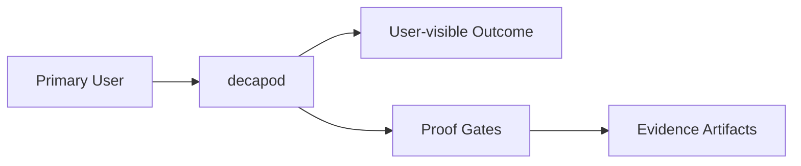

# Intent

<!-- decapod:declared-capabilities:start -->

## Declared Capability Surfaces

- `agent-helper`
- `authentication`
- `authorization`
- `background-processing`
- `control-plane`
- `event-driven`
- `external-integrations`
- `governance-kernel`
- `persistent-state`
- `scheduled-jobs`

<!-- decapod:declared-capabilities:end -->
## Product Outcome
- Decapod is a repo-native governance kernel for AI coding agents. It turns human intent into bounded, durable, and proof-backed agent work.
- Reliable convergence is the outcome: the agent preserves accepted intent, stays within explicit boundaries, maintains durable state, responds to validation, remediates supported failures, and produces evidence before completion.
- Product ontology: models produce intelligence; agents perform work; repositories preserve state; Decapod governs the transition from intent to proof.
- Reliability is designed, not hoped for. Trust in generated work follows from explicit intent, boundaries, durable state, validation, supported recovery, and evidence rather than generation capability alone.

## What This Project Is
Decapod is a Rust governance kernel invoked by agents through ephemeral CLI and structured RPC processes. It is intentionally daemonless. The repository is the durable execution surface, so one task can continue across processes, models, harnesses, and Decapod invocations.

The human expresses intent and provides judgment. The agent interprets the repository, performs the work, authors living specifications, follows validation feedback, and gathers evidence. Decapod governs accepted work, validates invariants, maintains governance state, refreshes supported projections, and blocks publication while required conditions are unsatisfied.

Decapod is not an autonomous coding agent, LLM, inference engine, orchestration framework, daemon, prompt library, coding assistant, project-management system, or replacement for an agent harness.

Key operating facts:
- **Primary languages**: Rust, rust
- **Detected surfaces**: cargo, rust

## Product View

## Inferred Baseline
- Repository: decapod
- Product type: service_or_library
- Primary languages: Rust, rust
- Detected surfaces: cargo, rust

## Scope
| Area | In Scope | Proof Surface |
|---|---|---|
| Governed execution | Preserve intent and boundaries through interpretation, execution, validation, supported remediation, revalidation, and publication | Plans, todos, trajectories, living specs, and lifecycle tests |
| Durable state | Keep authoritative state, generated projections, custody, evidence, and receipts distinguishable and repository-native | [ARCHITECTURE.md](./ARCHITECTURE.md), [INTERFACES.md](./INTERFACES.md), and schema checks |
| Publication quality | Block publication while required invariants or evidence are unsatisfied | [VALIDATION.md](./VALIDATION.md) blocking gates and validation receipts |

## Non-Goals (Falsifiable)
| Non-goal | How to falsify |
|---|---|
| Feature creep beyond the primary outcome | Any PR adds capability not tied to outcome criteria |
| Shipping without evidence | Missing validation artifacts for promoted changes |
| Ambiguous ownership boundaries | Missing owner/system-of-record in interfaces |
| Performing the agent's work | Documentation or interfaces claim Decapod interprets requirements, writes implementation code, or authors repository meaning |
| Replacing agents, harnesses, orchestrators, or task trackers | Product surfaces schedule agent execution, perform inference, or require Decapod to become the organizational system of record |

## Constraints
- Technical: runtime, dependency, and topology boundaries are explicit.
- Operational: deployment, rollback, and incident ownership are defined.
- Security/compliance: sensitive data handling and authz are mandatory.

## Acceptance Criteria (must be objectively testable)
- [ ] Decapod validate passes, required tests pass, and promotion-relevant artifacts are present.
- [ ] Non-functional targets are met (latency, reliability, cost, etc.).
- [ ] Validation gates pass and artifacts are attached.
- [ ] `cargo test` passes for unit/integration coverage
- [ ] `cargo clippy -- -D warnings` passes with no denied lints
- [ ] `cargo fmt --check` passes on the repo
- [ ] Resolved context proves every applied repository override by directive ID, source, hashes, bytes, and precedence.
- [ ] A healthy spec-drift gate emits no warning; every remaining warning names an observed condition.
- [ ] Runtime governance consumers observe canonical SQLite events after legacy JSONL removal.

## Epistemic Custody Fields

### Active Assumptions
- Host has functional `git` (verified in workspace preflight)
- Host has functional `docker`/`podman` for container workspaces (optional but gated)
- Agent has write access to `.decapod/` directory
- DECAPOD_SESSION_PASSWORD set per-agent for session acquisition
- Project is a git repository (workspace ensure requires it)

### Confidence & Risk Level
- **Confidence**: High (local coordination, deterministic rebuild, proven workspace isolation)
- **Risk**: Low (local isolation limits blast radius; no background processes)

### Measured vs Inferred Facts
| Fact | Source (Provenance) | Type |
|------|---------------------|------|
| Git is installed | `Command::new("git")` check in workspace.rs | Measured |
| SQLite WAL mode works | `db_connect` with journal_mode=WAL fallback | Measured |
| Isolated branch naming | `workspace::ensure` execution with agent/todo scoping | Measured |
| Deterministic DB rebuild | `todo::rebuild_db_from_events` round-trip test | Measured |
| Capsule hash determinism | `context_capsule::canonical_json_bytes` + SHA256 | Measured |

### Unresolved Contradictions
- Cloud backend experimental opt-in exists but sync/migration not implemented
- Federation (multi-repo knowledge graph) vs single-repo governance boundaries need clarification

### Deferred Questions
- Full cloud synchronization protocol (beyond init registration)
- Cross-repository obligation graphs
- Long-term capsule storage tiering

### Stop Conditions
- SQLite lock contention exceeding retry budget (5 retries with exponential backoff)
- Conflicting todo claims by another active agent session
- Workspace on protected branch with local modifications
- Validation epoch drift detected without refresh

### Proof Required Before Completion
- Green `cargo test` suite (unit + integration)
- Complete spec verification manifest generation
- `decapod validate --refresh-specs` passes
- All promotion gates satisfied with attached evidence

## Tradeoffs Register
| Decision | Benefit | Cost | Review Trigger |
|---|---|---|---|
| Simplicity vs extensibility | Faster iteration | Potential rework | Feature set expands |
| Strict gates vs dev speed | Higher confidence | More upfront discipline | Lead time regressions |

## First Implementation Slice
- [ ] Define the smallest user-visible workflow to ship first.
- [ ] Define required data/contracts for that workflow.
- [ ] Define what is intentionally postponed until v2.

## Open Questions (with decision deadlines)
| Question | Owner | Deadline | Decision |
|---|---|---|---|
| Which interfaces are versioned at launch? | TBD | YYYY-MM-DD | |
| Which non-functional target is hardest to hit? | TBD | YYYY-MM-DD | |

<!-- decapod:codebase-attestation:start -->
## Codebase Attestation

- Repository signal fingerprint: `da2222f40d1547d10c94dc41e24b54c576f6e04811c2fad4e9517552b0bf4da0`
- Significant implementation surfaces: `.github/` (10 files), `Cargo.lock/` (1 files), `Cargo.toml/` (1 files), `README.md/` (1 files), `docs/` (1 files), `src/` (101 files), `tests/` (4 files)
- Refreshed from the current codebase by `decapod specs.refresh`
<!-- decapod:codebase-attestation:end -->
