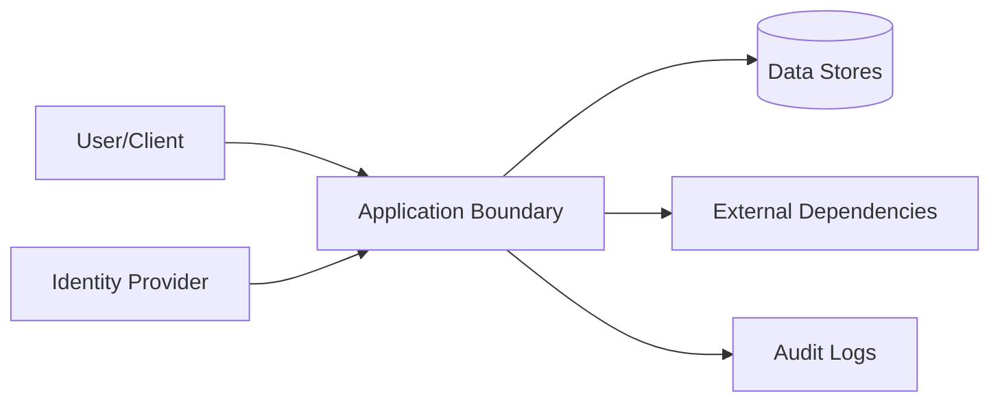

# Security

## Threat Model

## STRIDE Table
| Threat | Surface | Mitigation | Verification |
|---|---|---|---|
| Spoofing | Auth boundary | strong auth + token validation | auth tests |
| Tampering | State mutation APIs | integrity checks + RBAC | integration tests |
| Repudiation | Critical actions | immutable audit logs | log review |
| Information disclosure | Data at rest/in transit | encryption + classification | security scans |
| Denial of service | Hot paths | rate limit + backpressure | load tests |
| Elevation of privilege | Admin interfaces | least privilege + policy checks | authz tests |

## Authentication
- Identity source:
- Token/session lifetime:
- Rotation and revocation:

## Authorization
- Role model:
- Resource-level policy:
- Privilege escalation controls:

## Governance Artifact Trust Boundaries
- Prompt and issue text is untrusted input; the agent safety gate evaluates it
  before repository instructions are followed.
- Migration ledgers and trajectory files are evidence artifacts, not authority
  to broaden task scope or bypass a human decision gate.
- The migration notice instructs the agent to inspect the ledger; it does not
  silently grant permission to apply an unrequested breaking product change.
- Trajectory hashes protect artifact integrity, while Git history preserves
  prior runs; neither substitutes for authorization or validation.

## Data Classification
| Data Class | Examples | Storage Rules | Access Rules |
|---|---|---|---|
| Public | docs, non-sensitive metadata | standard | unrestricted |
| Internal | operational telemetry | controlled | team access |
| Sensitive | tokens, PII, secrets | encrypted | least privilege |

## Sensitive Data Handling
- Encryption at rest:
- Encryption in transit:
- Redaction in logs:
- Retention + deletion policy:

## Supply Chain Security
- Recommended scanners: `cargo audit`, `cargo deny`, `cargo vet`
- Dependency update cadence:
- Signed artifact/provenance strategy:

## Secrets Management
| Secret | Source | Rotation | Consumer |
|---|---|---|---|
| External service auth material | managed runtime configuration | periodic | runtime services |
| Artifact signing material | managed signing service/local secure store | periodic | release pipeline |

## Security Testing
| Test Type | Cadence | Tooling |
|---|---|---|
| SAST | each PR | language linters/scanners |
| Dependency scan | each PR + weekly | supply-chain tools |
| DAST/pentest | scheduled | external/internal |

## Trust-Boundary Inventory
| Boundary | Principal/Input | Authority Granted | Validation | Audit Evidence | Failure Default |
|---|---|---|---|---|---|
| User/agent -> entrypoint | prompt and issue text | bounded task context | prompt safety gate | trajectory record | deny/reject |
| Entrypoint -> core | parsed command arguments | scoped operation | command contract | validation receipt | deny/reject |
| Core -> persistence | governed state mutation | recorded artifact update | session and invariant gates | audit ledger | rollback/fail closed |
| Runtime -> external dependency | network/package input | explicitly authorized capability | policy and provenance checks | action evidence | timeout/degrade |

## Agent and Automation Safety
- The first local Decapod call in each run must surface any release transition
  and migration instruction before the agent continues.
- Migration notices direct inspection of the migration ledger and catalog; they
  do not silently authorize an unrequested breaking product change.
- Untrusted prompt, issue, configuration, or attachment content cannot broaden
  authority or replace a human decision gate.
- Privileged mutations require a scoped actor and durable proof artifact.

## Compliance and Audit
- Regulatory scope:
- Audit evidence location:
- Exception process:

## Pre-Promotion Security Checklist
- [ ] Threat model updated for changed surfaces.
- [ ] Auth/authz tests pass.
- [ ] Dependency vulnerability scan reviewed.
- [ ] No unresolved critical/high security findings.

## Strongest Security Primitives
Describe the security primitives and security controls implemented in this repository.

## Security Practices
- **Least Privilege**: Ensure minimal access permissions for all subsystems and roles.
- **Input Validation**: Strictly validate all inputs at trust boundaries.
- **Secure Storage**: Encrypt sensitive data at rest and in transit.

<!-- decapod:codebase-attestation:start -->

## Codebase Attestation

- Repository signal fingerprint: `e887d87ee09cd774e16c328247b89ddd33d46279bd24764f4592b34e75d2e466`
- Significant implementation surfaces: `.github/` (9 files), `Cargo.lock/` (1 files), `Cargo.toml/` (1 files), `README.md/` (1 files), `docs/` (1 files), `src/` (104 files), `tests/` (4 files)
- Refreshed from the current codebase by `decapod specs.refresh`
<!-- decapod:codebase-attestation:end -->
