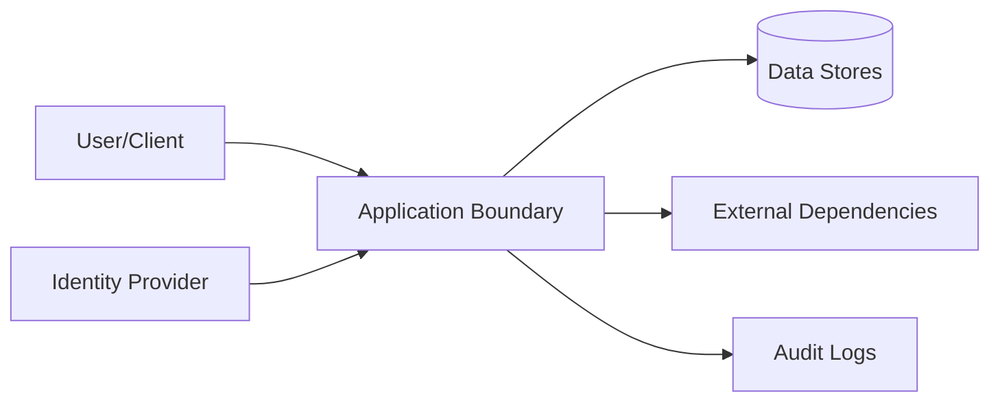

# Security

## Threat Model

```mermaid
flowchart LR
   U[User/Client] --> A[Application Boundary]
   A --> D[(Data Stores)]
   A --> X[External Dependencies]
   I[Identity Provider] --> A
   A --> L[Audit Logs]
```

## STRIDE Table
| Threat | Surface | Mitigation | Verification |
|---|---|---|---|
| Spoofing | Auth boundary | strong auth + token validation | auth tests |
| Tampering | State mutation APIs | integrity checks + RBAC | integration tests |
| Repudiation | Critical actions | immutable audit logs | log review |
| Information disclosure | Data at rest/in transit | encryption + classification | security scans |
| Denial of service | Hot paths | rate limit + backpressure | load tests |
| Elevation of privilege | Admin interfaces | least privilege + policy checks | authz tests |

## Authentication
- Identity source:
- Token/session lifetime:
- Rotation and revocation:

## Authorization
- Role model:
- Resource-level policy:
- Privilege escalation controls:

## Governance Artifact Trust Boundaries
- Prompt and issue text is untrusted input; the agent safety gate evaluates it
  before repository instructions are followed.
- Migration ledgers and trajectory files are evidence artifacts, not authority
  to broaden task scope or bypass a human decision gate.
- The migration notice instructs the agent to inspect the ledger; it does not
  silently grant permission to apply an unrequested breaking product change.
- Trajectory hashes protect artifact integrity, while Git history preserves
  prior runs; neither substitutes for authorization or validation.
- Absolute local paths are treated as information-disclosure material at the
  governance-artifact boundary. Internal paths are reduced to project-relative
  names and external paths are replaced with <external-path> before they
  enter trajectory or validation output. This is redaction, not encryption;
  the active filesystem operation retains its private absolute path.
- The data db verify diagnostic has read-only access and no repair authority.
  Corruption cannot grant permission for raw SQLite, REINDEX, or dump/reload;
  recovery is available only through the explicit, authenticated Decapod
  operator command backed by Dactyl v0.10.0's supported contract.
- The local datastore sidecar lock is a coordination primitive, not an
  authorization boundary. Decapod holds it for canonical connection lifetime,
  reports bounded contention, and never deletes it as stale; OS lock release
  handles process exit. External clients that ignore the contract remain
  outside Decapod's corruption-prevention guarantee.

## Data Classification
| Data Class | Examples | Storage Rules | Access Rules |
|---|---|---|---|
| Public | docs, non-sensitive metadata | standard | unrestricted |
| Internal | operational telemetry | controlled | team access |
| Sensitive | tokens, PII, secrets | encrypted | least privilege |

## Sensitive Data Handling
- Encryption at rest:
- Encryption in transit:
- Redaction in logs:
- Retention + deletion policy:

## Supply Chain Security
- Recommended scanners: `cargo audit`, `cargo deny`, `cargo vet`
- Dependency update cadence:
- Signed artifact/provenance strategy:

## Secrets Management
Gatekeeper recognizes literal bearer credentials after header/assignment
delimiters, at the start of quoted or backticked values (with optional leading
whitespace), at the start of line/block comments, and on standalone scheme
lines. The word bearer inside an ordinary sentence is not
itself authentication-scheme syntax. Short values and dictionary words in
explicit credential syntax remain findings; token spelling, entropy, test
filenames, and synthetic-fixture labels do not grant an exemption. Secret
scanning remains line-based and heuristic rather than a complete parser or
dataflow analysis: a value described only in arbitrary prose is outside this
bearer-scheme recognizer. A quoted value beginning with a newline is covered
when the scheme and credential occupy the same subsequent line; concatenated
values or schemes split from their credentials across lines are not covered.

Rust password-value candidates additionally use conservative, byte-span-bound
formatting context. A complete basic named replacement field is excluded from
hardcoded-password findings only when an absolute standard formatting macro
receives that named argument directly from `::std::env::var` with a literal key,
optionally through parentheses and at most one `?` or argument-free `unwrap`
extraction. Further methods could be custom extension traits. This is runtime
source evidence, not an exemption based on the credential's spelling. Every
other match on the same line, including the environment-key literal, is still
scanned. Arguments with literal defaults, unknown calls, or captured-variable
provenance remain findings; a recognized unresolved replacement field receives
a specific diagnostic rather than a safety waiver.

This deliberately partial Rust classifier does not expand macros or resolve
whole-program dataflow. Unqualified macros do not grant exemptions. Opaque
macro bodies, ambiguous standard-library namespaces, transforming attributes,
malformed source, cooked string escapes, unsupported format grammar, BOMs, and
shebangs retain the ordinary findings. Absolute standard paths assume the
standard extern-prelude names; local bindings visible in the scanned file fail
closed. Dependencies or parent modules that redefine those names are outside
this file-local source model. Raw and multiline strings use original byte
locations; a mismatch in source mapping never grants an exemption.

Connection-string, key, and dangerous-pattern rules remain independent. SQL-
looking strings and embedded shell inputs remain findings: a SQL-looking string
can be passed indirectly to a shell, so extensions and nearby keywords cannot
prove it harmless. Synthetic credential-shaped fixtures remain detectable.
Missing container custody and other publication evidence remain independent
blocking requirements.

| Secret | Source | Rotation | Consumer |
|---|---|---|---|
| External service auth material | managed runtime configuration | periodic | runtime services |
| Artifact signing material | managed signing service/local secure store | periodic | release pipeline |

## Security Testing
| Test Type | Cadence | Tooling |
|---|---|---|
| SAST | each PR | language linters/scanners |
| Dependency scan | each PR + weekly | supply-chain tools |
| DAST/pentest | scheduled | external/internal |

## Trust-Boundary Inventory
| Boundary | Principal/Input | Authority Granted | Validation | Audit Evidence | Failure Default |
|---|---|---|---|---|---|
| User/agent -> entrypoint | prompt and issue text | bounded task context | prompt safety gate | trajectory record | deny/reject |
| Entrypoint -> core | parsed command arguments | scoped operation | command contract | validation receipt | deny/reject |
| Core -> persistence | governed state mutation | recorded artifact update | session and invariant gates | audit ledger | rollback/fail closed |
| Runtime -> external dependency | network/package input | explicitly authorized capability | policy and provenance checks | action evidence | timeout/degrade |

## Agent and Automation Safety
- The first local Decapod call in each run must surface any release transition
  and migration instruction before the agent continues.
- Migration notices direct inspection of the migration ledger and catalog; they
  do not silently authorize an unrequested breaking product change.
- Untrusted prompt, issue, configuration, or attachment content cannot broaden
  authority or replace a human decision gate.
- Privileged mutations require a scoped actor and durable proof artifact.

## Compliance and Audit
- Regulatory scope:
- Audit evidence location:
- Exception process:

## Pre-Promotion Security Checklist
- [ ] Threat model updated for changed surfaces.
- [ ] Auth/authz tests pass.
- [ ] Dependency vulnerability scan reviewed.
- [ ] No unresolved critical/high security findings.

## Strongest Security Primitives
Describe the security primitives and security controls implemented in this repository.

## Security Practices
- **Least Privilege**: Ensure minimal access permissions for all subsystems and roles.
- **Input Validation**: Strictly validate all inputs at trust boundaries.
- **Secure Storage**: Encrypt sensitive data at rest and in transit.

<!-- decapod:codebase-attestation:start -->

## Codebase Attestation

- Repository signal fingerprint: `34647bb8f923292a6788fce97bf591b7da81244f2daed9693986e988f9457e5b`
- Significant implementation surfaces: `.github/` (9 files), `Cargo.lock/` (1 files), `Cargo.toml/` (1 files), `README.md/` (1 files), `assets/` (5 files), `docs/` (1 files), `src/` (124 files), `tests/` (161 files)
- Refreshed from the current codebase by `decapod specs.refresh`
<!-- decapod:codebase-attestation:end -->

## Storage filesystem permission boundary

Decapod-owned creation uses explicit Unix directory/file modes before writing
state. Datastore entrypoints validate existing SQLite and coordination
sidecars, leaf links and directory ancestry without silently chmodding an
installation. Explicit trusted-group datastore sharing is bounded to the
storage directory's group; machine credentials and sessions remain private.
Atomic and migration copies use the same owned-state creation boundary.
Online-backup temporaries are confined to a private staging directory before
safe final publication. Pinned Dactyl recovery cannot select private staging,
so shared-directory recovery is explicitly unsupported; private-directory
recovery preserves the original safe mode on its new rebuilt inode. Unix
mode checks are not Windows ACL enforcement. `docs/storage-permissions.md`
defines the supported boundary, operator recovery and subprocess-umask proof.
