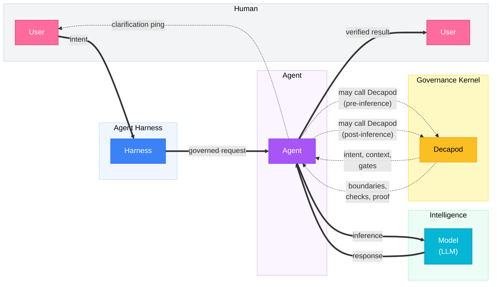

<p align="center">🦀</p>

<p align="center">
  <code>cargo binstall decapod && decapod init</code>
</p>

<p align="center">
  <strong>Decapod</strong><br />
  Repo-native governance kernel for AI coding agents.<br />
  <em>Intent · Custody · Trajectory · Proof — <strong>fleet coherence</strong></em>
</p>

<p align="center">
  You keep working in Cursor, Claude Code, Codex, Antigravity, Grok, or any other harness. Decapod gives the agents in that repo a shared governance kernel so work stays bounded, attributable, and recoverable after a session ends.
</p>

<p align="center">
  Decapod is a local-first, daemonless, repo-native governance kernel that agents call at governance boundaries — before acting, before inference, before touching code, before completing — to shape intent, bound context, enforce boundaries, and produce proof.
</p>

<p align="center">
  <a href="https://github.com/DecapodLabs/decapod/actions"></a>
  <a href="https://crates.io/crates/decapod"></a>
  <a href="https://github.com/DecapodLabs/decapod/blob/master/LICENSE"></a>
  <a href="https://decapodlabs.github.io/accountable-agentic-execution/"></a>
</p>

Canonical Contract: [assets/constitution.json (core/DECAPOD)](assets/constitution.json#L5)

Paper: [Intent, Custody, Trajectory, and Proof (Raber, 2026)](https://github.com/DecapodLabs/accountable-agentic-execution/blob/main/paper/Accountable_Agentic_Execution.pdf) · [dashboard](https://decapodlabs.github.io/accountable-agentic-execution/) · [artifact](https://github.com/DecapodLabs/accountable-agentic-execution)

---

## Quick Start

```bash
cargo binstall decapod
decapod init
```

`decapod init` creates `.decapod/`, the repo-native substrate your agent uses to turn intent, rules, context, custody, validation, and completion into inspectable project state.

Agent conversations are temporary. Repo state is durable. Decapod keeps the parts of agent work that should not live only in a chat transcript, so a later agent, reviewer, CI run, or human maintainer can recover what was requested, what was understood, what boundaries applied, what changed, what validation ran, and what remains unresolved.

---

## Fleet coherence

Chat is ephemeral. The repository is where coordination has to live.

Agents can already edit, build, and test. What they still lose, mid-run or mid-handoff, is ownership, selected context, and checkable evidence. Once write access and shell tools are in play, agent work behaves like concurrent processes over shared state. That is the systems problem Decapod is built for.

**Fleet coherence** is the ability of independently launched agents (same harness or different ones) to share one project authority, claim distinct work, keep a selected governance record, and finish against a common proof boundary. It comes from four primitives:

| | |
| --- | --- |
| **Intent** | Desired outcome, constraints, unknowns, and completion standard, carried in plans, todos, and specs rather than only in a prompt. |
| **Custody** | Exclusive task claims and isolated worktrees (containers when configured) so two agents do not silently own the same work. |
| **Trajectory** | Selected events for claims, handoffs, validation, and proof so a later process can reorient without replaying a vendor chat. |
| **Proof** | Machine-checkable validation and provenance bound to governed state. Completion is a verified transition. |

The hard case is concurrent work that is *similar but distinct*: same modules or tests, different outcomes. Worktrees stop file trampling. Claims, context capsules, trajectory, and publication gates are what keep the fleet from wasting inference and shipping incompatible halves.

You speak naturally to whichever agent is available. The agent calls Decapod at governance boundaries. That split is deliberate: humans keep natural delegation; agents hold a stable machine contract for authority, custody, trajectory, and proof. See the [research paper](https://github.com/DecapodLabs/accountable-agentic-execution/blob/main/paper/Accountable_Agentic_Execution.pdf) for the formal model and study design. Controlled results are still prospective; the mechanisms are real.

---

## How it works

AI coding agents often lose the plot: they forget intent, pull too much context, skip dependencies, and touch protected files. A second agent or a tool switch makes that worse when ownership and evidence lived only in the previous chat.

Decapod gives them a repo-native governance layer that makes intent explicit, boundaries enforceable, context deliberate, and completion provable.

### The Loop



**Harness ↔ User pings** — The harness can ping the user for additional context when intent is unclear or verification needs human input.

Decapod is called by the agent at governance boundaries. Before inference, the agent *may* branch into Decapod to shape intent, context, and gates. After inference, the agent *may* branch into Decapod when the work needs boundary checks, verification, proof, or another governed pass. Each call may recurse until the work is shaped, bounded, and provable. Decapod is not the agent and not the model; it is the governance kernel the agent calls whenever work needs control.

Decapod is called before:

- **Acting** — clarify intent and generate specs
- **Inference** — resolve focused context capsules
- **Touching Code** — enforce boundaries and protected paths
- **Completing** — produce verification and proof

The model weights stay fixed. What changes is the corridor around the model: resolve authoritative project context before implementation inference, then gate completion on proof. That is also how a later agent re-enters the same work without your ad hoc briefing.

---

## Capabilities

1. **Clarifies intent** — Converts vague requests into explicit, versioned specifications.
2. **Bounds context** — Resolves only the minimal relevant code and docs for the task, with provenance. More context is not presumed better.
3. **Coordinates concurrent agents** — Exclusive claims and isolated workspaces so agents can share a repo without trampling work or losing state.
4. **Records trajectory** — Durable governance events for handoff and recovery across sessions and harnesses.
5. **Enforces boundaries** — Safeguards protected branches and sensitive modules.
6. **Governs adaptation** — Manages feedback-driven instruction changes through explicit review.
7. **Requires proof** — Gates completion on deterministic verification artifacts.

Decapod externalizes that state into the project. Role-playing multi-agent frameworks keep coordination inside one conversation topology; Decapod keeps it in repository artifacts any conforming harness can call. Worktrees alone are not enough for semantic overlap, dependency order, or post-merge proof.

---

## The substrate

Decapod preserves what agent workbenches lose: governed project state that survives a session, a tool switch, a crash, a retry, or a handoff.

`.decapod/` is the repo-native substrate for governed agent execution. It records the durable state Decapod needs to keep work bounded, attributable, resumable, and provable without depending on any one model provider, agent workbench, or conversation transcript.

```
.decapod/
  managed/
    specs/         # Living specs (INTENT, ARCHITECTURE, INTERFACES, OPERATIONS, README, SECURITY, SEMANTICS, VALIDATION) — tracked
    sessions/      # Agent session custody and correlation — tracked
  generated/
    awareness/     # Deterministic context capsules — generated at runtime
    artifacts/     # Verification output and proof provenance — generated at runtime
  data/            # Durable repo-native state — untracked (optionally select `backend=cloud` in `.decapod/config.toml` or during `decapod init`)
  governance/      # Living evidence (trajectory, proof rubrics, validation receipts, research claims) — tracked
  workspaces/      # Isolated git worktrees (container workspaces require explicit opt-in) — created on demand
  config.toml      # Project shape and agent-facing configuration — tracked
  OVERRIDE.md      # Plain-Markdown local authority; Decapod derives resolution proof — tracked
```

The substrate turns the important parts of agent work into durable repo state:

- **Intent** becomes specs and todos instead of an implicit prompt.
- **Context** becomes scoped capsules instead of whatever fit in chat history.
- **Custody** becomes claimed tasks and isolated workspaces instead of informal ownership.
- **Trajectory** becomes event-backed governance records instead of lost intermediate reasoning.
- **Boundaries** become project rules, overrides, and validation gates instead of reminders.
- **Validation** becomes proof artifacts and receipts instead of a final assertion.
- **Completion** becomes a verified state transition instead of "looks done".

Every governed run leaves operational evidence. The generated files are the human-visible proof surface: inspect them locally, review them in PRs, and use them to re-establish state across different agents like Cursor, Codex, Gemini, and Kilo.

After `cargo install decapod`, the next normal Decapod invocation autonomously
reconciles unproven event JSONL into canonical SQLite before runtime reads. A
durable single-datastore migration receipt retires already-imported JSONL and
repairs any legacy SQLite stores recreated by an older binary without rereading
the archives as live authority. Existing
override bodies are rendered into a fenced source area under each exact current
directive subsection. Humans replace the visible instruction inside that block
with Markdown or any documentation style they prefer; Decapod extracts the body
without rendering it as document structure. Existing body bytes are preserved,
and ambiguous binding authority fails closed with derived source/body hashes and byte counts.

Decapod does not make agents smarter by giving them longer conversations. It makes agent work shippable by turning intent, context, boundaries, custody, trajectory, validation, and completion into governed repo state.

---

## The constitution

Decapod ships with an embedded engineering constitution: 100+ embedded constitution documents covering architecture, security, performance, and testing.

Agents consult the constitution, cite claim IDs, follow gates, and produce proof, which reduces guesswork without eliminating judgment. The constitution is the authority root: an embedded baseline, a binding project-local `OVERRIDE.md`, and task-scoped projections with provenance before inference. That structure exists so authority is queryable rather than treated as one unbounded instruction file in the prompt.

---

## Guarantees

- **Daemonless** — Runs on demand like `git` or `grep`.
- **Local-first** — Ordinary governance runs locally without requiring a persistent hosted service.
- **Repo-native** — Governed state remains durable and inspectable with the repository.
- **Provider-agnostic** — Works with any model provider, agent harness, or toolchain (behavior may vary per integration). Project state, not a single vendor conversation, is the coordination surface.
- **Completion requires passed proof-plan gates** — `VERIFIED` status requires passed proof-plan gates (INV-PROOF-GATED).
- **Enforces protected paths and branch isolation (configured)** — Protected paths and branch isolation enforced per `.decapod/config.toml`.

Decapod is the repo-native governance kernel agents call when work needs bounded execution, coordination, continuity, and proof. It is not an agent framework, prompt pack, model router, or generic orchestrator. Claims do not replace human authority. Handoff does not transfer hidden chat state. Worktrees do not guarantee clean integration. Proof records what configured gates observed.

---

## Documentation

- **[Human Documentation (mdBook)](https://decapodlabs.github.io/decapod/)**: Conceptual overview, workflows, adoption guide, and reference.
- **[Agent API Index](docs/agent/api-index.md)** — Contracts and interfaces for agents integrating with Decapod.
- **[Universal Agent Contract (AGENTS.md)](AGENTS.md)**: The machine-readable entrypoint for all agents operating in this repo.
- **[Paper PDF](https://github.com/DecapodLabs/accountable-agentic-execution/blob/main/paper/Accountable_Agentic_Execution.pdf)**: *Intent, Custody, Trajectory, and Proof* (Raber, 2026).
- **[Research dashboard](https://decapodlabs.github.io/accountable-agentic-execution/)**: Project page and study overview.
- **[Fleet coherence protocol](https://github.com/DecapodLabs/accountable-agentic-execution/blob/main/docs/fleet-coherence-protocol.md)**: Handoff, concurrency, and tool-switch study design.

---

## Contributing

```bash
git clone https://github.com/DecapodLabs/decapod
cd decapod
cargo build && cargo test
```

- [CONTRIBUTING.md](CONTRIBUTING.md)
- [SECURITY.md](SECURITY.md)
- [Issues](https://github.com/DecapodLabs/decapod/issues)
