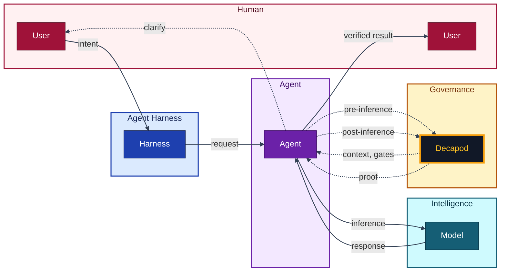

<p align="center">🦀</p>

<p align="center">
  <code>cargo binstall decapod && decapod init</code>
</p>

<p align="center">
  <strong>Decapod</strong><br />
  Repo-native governance kernel for AI coding agents.
</p>

<p align="center">
  Work in Cursor, Claude Code, Codex, Antigravity, Grok, or any harness you prefer.
  Decapod governs the work without replacing the agent or its harness.
</p>

<p align="center">
  <a href="https://github.com/DecapodLabs/decapod/actions"></a>
  <a href="https://crates.io/crates/decapod"></a>
  <a href="https://github.com/DecapodLabs/decapod/blob/master/LICENSE"></a>
  <a href="assets/constitution.json#L5"></a>
  <a href="https://decapodlabs.github.io/accountable-agentic-execution/"></a>
</p>

---

## The layer Decapod occupies

Decapod sits between agent capability and trusted delivery:

```text
Models produce intelligence.
Agents perform work.
Repositories preserve state.
Decapod governs the transition from intent to proof.
```

As agents make code generation easier, generation is no longer the complete
reliability problem. Organizations need to trust what was generated. Reliability
is designed, not hoped for: intent, boundaries, durable state, validation,
recovery, and evidence make trust an architectural property of the delivery
path.

## Product definition

> Decapod is a repo-native governance kernel that turns human intent into bounded, durable, and proof-backed agent work.

Software work has always required people to manage commands, workflows, state,
and recovery. AI agents improve that interface, but natural language alone does
not prevent drift, lost context, conflicting work, or false completion. Decapod
moves those execution burdens into governed repository state.

## Product statement

> The model can reason. Decapod makes the agent converge.

Convergence means the agent preserves the original intent, stays within explicit
boundaries, carries durable state across invocations, responds to validation,
remediates supported failures, and produces evidence before claiming completion.
Governance is the mechanism. Reliable convergence is the outcome.

## Execution flow

```text
Human intent
→ agent interpretation
→ explicit boundaries
→ governed execution
→ validation and recovery
→ proof-backed publication
```

The human expresses intent and provides judgment. The agent interprets the
repository, performs the work, authors the living specifications, follows
validation feedback, and gathers evidence. Decapod governs accepted work and
blocks publication when required conditions are not satisfied. The repository
preserves the state and history that let the work continue across processes,
models, harnesses, and Decapod invocations.

## Product boundaries

Decapod is not an autonomous coding agent, LLM, inference engine, orchestration
framework, daemon, prompt library, coding assistant, project-management system,
or replacement for an agent harness. It governs work performed by agents.

## Quick start

```bash
cargo binstall decapod
decapod init
```

One command installs the kernel. One command prepares the repository. You keep
speaking naturally. Agents call Decapod at the points that matter: before
acting, before inference, at validation boundaries, and before publication.

What was asked, what was understood, what changed, and what was proven
is written into the project itself.

---

## How it works

An agent task may span many Decapod invocations. Each CLI or RPC invocation is
ephemeral. Decapod intentionally runs without a daemon; durable execution state
lives in the repository. Agents repeatedly invoke the kernel as they interpret,
execute, validate, remediate, revalidate, and publish.



Validation is part of that control loop, not a terminal report. A failed gate
usually means the task remains incomplete. When Decapod exposes a supported
remediation, the agent applies it, updates the relevant artifact, and validates
again. Not every failure is recoverable; unresolved decision gates and
contradictions remain visible for human judgment. Publication is a governed
state transition, and agent-reported completion is not proof that it occurred.

---

## Capabilities

1. **Intent** — Vague requests become explicit, versioned specifications.
2. **Context** — Only the relevant code and docs, with provenance.
3. **Coordination** — Exclusive claims and isolated workspaces for concurrent agents.
4. **Trajectory** — Durable events for handoff across sessions and harnesses.
5. **Boundaries** — Protected branches and sensitive modules stay protected.
6. **Adaptation** — Instruction changes go through explicit review.
7. **Proof** — Completion requires deterministic verification.

---

## The substrate

`.decapod/` holds the durable state of governed agent work:

```
.decapod/
  managed/specs/     # Living project specifications
  managed/sessions/  # Session custody
  generated/         # Context capsules and proof artifacts
  data/              # Local project store
  governance/        # Trajectory, claims, and validation
  workspaces/        # Isolated worktrees (containers when configured)
  config.toml        # Project shape
  OVERRIDE.md        # Local authority, in plain Markdown
```

- **Intent** becomes specs and todos.
- **Context** becomes scoped capsules.
- **Custody** becomes claimed tasks and workspaces.
- **Trajectory** becomes event-backed records.
- **Boundaries** become rules, overrides, and gates.
- **Validation** becomes proof artifacts.
- **Completion** becomes a verified state transition.

`OVERRIDE.md` is yours to edit. Write instructions the way you write documentation.
Decapod binds each directive to its source and body with fail-closed resolution.

Decapod does not author repository meaning or perform the agent's work. It makes
the work reviewable and publishable by turning governance into repository state.

---

## The constitution

Decapod ships with an embedded engineering constitution —
architecture, security, performance, and testing as queryable doctrine.

Agents consult it, cite claims, follow gates, and produce proof.
Judgment remains human. Authority is explicit:
baseline constitution, project override, task-scoped projection.

---

## Guarantees

- **Daemonless** — Invoked like `git` or `grep`.
- **Local-first** — Governance runs on your machine by default.
- **Repo-native** — State stays with the repository.
- **Provider-agnostic** — Any model, any harness. The project is the coordination surface.
- **Proof-gated completion** — `VERIFIED` requires passed proof-plan gates.
- **Branch isolation** — Protected paths and branches stay protected.

Decapod is a governance kernel. The agent remains responsible for the work.

---

## Documentation

- [Human docs](https://decapodlabs.github.io/decapod/)
- [Governed execution architecture](docs/architecture/governed-execution.md)
- [Agent API](docs/agent/api-index.md)
- [Agent contract](AGENTS.md)
- [Paper](https://github.com/DecapodLabs/accountable-agentic-execution/blob/main/paper/Accountable_Agentic_Execution.pdf)
- [Research](https://decapodlabs.github.io/accountable-agentic-execution/)

---

## Contributing

```bash
git clone https://github.com/DecapodLabs/decapod
cd decapod
cargo build && cargo test
```

[CONTRIBUTING](CONTRIBUTING.md) · [SECURITY](SECURITY.md) · [Issues](https://github.com/DecapodLabs/decapod/issues)
