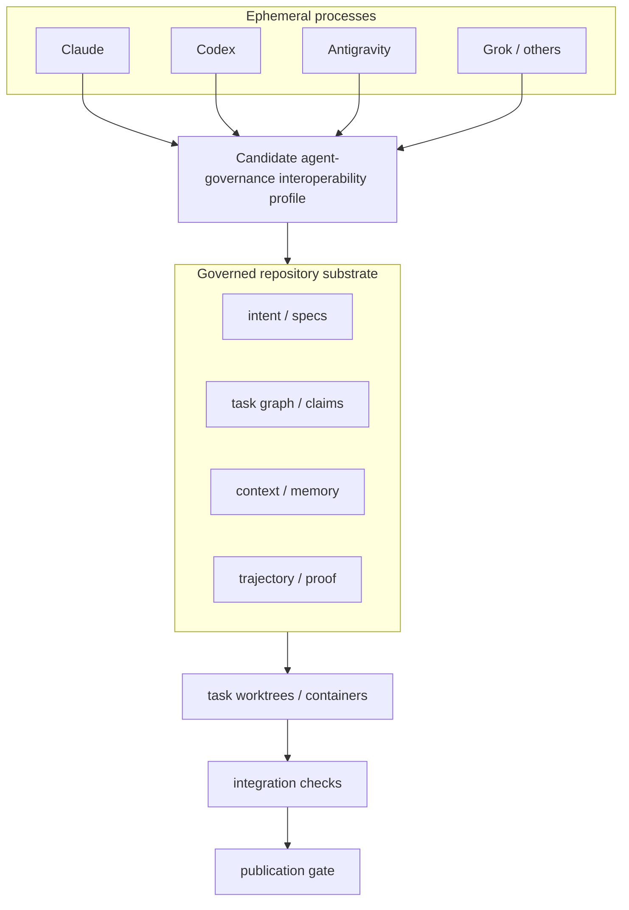
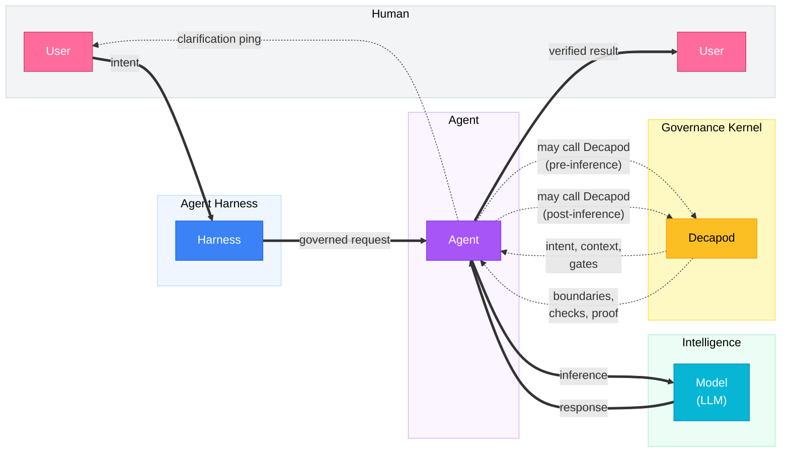

<p align="center">🦀</p>

<p align="center">
  <code>cargo binstall decapod && decapod init</code>
</p>

<p align="center">
  <strong>Decapod</strong><br />
  Repo-native governance kernel for AI coding agents.<br />
  <em>Intent · Custody · Trajectory · Proof → <strong>fleet coherence</strong></em>
</p>

<p align="center">
  You keep working in Cursor, Claude Code, Codex, Antigravity, Grok, or any other harness; Decapod gives the agents operating there a shared governance kernel inside the repository — so independently launched agents stay coherent across sessions, handoffs, and concurrent work.
</p>

<p align="center">
  Decapod is a local-first, daemonless, repo-native governance kernel that agents call at governance boundaries — before acting, before inference, before touching code, before completing — to shape intent, bound context, enforce boundaries, and produce proof.
</p>

<p align="center">
  <a href="https://github.com/DecapodLabs/decapod/actions"></a>
  <a href="https://crates.io/crates/decapod"></a>
  <a href="https://github.com/DecapodLabs/decapod/blob/master/LICENSE"></a>
  <a href="https://decapodlabs.github.io/accountable-agentic-execution/"></a>
</p>

Canonical Contract: [assets/constitution.json (core/DECAPOD)](assets/constitution.json#L5)

**Paper (PDF):** [Intent, Custody, Trajectory, and Proof: Toward Accountable Execution in Agentic Software Engineering](https://github.com/DecapodLabs/accountable-agentic-execution/blob/main/paper/Accountable_Agentic_Execution.pdf) — Raber, Decapod Labs, July 2026  
[Project dashboard](https://decapodlabs.github.io/accountable-agentic-execution/) · [research artifact](https://github.com/DecapodLabs/accountable-agentic-execution)

---

## Fleet coherence

Agent conversations are ephemeral. The governed repository is the durable coordination subject.

Modern coding agents give us *executable intent* — models that edit, build, test, and deploy. What they still lack, in a chat-centered baseline, is durable **custody** and **proof**. Once an agent can write the repo and run arbitrary tools, software engineering is a **distributed execution and security problem**, not only a language-modeling one.

**Fleet coherence** is the bounded ability of independently launched, heterogeneous agents to use one durable project authority, custody model, governance trajectory, and proof boundary across sessions, handoffs, and similar-but-distinct concurrent work. It is an *emergent property* of four primitives — not a fifth primitive, a consensus protocol, or a conflict-free merge guarantee:

| Primitive | Role |
| --- | --- |
| **Intent** | Human/team desired outcome, motivation, constraints, priorities, unresolved questions, stop conditions, and completion standard — progressively resolved through plans, todos, specs, and proof expectations. A prompt is an initial, incomplete expression of intent; governed artifacts are projections, not the source of authority. |
| **Custody** | Explicit task ownership and isolated git worktrees (containers when configured) so mutations stay bounded and claims stay exclusive. |
| **Trajectory** | Selected governance record — tasks, handoffs, proof, memory, and validation events — so later agents can reconstruct without replaying a vendor chat. |
| **Proof** | Machine-checkable validation and provenance evidence bound to governed state; completion is a verified transition, not a verbal claim. |

Governed work follows a fixed corridor:

**intent → claim → workspace → proofs → publish**

The central fleet question:

> Can multiple independently launched agents concurrently solve **similar but distinct** problems in the same codebase while preserving shared authority, distinct task custody, isolated mutation, dependency awareness, and integrated proof?

Worktrees alone answer only the direct-mutation part. Decapod also externalizes claims, context capsules, trajectory, and proof so concurrent agents can avoid duplicated inference, coordinate handoffs across harnesses, and publish against a shared acceptance boundary.



You speak naturally to whichever agent is available — *type the outcome and walk away*. The agent handles Decapod’s stable governance protocol. That **operator decoupling** is the design target of a candidate [agent-governance interoperability profile](https://github.com/DecapodLabs/accountable-agentic-execution/blob/main/docs/agent-governance-interoperability.md): a narrow machine contract for authority, custody, trajectory, and proof that harnesses could pre-bundle or discover — without making one vendor conversation the project’s durable state.

---

## Quick Start

```bash
cargo binstall decapod
decapod init
```

`decapod init` creates `.decapod/`, the repo-native substrate your agent uses to turn intent, rules, context, custody, validation, and completion into inspectable project state.

Agent conversations are temporary. Repo state is durable. Decapod preserves the parts of agent work that should not live only in a chat transcript, so a later agent, reviewer, CI run, or human maintainer can recover what was requested, what was understood, what boundaries applied, what changed, what validation ran, and what remains unresolved.

---

## How it works

AI coding agents often lose the plot: they forget intent, pull too much context, skip dependencies, and touch protected files. Multi-agent fleets compound those failures — cross-runtime discontinuity, ownership ambiguity, duplicated inference, handoff loss, and integration races that worktrees alone cannot prevent.

Decapod gives them a repo-native governance layer that makes intent explicit, boundaries enforceable, context deliberate, completion provable, and concurrent agents coherent.

### The Loop



**Harness ↔ User pings** — The harness can ping the user for additional context when intent is unclear or verification needs human input.

Decapod is called by the agent at governance boundaries. Before inference, the agent *may* branch into Decapod to shape intent, context, and gates. After inference, the agent *may* branch into Decapod when the work needs boundary checks, verification, proof, or another governed pass. Each call may recurse until the work is shaped, bounded, and provable. Decapod is not the agent and not the model; it is the governance kernel the agent calls whenever work needs control.

Decapod is called before:

- **Acting** — clarify intent and generate specs
- **Inference** — resolve focused context capsules
- **Touching Code** — enforce boundaries and protected paths
- **Completing** — produce verification and proof

The primary research question remains walk-away alignment: under the same complex natural delegation prompt, can pre-inference resolution of authoritative project context let an unchanged model converge toward the intended outcome with less human coaching? The fleet program extends that question across handoffs, concurrent agents, and tool switches.

---

## Capabilities

1. **Clarifies intent** — Converts vague requests into explicit, versioned specifications (Intent).
2. **Bounds context** — Resolves only the minimal relevant code and docs for the task, with provenance.
3. **Coordinates concurrent agents** — Shared authority, exclusive claims, and isolated workspaces for **fleet coherence** without trampling work or losing state (Custody).
4. **Records trajectory** — Durable governance events so a later session or workbench can reorient without a full chat replay (Trajectory).
5. **Enforces boundaries** — Safeguards protected branches and sensitive modules.
6. **Governs adaptation** — Manages feedback-driven instruction changes through explicit review.
7. **Requires proof** — Gates completion on deterministic verification artifacts (Proof).

### What fleet coherence is — and is not

| Is | Is not |
| --- | --- |
| Shared durable project authority across agents | Global consensus or a distributed lock service |
| Explicit task custody and workspace isolation | Complete OS sandboxing or credential isolation |
| Selected trajectory for handoff and recovery | Lossless transfer of hidden model reasoning |
| Shared proof / publication boundary | Conflict-free merge or semantic-correctness certificate |
| Provider-independent *project* state | A guarantee every harness complies automatically |

Decapod targets the **cost of fragmentation**: context rehydration, duplicated inference, collision repair, handoff reconstruction, verification waste, integration failure after separately valid work, dialect translation across harnesses, context bloat, and abandoned interrupted runs. Benefits, if any, are always measured against governance overhead — setup, context resolution, workspaces, proof, and integration cost.

---

## Research foundation

Decapod is the reference implementation for:

> **Alex H. Raber.** *Intent, Custody, Trajectory, and Proof: Toward Accountable Execution in Agentic Software Engineering.* Decapod Labs, July 2026. Pre-results technical report.  
> **[PDF](https://github.com/DecapodLabs/accountable-agentic-execution/blob/main/paper/Accountable_Agentic_Execution.pdf)** · [dashboard](https://decapodlabs.github.io/accountable-agentic-execution/) · [artifact](https://github.com/DecapodLabs/accountable-agentic-execution)

The paper frames agentic software engineering as a *distributed execution problem* and formalizes the four primitives above. The primary empirical question is one-shot **walk-away** delegation under an identical natural prompt: conventional (CN) versus Decapod-governed (DN) execution with an *unchanged* underlying model. Decapod is hypothesized to make the agent system *operationally more knowledgeable* by resolving authoritative project context **before** implementation inference — not by changing model weights.

**Status:** mechanisms, terminology, schemas, and falsifiable protocols are public; controlled empirical benchmarks are not yet executed. Checked-in controlled records in the research artifact are synthetic harness fixtures, not treatment evidence. Hypotheses concern system-level operational alignment and coordination at a fixed model — not changed model intelligence, complete sandboxing, conflict-free merging, or global consensus.

Prospective study program:

| Study | Focus |
| --- | --- |
| **A** | Walk-away alignment — CN vs DN under the identical complex natural prompt (primary) |
| **B** | Handoff continuity — structured conventional handoff vs governed ownership/context/trajectory/proof transfer |
| **C** | Concurrent heterogeneous fleet — similar-but-distinct tasks with shared authority and integrated proof |
| **D** | Tool-switch continuity — reorientation across workbenches without prior chat transcripts |
| **E** | Observational dogfooding — longitudinal repository facts only; not causal evidence |

**Qualified fleet invariants** (from the implementation audit) distinguish what is enforced today versus still desired: exclusive primary custody and workspace isolation on governed paths; dependency awareness that is represented but not a global scheduler; semantic-overlap awareness among similar-but-distinct tasks (desired, not automatic); bounded handoff continuity; provider-independent project state as an external contract; proof-gated publication; projection consistency for declared surfaces — not distributed consensus.

### Positioning (related work)

Decapod is not “another multi-agent role framework.” MetaGPT, ChatDev, AutoGen, and OpenHands already show role specialization, conversation topology, memory, and sandboxed execution. The architectural distinction is **externalization**: governance lives in durable project state and a CLI/RPC contract so *separately launched* workbenches can participate **without** joining one chat chain or long-running orchestrator.

Closest empirical caution is Gloaguen et al. (ETH Zürich / ICLR MemAgents, 2026): repository-level agent instructions can be followed while **not** improving task success and raising inference cost (>20% in that study). Instruction following ≠ good governance. Decapod answers with structured, queryable constitutional authority and **scoped** pre-inference capsules — minimality and provenance — not a longer prompt file. Whether that structure wins is untested; the paper treats context items as auditable (necessary / useful / irrelevant / redundant / contradictory / harmful).

Proof is pragmatic configured evidence (compilers, tests, workunits, provenance), not mathematical verification or in-toto-class supply-chain signing. Credible fleet baselines are issue trackers + structured handoffs + worktrees + CI — not an empty shared directory.

### Intent-Driven Design

The author coined **Intent-Driven Design** (public LinkedIn, Aug 2025; constitution-first scaffolding by Sep 2025): begin with human/team intent, preserve durable authority in a project constitution, and derive agent guidance before implementation. That lineage is design provenance, not outcome evidence.

### Falsification, threats, and future work

The thesis is designed to lose if structured handoffs and ordinary worktrees match Decapod, shared context harms agents, or coordination overhead outweighs benefit. Implementation boundaries are explicit: no complete OS sandbox, no universal execution ledger, no conflict-free merge guarantee, no native MCP/A2A/HTTP governance service yet, no organization-level constitution overlay. “Federation” in the binary is a **local typed memory graph**; a future optional cloud plane (leases, remote handoff, cross-team evidence) is prospective and must not relocate source-of-truth into a vendor agent platform.

Implementation surfaces include atomic exclusive claims, trust-gated shared ownership and handoff, task-scoped worktrees, deterministic context capsules, selected governance events, proof/workunit state, and publication gates. Handoff does not transfer hidden chat state; worktrees do not prove clean integration.

---

## The substrate

Decapod preserves what agent workbenches lose: governed project state that survives a session, a tool switch, a crash, a retry, or a handoff.

`.decapod/` is the repo-native substrate for governed agent execution. It records the durable state Decapod needs to keep work bounded, attributable, resumable, and provable — without depending on any one model provider, agent workbench, or conversation transcript.

```
.decapod/
  managed/
    specs/         # Living specs (INTENT, ARCHITECTURE, INTERFACES, OPERATIONS, README, SECURITY, SEMANTICS, VALIDATION) — tracked
    sessions/      # Agent session custody and correlation — tracked
  generated/
    awareness/     # Deterministic context capsules — generated at runtime
    artifacts/     # Verification output and proof provenance — generated at runtime
  data/            # Durable repo-native state — untracked (optionally select `backend=cloud` in `.decapod/config.toml` or during `decapod init`)
  governance/      # Living evidence (trajectory, proof rubrics, validation receipts, research claims) — tracked
  workspaces/      # Isolated git worktrees (container workspaces require explicit opt-in) — created on demand
  config.toml      # Project shape and agent-facing configuration — tracked
  OVERRIDE.md      # Plain-Markdown local authority; Decapod derives resolution proof — tracked
```

The substrate turns the important parts of agent work into durable repo state:

- **Intent** becomes specs and todos instead of an implicit prompt.
- **Context** becomes scoped capsules instead of whatever fit in chat history.
- **Custody** becomes claimed tasks and isolated workspaces instead of informal ownership.
- **Trajectory** becomes event-backed governance records instead of lost intermediate reasoning.
- **Boundaries** become project rules, overrides, and validation gates instead of reminders.
- **Validation** becomes proof artifacts and receipts instead of a final assertion.
- **Completion** becomes a verified state transition instead of "looks done".

Every governed run leaves operational evidence. The generated files are the human-visible proof surface: inspect them locally, review them in PRs, and use them to re-establish state across different agents like Cursor, Codex, Gemini, and Kilo.

After `cargo install decapod`, the next normal Decapod invocation autonomously
reconciles unproven event JSONL into canonical SQLite before runtime reads. A
durable single-datastore migration receipt retires already-imported JSONL and
repairs any legacy SQLite stores recreated by an older binary without rereading
the archives as live authority. Existing
override bodies are rendered into a fenced source area under each exact current
directive subsection. Humans replace the visible instruction inside that block
with Markdown or any documentation style they prefer; Decapod extracts the body
without rendering it as document structure. Existing body bytes are preserved,
and ambiguous binding authority fails closed with derived source/body hashes and byte counts.

Decapod does not make agents smarter by giving them longer conversations. It makes agent work shippable by turning intent, context, boundaries, custody, trajectory, validation, and completion into governed repo state — the substrate of fleet coherence.

---

## The constitution

Decapod ships with an embedded engineering constitution: 100+ embedded constitution documents covering architecture, security, performance, and testing.

Agents consult the constitution, cite claim IDs, follow gates, and produce proof — reducing guesswork but not eliminating the need for judgment. The constitution is the authority root for the governance contract: an embedded baseline, a binding project-local `OVERRIDE.md`, and task-scoped provenance-bearing projections before inference. Organization-level policy overlays remain a prospective layer of the constitutional authority chain.

---

## Guarantees

- **Daemonless** — Runs on demand like `git` or `grep`.
- **Local-first** — Ordinary governance runs locally without requiring a persistent hosted service.
- **Repo-native** — Governed state remains durable and inspectable with the repository.
- **Provider-agnostic** — Works with any model provider, agent harness, or toolchain (behavior may vary per integration); fleet coherence targets project state, not a single vendor conversation.
- **Completion requires passed proof-plan gates** — `VERIFIED` status requires passed proof-plan gates (INV-PROOF-GATED).
- **Enforces protected paths and branch isolation (configured)** — Protected paths and branch isolation enforced per `.decapod/config.toml`.

Decapod is not an agent framework, prompt pack, model router, or generic orchestrator. It is the repo-native governance kernel agents call when work needs bounded execution, coordination, continuity, and proof — including **fleet coherence** across concurrent and sequential agent processes.

---

## Documentation

Decapod provides comprehensive documentation for both human operators and AI agents.

- **[Human Documentation (mdBook)](https://decapodlabs.github.io/decapod/)**: Conceptual overview, workflows, adoption guide, and reference.
- **[Agent API Index](docs/agent/api-index.md)** — Contracts and interfaces for agents integrating with Decapod.
- **[Universal Agent Contract (AGENTS.md)](AGENTS.md)**: The machine-readable entrypoint for all agents operating in this repo.
- **[Paper PDF](https://github.com/DecapodLabs/accountable-agentic-execution/blob/main/paper/Accountable_Agentic_Execution.pdf)**: *Intent, Custody, Trajectory, and Proof* (Raber, 2026).
- **[Research dashboard](https://decapodlabs.github.io/accountable-agentic-execution/)**: Accountable Agentic Execution project page and study overview.
- **[Fleet Coherence Protocol](https://github.com/DecapodLabs/accountable-agentic-execution/blob/main/docs/fleet-coherence-protocol.md)**: Prospective handoff, concurrency, and tool-switch study design.

---

## Contributing

```bash
git clone https://github.com/DecapodLabs/decapod
cd decapod
cargo build && cargo test
```

- [CONTRIBUTING.md](CONTRIBUTING.md)
- [SECURITY.md](SECURITY.md)
- [Issues](https://github.com/DecapodLabs/decapod/issues)
