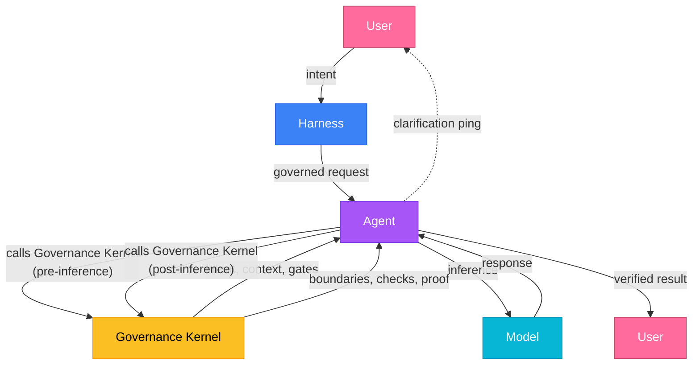

<p align="center">🦀</p>

<p align="center">
  <code>cargo binstall decapod && decapod init</code>
</p>

<p align="center">
  <strong>Decapod</strong><br />
  Repo-native governance kernel for AI coding agents.
</p>

<p align="center">
  Decapod runs on demand. Agents call it at governance boundaries — before acting, before inference, before touching code, before completing — to shape intent, bound context, enforce boundaries, and produce proof.
</p>

<p align="center">
  You keep working in your harness (Cursor, Claude Code, Codex, Antigravity, or any agent tool). Decapod gives those agents a shared governance layer inside the repo.
</p>

<p align="center">
  <a href="https://github.com/DecapodLabs/decapod/actions"></a>
  <a href="https://crates.io/crates/decapod"></a>
  <a href="https://github.com/DecapodLabs/decapod/blob/master/LICENSE"></a>
</p>

Canonical Contract: [assets/constitution.json (core/DECAPOD)](assets/constitution.json#L5)

Paper: [Accountable Agentic Execution (Raber, 2026)](https://decapodlabs.github.io/accountable-agentic-execution/)

---

## Quick Start

```bash
cargo binstall decapod
decapod init
```

`decapod init` creates `.decapod/`, the repo-native substrate your agent uses to turn intent, rules, context, custody, validation, and completion into inspectable project state.

Agent conversations are temporary. Repo state is durable. Decapod preserves the parts of agent work that should not live only in a chat transcript, so a later agent, reviewer, CI run, or human maintainer can recover what was requested, what was understood, what boundaries applied, what changed, what validation ran, and what remains unresolved.

---

## How it works

AI coding agents often lose the plot: they forget intent, pull too much context, skip dependencies, and touch protected files. Decapod gives them a repo-native governance layer that makes intent explicit, boundaries enforceable, context deliberate, and completion provable.

### The Loop



**Harness ↔ User pings** — The harness can ping the user for additional context when intent is unclear or verification needs human input.

Decapod is called by the agent at governance boundaries. Before inference, the agent branches into Decapod to shape intent, context, and gates. After inference, the agent branches into Decapod when the work needs boundary checks, verification, proof, or another governed pass. Each call may recurse until the work is shaped, bounded, and provable. Decapod is not the agent and not the model; it is the governance kernel the agent calls whenever work needs control.

Decapod is called before:

- **Acting** — clarify intent and generate specs
- **Inference** — resolve focused context capsules
- **Touching Code** — enforce boundaries and protected paths
- **Completing** — produce verification and proof

---

## Capabilities

1. **Clarifies intent** — Converts vague requests into explicit, versioned specifications.
2. **Bounds context** — Resolves only the minimal relevant code and docs for the task.
3. **Coordinates concurrent agents** — Lets Cursor, Claude Code, Codex, Gemini CLI, and other tools work against the same repo simultaneously without duplicating work, trampling workspaces, or losing state.
4. **Enforces boundaries** — Safeguards protected branches and sensitive modules.
5. **Governs adaptation** — Manages feedback-driven instruction changes through explicit review.
6. **Requires proof** — Gates completion on deterministic verification artifacts.

---

## The substrate

Decapod preserves what agent workbenches lose: governed project state that survives a session, a tool switch, a crash, a retry, or a handoff.

`.decapod/` is the repo-native substrate for governed agent execution. It records the durable state Decapod needs to keep work bounded, attributable, resumable, and provable — without depending on any one model provider, agent workbench, or conversation transcript.

```
.decapod/
  managed/
    specs/         # Living specs (INTENT, ARCHITECTURE, INTERFACES, OPERATIONS, README, SECURITY, SEMANTICS, VALIDATION)
    sessions/      # Agent session custody and correlation
  generated/
    awareness/     # Deterministic context capsules
    artifacts/     # Verification output and proof provenance
  data/            # Durable repo-native state (DBs, events, todos)
  governance/      # Trajectory, proof rubrics, validation receipts
  workspaces/      # Isolated git worktrees and container workspaces
  config.toml      # Project shape and agent-facing configuration
  OVERRIDE.md      # Local rules that override embedded defaults
```

The substrate turns the important parts of agent work into durable repo state:

- **Intent** becomes specs and todos instead of an implicit prompt.
- **Context** becomes scoped capsules instead of whatever fit in chat history.
- **Custody** becomes claimed tasks and isolated workspaces instead of informal ownership.
- **Boundaries** become project rules, overrides, and validation gates instead of reminders.
- **Validation** becomes proof artifacts and receipts instead of a final assertion.
- **Completion** becomes a verified state transition instead of "looks done".

Every governed run leaves operational evidence. The generated files are the human-visible proof surface: inspect them locally, review them in PRs, and use them to re-establish state across different agents like Cursor, Codex, Gemini, and Kilo.

Decapod does not make agents smarter by giving them longer conversations. It makes agent work shippable by turning intent, context, boundaries, custody, validation, and completion into governed repo state.

---

## The constitution

Decapod ships with an embedded engineering constitution: 100+ embedded constitution documents covering architecture, security, performance, and testing.

Everything an engineering org usually keeps in tribal memory or review culture becomes executable guidance. Your agent does not guess; it reads the constitution, cites claim IDs, follows gates, and produces proof.

---

## Guarantees

- **Daemonless** — Runs on demand like `git` or `grep`.
- **Repo-native** — All state lives in your repository.
- **Completion requires passed proof-plan gates** — `VERIFIED` status requires passed proof-plan gates (INV-PROOF-GATED).
- **Enforces protected paths and branch isolation (configured)** — Protected paths and branch isolation enforced per `.decapod/config.toml`.

Decapod is not an agent framework, prompt pack, model router, or generic orchestrator. It is the repo-native governance kernel agents call when work needs bounded execution, coordination, continuity, and proof.

---

## Documentation

Decapod provides comprehensive documentation for both human operators and AI agents.

- **[Human Documentation (mdBook)](https://decapodlabs.github.io/decapod/)**: Conceptual overview, workflows, adoption guide, and reference.
- **[Agent Orientation Corpus (embedded, via `decapod docs ingest`)**: API-awareness layer for agents, including command contracts and payload examples.
- **[Universal Agent Contract (AGENTS.md)](AGENTS.md)**: The machine-readable entrypoint for all agents operating in this repo.

## Contributing

```bash
git clone https://github.com/DecapodLabs/decapod
cd decapod
cargo build && cargo test
```

- [CONTRIBUTING.md](CONTRIBUTING.md)
- [SECURITY.md](SECURITY.md)
- [Issues](https://github.com/DecapodLabs/decapod/issues)