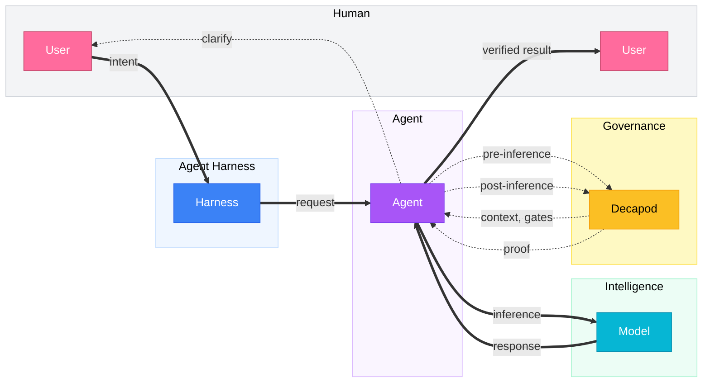

<p align="center">🦀</p>

<p align="center">
  <code>cargo binstall decapod && decapod init</code>
</p>

<p align="center">
  <strong>Decapod</strong><br />
  Repo-native governance for AI coding agents.<br />
  <em>Intent · Custody · Trajectory · Proof — <strong>fleet coherence</strong></em>
</p>

<p align="center">
  Work in Cursor, Claude Code, Codex, Antigravity, Grok, or any harness you prefer.
  Decapod is the shared governance layer inside the repository —
  so agent work stays bounded, attributable, and recoverable.
</p>

<p align="center">
  <a href="https://github.com/DecapodLabs/decapod/actions"></a>
  <a href="https://crates.io/crates/decapod"></a>
  <a href="https://github.com/DecapodLabs/decapod/blob/master/LICENSE"></a>
  <a href="https://decapodlabs.github.io/accountable-agentic-execution/"></a>
</p>

[Constitution](assets/constitution.json#L5) · [Paper](https://github.com/DecapodLabs/accountable-agentic-execution/blob/main/paper/Accountable_Agentic_Execution.pdf) · [Research](https://decapodlabs.github.io/accountable-agentic-execution/)

---

## Quick Start

```bash
cargo binstall decapod
decapod init
```

One command installs the kernel. One command prepares the repository.
Agents call Decapod at governance boundaries. You keep speaking naturally.

Conversations are temporary. Repository state is durable.
What was asked, what was understood, what changed, and what was proven —
all of it lives in the project, not only in chat.

---

## Fleet coherence

Chat is ephemeral. The repository is where coordination belongs.

**Fleet coherence** is independently launched agents sharing one project authority,
claiming distinct work, keeping a selected governance record,
and finishing against a common proof boundary.

| | |
| --- | --- |
| **Intent** | Outcome, constraints, and completion standard — carried in plans, todos, and specs. |
| **Custody** | Exclusive claims and isolated workspaces so agents do not silently collide. |
| **Trajectory** | Selected events so a later process can reorient without replaying a vendor chat. |
| **Proof** | Validation bound to governed state. Completion is a verified transition. |

The hard case is concurrent work that is *similar but distinct*:
shared modules, different outcomes. Worktrees stop file trampling.
Claims, context, trajectory, and publication gates keep the fleet coherent.

You speak to whichever agent is available.
The agent calls Decapod. Humans keep natural language.
Agents hold a stable machine contract.

---

## How it works

Agents forget intent, over-pull context, skip boundaries, and claim done too early.
A second agent or a tool switch makes that worse when ownership lived only in the last chat.

Decapod is called before acting, before inference, before touching code, and before completing.



Decapod is not the agent and not the model.
It is the governance kernel the agent calls when work needs control.

The model stays fixed. The corridor around it changes:
resolve project context before implementation, gate completion on proof.
A later agent can re-enter the same work without an ad hoc briefing.

---

## Capabilities

1. **Intent** — Vague requests become explicit, versioned specifications.
2. **Context** — Only the relevant code and docs, with provenance.
3. **Coordination** — Exclusive claims and isolated workspaces for concurrent agents.
4. **Trajectory** — Durable events for handoff across sessions and harnesses.
5. **Boundaries** — Protected branches and sensitive modules stay protected.
6. **Adaptation** — Instruction changes go through explicit review.
7. **Proof** — Completion requires deterministic verification.

---

## The substrate

`.decapod/` holds the durable state of governed agent work:

```
.decapod/
  managed/specs/     # Living project specifications
  managed/sessions/  # Session custody
  generated/         # Context capsules and proof artifacts
  data/              # Local project store
  governance/        # Trajectory, claims, and validation
  workspaces/        # Isolated worktrees (containers when configured)
  config.toml        # Project shape
  OVERRIDE.md        # Local authority, in plain Markdown
```

- **Intent** becomes specs and todos.
- **Context** becomes scoped capsules.
- **Custody** becomes claimed tasks and workspaces.
- **Trajectory** becomes event-backed records.
- **Boundaries** become rules, overrides, and gates.
- **Validation** becomes proof artifacts.
- **Completion** becomes a verified state transition.

`OVERRIDE.md` is yours to edit. Write instructions the way you write documentation.
Decapod binds each directive to its source and body with fail-closed resolution.

Decapod does not make agents smarter with longer chats.
It makes agent work shippable by turning governance into repository state.

---

## The constitution

Decapod ships with an embedded engineering constitution —
architecture, security, performance, and testing as queryable doctrine.

Agents consult it, cite claims, follow gates, and produce proof.
Judgment remains human. Authority is explicit:
baseline constitution, project override, task-scoped projection.

---

## Guarantees

- **Daemonless** — Invoked like `git` or `grep`.
- **Local-first** — Governance runs on your machine by default.
- **Repo-native** — State stays with the repository.
- **Provider-agnostic** — Any model, any harness. The project is the coordination surface.
- **Proof-gated completion** — `VERIFIED` requires passed proof-plan gates.
- **Branch isolation** — Protected paths and branches stay protected.

Decapod is a governance kernel — not an agent framework, prompt pack, or model router.

---

## Documentation

- [Human docs](https://decapodlabs.github.io/decapod/)
- [Agent API](docs/agent/api-index.md)
- [Agent contract](AGENTS.md)
- [Paper](https://github.com/DecapodLabs/accountable-agentic-execution/blob/main/paper/Accountable_Agentic_Execution.pdf)
- [Research](https://decapodlabs.github.io/accountable-agentic-execution/)
- [Fleet coherence protocol](https://github.com/DecapodLabs/accountable-agentic-execution/blob/main/docs/fleet-coherence-protocol.md)

---

## Contributing

```bash
git clone https://github.com/DecapodLabs/decapod
cd decapod
cargo build && cargo test
```

[CONTRIBUTING](CONTRIBUTING.md) · [SECURITY](SECURITY.md) · [Issues](https://github.com/DecapodLabs/decapod/issues)
